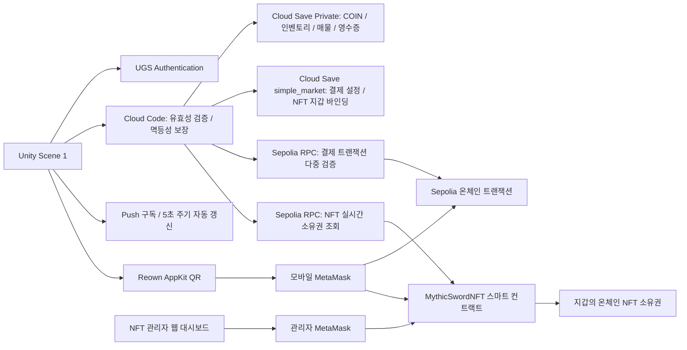

# UGSMarketwithSepoliaETH

현재 코드는 **Authentication + Cloud Save + Cloud Code**로 동작하는 Economy-free v2입니다. Unity Economy 서비스 활성화, Currency/Inventory Item 생성, Economy Configuration Publish는 필요 없습니다.

Unity 6로 개발된 **교육용 RPG 아이템 거래소 + Sepolia 지갑 결제 + NFT 쿠폰 실습** 프로젝트입니다.

학생은 GitHub의 **Code → Download ZIP**을 통해 코드를 내려받아 Unity Editor에서 실행합니다. 학생 간 거래 실습에서는 모든 학생이 동일한 UGS 프로젝트 및 환경에 연결하고, 각자 별도의 게임 계정을 생성하여 접속합니다. 게임 내 골드·아이템·거래 기록은 UGS Cloud Save에 저장되며, 신화검 NFT의 소유권은 Sepolia 블록체인에 영구 기록됩니다. MetaMask 지갑은 인앱 결제 및 NFT 실습 단계에서 연결합니다.

> **실습 기준: `MarketPlaceUGS-main/Assets/Scene/1.unity`, Windows Editor Play, Reown QR + 모바일 MetaMask.**  
> ZIP 압축 파일만 내려받는다고 해서 클라우드 설정까지 자동으로 복제되는 것은 아닙니다. 아래 가이드 순서에 따라 UGS 프로젝트, Cloud Code, 암호화폐 지갑 설정을 차례대로 구성해야 합니다.

v2 실습 기록 갱신일: **2026-09-23**. Unity Economy 서비스를 신규 프로젝트에서 더 이상 사용할 수 없게 된 환경 변화에 대응하여, 아키텍처를 Cloud Save + Cloud Code 중심 체제로 전면 개편했습니다. 이번 실습 환경을 통해 회원가입·로그인·인벤토리 조회, 거래소 매물 조회·등록·취소·구매·판매대금 정산, QR 지갑 연결, Sepolia ETH 기반 골드 및 전설검 결제, NFT 서명 연동·기존 보유분 동기화·신규 쿠폰 등록 및 수령까지 실제 유저 시나리오 동작을 검증 완료했습니다. **단, NFT를 지갑 간 전송한 후 양쪽 게임 클라이언트 인벤토리에 실시간 반영하는 테스트는 이번 세션에서 실행하지 않았습니다.** 학생별로 새 환경을 구축할 때는 아래 순서에 따라 단계별로 정상 동작 여부를 확인하십시오.

### 현재 수업 연결값

| 항목 | 설정값 |
|---|---|
| 신규 UGS Project ID | `733a611e-93a2-4be3-aa68-9dd3325fa879` |
| UGS 환경(Environment) | `production` |
| Unity 실습 씬(Scene) | `MarketPlaceUGS-main/Assets/Scene/1.unity` |
| 거래소 데이터 저장 위치 | Cloud Save → Game Data → `classroom_market` → **Private** → `state` |

로컬의 `ProjectSettings/ProjectSettings.asset` 파일에 명시된 `cloudProjectId`는 위 ID로 이미 설정되어 있습니다. 하지만 이것만으로 Unity Dashboard 상에 인증 프로바이더, 데이터베이스, 서버 함수가 자동으로 생성되는 것은 아닙니다. Unity Services 메뉴에서 실제 조직(Organization)과 프로젝트 연결 상태를 확인하고, 아래 절차에 따라 초기 설정을 완료해야 합니다. 다른 수업이나 별도 환경에서 진행할 경우 담당 강사가 지정한 Project ID로 연결하십시오.

**JavaScript 코드는 Cloud Code에 업로드하고, JSON 초기 데이터는 Cloud Save에 등록합니다.** 프로젝트 폴더 내의 모든 `.js` 파일을 업로드하는 것이 아니며, 배포해야 할 대상 파일 목록과 파라미터 규격은 9절에 명시되어 있습니다.

### 처음 시작한다면 이 순서로 진행하세요

| 단계 | 학생 작업 내용 | 완료 기준 |
|---|---|---|
| 1 | 1~4절: 기본 개념·시스템 구조·준비물 확인 | 게임 계정, 블록체인 지갑, 백엔드 서버의 역할 구분 이해 |
| 2 | 5~9절: ZIP 프로젝트 열기, UGS 리소스 구성 및 기본 거래소 서버 함수 8개 배포 | Scene 1 로그인 성공 및 기본 데이터 초기화 완료 |
| 3 | 10절: 일반 아이템 거래소 실습 | 판매 등록·구매·판매대금 정산(Claim) 정상 동작 확인 |
| 4 | 11~12절: Reown 모바일 지갑 연결, Sepolia 테스트 ETH 결제 | 10,000 골드 및 일반 전설검 인벤토리 지급 확인 |
| 5 | 13.1~13.4: NFT 스마트 컨트랙트·쿠폰·Unity UI 인스펙터 필드 설정 | 배포된 컨트랙트 주소 및 학생용 쿠폰 코드 확보 |
| 6 | 13.5: NFT 서버 함수 3개 배포, 지갑 EIP-191 서명 바인딩 | UGS 게임 계정과 암호화폐 지갑 주소의 1:1 결합 완료 |
| 7 | 13.6~13.9: NFT 온체인 수령·인벤토리 동기화·타 학생 전송 | 보유 시 게임 내 표시, 외부 전송 시 제거 및 신규 수령자 표시 확인 |

Unity Dashboard 및 MetaMask의 버전에 따라 세부 메뉴 명칭이 일부 다를 수 있습니다. UI 명칭이 상이할 경우 본 문서에 기재된 **리소스 ID, 함수 이름, 파일 경로, 환경(Environment) 이름**을 절대 기준으로 삼아 설정하십시오.

## 목차

- [1. 프로젝트 개요와 구현 상태](#1-프로젝트-개요와-구현-상태)
- [2. 폴더 및 시스템 구조](#2-폴더-및-시스템-구조)
- [3. 강사와 학생의 역할](#3-강사와-학생의-역할)
- [4. 준비물](#4-준비물)
- [5. ZIP 다운로드와 Unity 실행](#5-zip-다운로드와-unity-실행)
- [6. UGS 프로젝트와 회원가입 설정](#6-ugs-프로젝트와-회원가입-설정)
- [7. Economy 없는 수업 구성](#7-economy-없는-수업-구성)
- [8. Cloud Save 초기 설정](#8-cloud-save-초기-설정)
- [9. Cloud Code 배포](#9-cloud-code-배포)
- [10. 기본 거래소 실습](#10-기본-거래소-실습)
- [11. MetaMask와 Reown QR 연결](#11-metamask와-reown-qr-연결)
- [12. 골드와 전설검 결제](#12-골드와-전설검-결제)
- [13. 신화검NFT 발행과 쿠폰 실습](#13-신화검nft-발행과-쿠폰-실습)
- [14. 장애 확인 및 복구 원칙](#14-장애-확인-및-복구-원칙)
- [15. 개발·검증·선택적 WebGL 빌드](#15-개발검증선택적-webgl-빌드)
- [16. 강사용 GitHub 배포 점검](#16-강사용-github-배포-점검)
- [17. 완료 체크와 후속 과제](#17-완료-체크와-후속-과제)

## 1. 프로젝트 개요와 구현 상태

### 1.1 무엇을 배우는가

1. Unity Authentication 서비스를 활용한 사용자 회원가입 및 로그인 구현
2. Cloud Save 기반의 서버 전용(Server-authoritative) 골드 잔액 및 인벤토리 데이터 관리
3. Cloud Code 서버리스 로직을 통한 아이템 매물 등록, 안전한 P2P 구매, 판매 대금 정산
4. Unity 환경에서 Reown AppKit QR 코드를 통해 모바일 MetaMask 지갑을 연결하는 기법
5. Sepolia 테스트 ETH 입금 내역을 백엔드 서버에서 온체인으로 무신뢰(Zero-Trust) 검증한 후 게임 내 재화를 지급하는 결제 파이프라인
6. ERC-721 NFT 스마트 컨트랙트 배포, 지갑 주소 지정형 온체인 쿠폰 등록 및 교환(Redeem)
7. EIP-191 암호학적 메시지 전자 서명을 통해 지갑 소유권을 무가스비로 검증하고 게임 계정에 1:1로 결합(Binding)하는 방법
8. 서버가 블록체인 노드 RPC를 통해 사용자의 NFT 보유 여부를 실시간 조회하여 인벤토리에 추가/제거하는 온체인 동기화 기법
9. 네트워크 재시도, 멱등성(Idempotency) 설계를 통한 중복 지급 방지, 분산 트랜잭션 오류 복구 및 중앙 게임 데이터와 블록체인 분산 소유권의 근본적 차이점 이해

이 프로젝트는 완성형 액션 RPG가 아니라, **게임 경제 시스템과 외부 블록체인 지갑을 안전하게 연결하는 백엔드 아키텍처 실습용 상점**입니다. 현재 구현된 화면을 통해 로그인, 재화 조회, 아이템 P2P 거래, 크립토 결제, NFT 쿠폰 발급 및 동기화 메커니즘을 집중 학습합니다. 무기 장착, 공격 애니메이션, 전투 대미지 판정 등은 본 실습 범위 외의 후속 구현 과제입니다.

### 알아둘 핵심 용어

| 용어 | 본 프로젝트에서의 정의 및 역할 |
|---|---|
| **UGS** | Unity Gaming Services. 사용자 계정 인증, 데이터 저장, 서버리스 코드를 제공하는 Unity의 공식 백엔드 클라우드 플랫폼 |
| **Player ID** | UGS Authentication을 통해 게임 로그인 시 발급되는 사용자 고유 식별자. 블록체인 지갑 주소와 완전히 별개의 식별자임 |
| **지갑 주소 (Wallet Address)** | NFT 및 Sepolia 테스트 ETH를 송수신하는 `0x...` 형태의 이더리움 공개 주소 |
| **Sepolia** | Ethereum 공식 테스트 네트워크. 실제 금전 가치가 없는 테스트 ETH를 사용하며 메인넷이 아님 |
| **가스비 (Gas Fee)** | 스마트 컨트랙트 배포, NFT 발행(Mint), 지갑 간 전송 트랜잭션을 블록체인 원장에 기록할 때 소모되는 네트워크 수수료 |
| **RPC (Remote Procedure Call)** | 게임 서버가 블록체인 풀노드와 통신하여 트랜잭션 상태 및 NFT 소유권을 조회하는 JSON-RPC 통신 창구 |
| **계약 주소 (Contract Address)** | 블록체인에 배포된 NFT 스마트 컨트랙트 고유 주소. 관리자 개인 지갑 주소와 구분됨 |
| **tokenId** | **특정 NFT 스마트 컨트랙트 내부에서** 개별 NFT를 식별하는 고유 번호. 계약 주소와 조합하여 유일성을 가짐 |
| **txHash (Transaction Hash)** | 블록체인 네트워크에 브로드캐스팅된 트랜잭션의 32바이트 고유 식별자. 온체인 결제 검증 및 지급 증빙 영수증으로 활용 |
| **Publish** | Unity Dashboard 상에서 수정한 Cloud Code 스크립트를 실제 클라이언트가 호출할 수 있는 런타임 버전으로 활성화 및 배포하는 작업 |

### 1.2 세 가지 상품의 특성 및 차이점

| 구분 | 10,000 골드 | 전설검 | 신화검 NFT |
|---|---|---|---|
| **지급 위치** | UGS Cloud Save `COIN` | UGS Cloud Save 인벤토리 | Sepolia 블록체인 NFT 컨트랙트 |
| **획득 방식** | 0.0001 Sepolia ETH 온체인 결제 | 0.0001 Sepolia ETH 온체인 결제 | 관리자 발급 쿠폰 교환 또는 직접 민팅 |
| **별도 가스비** | 유저 결제 트랜잭션 시 발생 | 유저 결제 트랜잭션 시 발생 | 쿠폰 등록(관리자) 및 민팅/전송(유저) 시 발생 |
| **MetaMask NFT 목록** | 미표시 (게임 내부 DB 재화) | 미표시 (게임 내부 DB 아이템) | 컨트랙트 주소 및 `tokenId`로 지갑에서 확인 가능 |
| **게임 내 리소스 ID** | `COIN` | `LEGENDARY_SWORD` | `MYTHIC_SWORD_NFT` (소유권 동기화 연동) |
| **지갑 간 자유 전송** | 불가능 (게임 내부 계정에 귀속) | 불가능 (게임 내부 계정에 귀속) | 가능 (블록체인 지갑 간 자유 전송 지원) |

> [!IMPORTANT]
> **Sepolia ETH, 게임 내 재화인 COIN, 그리고 신화검 NFT는 완전히 독립된 자산입니다.** NFT 발행 시 지불하는 가스비는 이더리움 검증자들에게 지급되는 수수료일 뿐 게임 상점의 매출이 아닙니다. 또한 UGS Dashboard의 `production`은 서비스 환경의 식별자일 뿐, 이더리움 메인넷 환경을 의미하는 것이 아닙니다.

### 1.3 현재 구현 상태 및 검증 범위 (2026-09-23 기준)

| 항목 | 구현 및 검증 상태 |
|---|---|
| **인증·골드·인벤토리** | Username/Password 기반 로그인 구현 완료. 신규 계정 최초 접속 시 1,000 COIN 기본 지급 및 Cloud Save 단일 원장 기반 조회 정상 동작 |
| **판매·구매·취소·정산** | 플레이어 자산과 거래소 매물 데이터를 동일한 Cloud Save 원장에 원자적(Atomic)으로 저장. 동시 다발적 구매 충돌 방지 및 중복 요청 방지(멱등성) 테스트 통과 |
| **거래소 화면 자동 갱신** | 5초 주기 백그라운드 자동 조회(Polling)를 기본 탑재하고, 선택적 C# Push 모듈을 통한 실시간 변경 알림 연동 지원 |
| **골드·전설검 결제** | Sepolia 블록체인 온체인 다중 검증 파이프라인 유지. 재화 지급 처리와 결제 영수증 저장을 단일 writeLock 트랜잭션으로 원자적 커밋하여 중복 지급 원천 차단 테스트 통과 |
| **NFT 연동 시스템** | 기존 스마트 컨트랙트 및 쿠폰 발행 메커니즘 유지. 온체인 소유권을 전수 검증하여 Cloud Save 인벤토리에 실시간 추가/삭제 동기화 구현 |
| **로컬 자동화 테스트 결과** | 서버·지갑·NFT 단위 테스트 총 69개 항목 전체 통과 (동시성 구매/취소 충돌, 잔액 초과 차감 시도, 중복 정산 방지, 네트워크 유실 재시도, 결제 트랜잭션 재전송 차단, NFT 서명 검증 등). Unity 런타임 소스 컴파일 성공 |
| **실제 환경 사용자 실습 검증** | 회원가입·로그인·인벤토리, 거래소 매물 등록/취소/타 계정 구매/판매대금 정산, QR 지갑 연결, 0.0001 ETH 결제 정상 완료 확인 |
| **실제 환경 NFT 실습 검증** | NFT 전용 Cloud Code 3종 배포 및 환경 설정, EIP-191 서명 바인딩, 기존 보유 NFT 인벤토리 표시, 신규 쿠폰 등록 및 Unity 클라이언트 내 수령 확인 완료 |
| **향후 추가 검증 대상** | NFT를 지갑 간 외부 전송한 후 양쪽 게임 클라이언트 인벤토리에 실시간 반영되는 과정, 다수 학생 동시 접속 환경 부하 테스트, Push 모듈의 장시간 온라인 세션 유지 테스트 |

Scene 1에 포함된 `Add Coin` 및 `Random Item` 버튼은 실습 편의를 위해 서버에서 제공하는 테스트용 재화 지급 기능입니다. 서버의 `demoEnabled` 전역 플래그 및 계정당 누적 100회 한도가 엄격하게 적용됩니다. SimpleMarket의 가챠(뽑기) 기능은 1회당 100 COIN을 차감합니다. 모든 인게임 거래는 Cloud Save의 단일 JSON 값에 원자적으로 기록되므로, 본 구조는 수업 및 프로토타입 규모에 최적화된 설계이며 초대규모 상용 라이브 서비스용 분산 DB 구조는 아닙니다.

## 2. 폴더 및 시스템 구조

### 2.1 저장소 디렉토리 구성

```text
UGSMarketwithSepoliaETH/                 ← 저장소 최상위 루트 디렉토리
├─ MarketPlaceUGS-main/                  ← Unity Hub에 프로젝트로 추가할 폴더
│  ├─ Assets/Scene/0.unity               ← 원본 거래소 참고용 씬
│  ├─ Assets/Scene/1.unity               ← 본 수업에서 사용하는 실제 실습 씬
│  ├─ Assets/Scripts/MarketPlace/        ← 거래소 UI, 서버 API 클라이언트, 자동 화면 갱신 스크립트
│  ├─ Assets/Scripts/UGSTest/            ← UGS 초기화, 회원가입 및 로그인 UI 로직
│  ├─ Assets/Scripts/SimpleMarket/       ← 블록체인 지갑 브리지, 골드/전설검 결제 및 NFT UI 로직
│  ├─ Assets/Editor/                    ← UI 인스펙터 자동 연결용 에디터 유틸리티 스크립트
│  ├─ Assets/Plugins/WebGL/             ← 브라우저 확장 프로그램 MetaMask 연동용 플러그인
│  ├─ Assets/Data/Market/               ← 아이템 메타데이터 (이름, 스프라이트 아이콘, 기본 판매가)
│  ├─ Packages/                        ← Unity 패키지 매니페스트 (manifest.json 등)
│  ├─ ProjectSettings/                 ← Unity 프로젝트 전역 설정
│  ├─ js/Mkt_*.txt                     ← deploy/Mkt_*.js와 완전히 동일한 서버 코드 사본
│  ├─ CloudCode/src/                   ← 거래소 및 결제 비즈니스 로직 원본 소스
│  ├─ CloudCode/deploy/                ← Dashboard에 배포할 번들링 완료 서버 코드
│  ├─ CloudCode/classroom-state.json    ← 거래소 Private state의 최초 초기화용 JSON 데이터
│  ├─ CloudCode/MarketNotifications/    ← 선택적 실시간 Push 알림용 C# 모듈 및 .ccm 패키지
│  ├─ CloudCode/*_COPY_ALL.txt          ← Dashboard 웹 에디터 전체 복사 붙여넣기용 파일
│  ├─ CloudCode/nft/                   ← NFT 지갑 바인딩 및 인벤토리 동기화 서버 원본 소스
│  ├─ CloudCode/nft/deploy/            ← NFT 서버 함수 3종의 배포용 완성본 파일
│  └─ NFTWorkshop/                     ← Solidity NFT 컨트랙트, 관리자 웹 도구, 로컬 테스트 환경
├─ archive/                             ← 구버전 레거시 코드 보관 폴더 (배포 금지)
└─ AI_HANDOFF.md                        ← 시스템 구조, 배포 사양, 주의사항 기술 인수인계 문서
```

> [!NOTE]
> 과거 Embedded Wallet 기반 연동 문서는 아카이브로 분리 보관되었습니다. 현재 시스템은 **Reown AppKit을 통해 스마트폰 MetaMask 앱과 QR 코드로 연결**하는 방식을 표준으로 사용합니다.

### 2.2 전체 시스템 아키텍처 다이어그램



NFT 스마트 컨트랙트와 UGS 게임 인벤토리 간의 동기화는 `Nft_GetChallenge → Nft_BindWallet → Nft_SyncInventory`의 3단계 파이프라인으로 수행됩니다. 최초 1회 지갑 서명 바인딩을 완료하면, 이후 로그인 및 수동 Refresh 시마다 온체인 소유권을 조회하여 신규 보유 항목은 게임 인벤토리에 추가하고 전송된 항목은 자동으로 제거합니다. **이 동작을 위해서는 13.5절의 Cloud Save 및 Cloud Code 설정이 반드시 선행되어야 합니다.** 클라이언트 화면에 단순히 지갑 주소가 표시되는 것과, 서버리스 백엔드 상에서 암호학적 서명을 거쳐 바인딩된 상태는 완전히 다릅니다.

### 핵심 클라이언트 C# 소스 코드 목록

클라이언트 핵심 C# 스크립트는 총 18개로 구성되어 있으며, 배포되는 서버 측 코드는 **거래소 8개 + 결제 4개 + NFT 3개 = JavaScript 총 15개**, 그리고 선택적 **C# Push 모듈 1개**입니다. 모든 경로는 `MarketPlaceUGS-main/` 기준입니다.

| 디렉토리 경로 | 소스 파일명 | 핵심 역할 및 기능 |
|---|---|---|
| `Assets/Scripts/MarketPlace` | `PortfolioMarketDemo.cs` | 상점 및 인벤토리 전체 화면 갱신, Cloud Save 조회, 매물 등록/구매/수익 정산(Claim) UI 연동 |
| `Assets/Scripts/MarketPlace` | `MarketCloudClient.cs` | 플레이어 정보 조회, 쓰기 트랜잭션 시 고유 `request_id` 생성·PlayerPrefs 저장 및 재시도(멱등성) 처리 |
| `Assets/Scripts/MarketPlace` | `MarketLiveUpdates.cs` | 실시간 Push 구독, 백그라운드 5초 주기 자동 갱신, 연결 해제 및 재접속 폴백 처리 |
| `Assets/Scripts/MarketPlace` | `InventoryRowUI.cs` | 플레이어 인벤토리 단일 행 UI 제어, 신화검 NFT 거래소 판매 등록 차단 로직 |
| `Assets/Scripts/MarketPlace` | `MarketRowUI.cs` | 거래소 등록 매물 단일 행 UI 제어, 구매(Buy) 및 등록 취소(Cancel) 처리 |
| `Assets/Scripts/MarketPlace` | `ItemVisualData.cs` | 인게임 리소스 ID ↔ 아이템 이름, 스프라이트 아이콘, 기본 판매가 매핑 스크립터블 데이터 |
| `Assets/Scripts/MarketPlace` | `UgsDiagnostics.cs` | 프로젝트 초기화 상태 및 사용자 로그인 세션 상태 진단 도구 |
| `Assets/Scripts/UGSTest` | `UnityServiceInit.cs` | UGS 코어 SDK 초기화 및 환경 설정 로직 |
| `Assets/Scripts/UGSTest` | `UserNamePw.cs` | Username/Password 기반 회원가입(Signup) 및 로그인(Login), 인증 완료 후 데이터 자동 조회 |
| `Assets/Scripts/UGSTest` | `CloudSaveTest.cs` | 레거시 테스트 버튼들을 신규 v2 서버 엔드포인트 및 수업용 테스트 재화 지급 함수에 연결 |
| `Assets/Scripts/SimpleMarket` | `SceneWalletPanel.cs` | 골드 및 전설검 인앱 결제 견적(Quote) 요청, 지갑 트랜잭션 호출, 온체인 지급 검증 및 UI 갱신 |
| `Assets/Scripts/SimpleMarket` | `ReownWalletBridge.cs` | 에디터 환경 내 Reown AppKit 초기화, QR 세션 브리지, Sepolia ETH 송금, 쿠폰 Redeem, personal_sign 호출 |
| `Assets/Scripts/SimpleMarket` | `WebGlWallet.cs` | WebGL 빌드 환경에서 브라우저 MetaMask 확장 프로그램과 직접 통신하는 jslib 브리지 |
| `Assets/Scripts/SimpleMarket` | `MythicNftPanel.cs` | 온체인 쿠폰 상태 조회, EIP-191 서명 바인딩, 서버 기반 온체인 NFT 인벤토리 동기화 |
| `Assets/Scripts/SimpleMarket` | `SimpleMarketApp.cs` | 별도 독립 생성형 SimpleMarket 테스트 씬 구동용 앱 컨트롤러 |
| `Assets/Editor` | `SceneWalletSetup.cs` | Scene 1 내 기존 WalletPanel UI 요소(버튼, 텍스트) 자동 바인딩 에디터 스크립트 |
| `Assets/Editor` | `MythicNftSetup.cs` | Scene 1 내 기존 NFT 패널 UI 요소 자동 바인딩 에디터 스크립트 |
| `Assets/Editor` | `SimpleMarketSetup.cs` | 별도 독립 테스트 씬 자동 생성 및 빌드 프로파일 메뉴 (Scene 1 메인 실습에서는 사용하지 않음) |

### 2.3 시스템 핵심 컴포넌트별 역할

| 파일 / 컴포넌트 | 시스템 내 핵심 역할 |
|---|---|
| `UnityServiceInit`, `UserNamePw` | UGS SDK 라이프사이클 초기화, Username/Password 프로바이더 기반 인증 처리 |
| `PortfolioMarketDemo` | 보유 골드 잔액, 개인 인벤토리, 거래소 매물 목록 실시간 조회 및 거래 UI 이벤트 핸들링 |
| `SceneWalletPanel` | 골드 및 전설검 결제 견적 수신, 외부 지갑 송금 요청, 온체인 영수증 대조 및 인벤토리 지급 요청 |
| `ReownWalletBridge` | Unity 에디터 상에서 AppKit을 초기화하고 WalletConnect QR 코드를 렌더링하여 트랜잭션 중계 |
| `WebGlWallet` + `SimpleMarketWallet.jslib` | WebGL 런타임 환경에서 웹 브라우저의 `window.ethereum` API를 직접 호출하는 네이티브 브리지 |
| `SceneWalletSetup` | 기존 하이어라키 씬 내의 UI 컴포넌트 참조를 검증하고 누락된 연결을 자동으로 복구하는 툴 |
| `MarketCloudClient`, `MarketLiveUpdates` | Cloud Code 호출 시 멱등성 보장 키 주입, 네트워크 단절 복구 및 하이브리드 화면 무효화 |
| `CloudCode/src/cloud-store.js` | Cloud Save Private 상태 원자적 읽기/쓰기, CAS(`writeLock`) 기반 낙관적 동시성 충돌 자동 재시도, 정원 및 용량 제한 방어 |
| `CloudCode/src/cloud-market.js` | 거래소 매물 등록, 안전한 P2P 구매, 등록 취소, 판매 대금 정산, 가챠, 수업용 테스트 재화 지급 로직 |
| `CloudCode/src/core.js` | Sepolia 온체인 트랜잭션 다중 검증(체인, 금액, EOA, 메모 일치 여부, 3 컨펌) 및 결제 확인 |
| `CloudCode/src/cloud-adapter.js` | Cloud Save SDK 통신 및 이더리움 JSON-RPC 풀노드 질의를 담당하는 추상화 어댑터 |
| `CloudCode/build.js` | 모듈화된 공유 소스 코드를 UGS Dashboard에 즉시 업로드 가능한 단일 실행 번들 파일로 빌드 |
| `CloudCode/MarketNotifications/Notifications.cs` | 상태 원장의 `revision` 번호를 모니터링하여 데이터 변경 시 구독 중인 클라이언트에 `MarketChanged` 방송 |
| `MythicSwordNFT.sol` | OpenZeppelin 기반 ERC-721Enumerable 스마트 컨트랙트. 관리자 쿠폰 등록, 일회성 교환, 최대 공급량 제어 |
| `NFTWorkshop/web` | 관리자용 컨트랙트 배포 및 쿠폰 해시 등록, 학생용 보유 현황 조회 및 타 지갑 전송 웹 도구 |
| `MythicNftPanel` | 인게임 쿠폰 교환 요청, EIP-191 지갑 소유권 증명 서명 전송, 서버 온체인 동기화 트리거 |
| `CloudCode/nft/core.cjs` | 일회성 Nonce 챌린지 발급, EIP-191 전자서명 복원(`ecrecover`), 온체인 소유권 전수 조회를 통한 인벤토리 추가/삭제 |
| `CloudCode/nft/adapter.cjs` | NFT 동기화에 필요한 Cloud Save 입출력 및 Sepolia 노드 통신 전담 어댑터 |

> [!NOTE]
> `CloudCode/src/adapter.js`는 구버전 Unity Economy 시절의 회귀 테스트용 레거시 코드이며, 현재 `build.js`는 **`cloud-adapter.js`**를 기반으로 번들링합니다. Dashboard에는 분할된 소스 파일이 아닌 `CloudCode/deploy/` 내의 완성본 배포 파일을 업로드해야 합니다.

### 2.4 데이터 저장소 계층 및 영속성 위치

| 데이터 저장 위치 | 보관 대상 데이터 | ZIP 파일 포함 여부 |
|---|---|---|
| **UGS Authentication** | 사용자 게임 계정 식별자 및 고유 `Player ID` | 미포함 (클라우드 생성) |
| **Cloud Save `classroom_market` Private `state`** | 플레이어별 COIN 잔액, 인벤토리 아이템, 거래소 매물, 정산 가능 대금, 멱등성 요청 기록, 결제 영수증 단일 원장 | 초기 스키마 템플릿만 포함 (`classroom-state.json`) |
| **Cloud Save `simple_market` Default `config`** | 크립토 결제 수신용 상점 공개 지갑 주소, 결제 가격(Wei), 풀노드 RPC URL, 필요 블록 컨펌 수 | 문서 내 JSON 예시 포함 |
| **Cloud Save `simple_market` Default `nft_config`** | 조회 대상 신화검 NFT 스마트 컨트랙트 배포 주소 및 Sepolia RPC URL | 문서 내 JSON 예시 포함 |
| **Cloud Save `simple_market` Default `nft_state`** | `Player ID` ↔ 암호화폐 지갑 주소 1:1 매핑 바인딩 테이블, 일회성 서명 챌린지 큐, 동기화 세션 임대(Lease) 락 | 문서 내 JSON 예시 포함 |
| **PlayerPrefs / 브라우저 localStorage** | 로컬 미확인 트랜잭션 참조값, 네트워크 단절 재시도용 `request_id` | 새 PC 또는 클라이언트 재설치 시 자동 이전되지 않음 |
| **Sepolia 블록체인 원장** | 결제 송금 내역 영구 기록, NFT 컨트랙트 바이트코드, 온체인 토큰 소유권, 쿠폰 등록 및 사용 완료 플래그 | 온체인 상에 영구 보관 (ZIP과 완전히 무관) |
| **NFT 관리자 웹 localStorage** | 최근 배포한 스마트 컨트랙트 주소 캐시, 미등록 쿠폰 초안, 최근 실행 트랜잭션 해시 | 브라우저별 독립 보관 |

신규 환경을 구축할 때 구버전의 레거시 키인 `market/active_listings`나 `simple_market/Default/state`는 생성하지 않습니다. 만약 기존 운영 환경에 과거 데이터가 남아 있더라도 수동으로 삭제할 필요는 없으며, `cloud-adapter.js`가 이전 결제 영수증을 식별하여 중복 지급을 안전하게 차단합니다. **새로운 모든 거래 및 자산 데이터는 `classroom_market/Private/state` 단일 원장에 집중 관리됩니다.**

### 2.5 골드 및 전설검 인앱 결제 파이프라인

1. 클라이언트가 게임 로그인 완료 후 Cloud Code의 `Gold_GetQuote` 또는 `Sword_GetQuote`를 호출하여 결제 견적을 수신합니다.
2. 서버는 결제 트랜잭션의 `data`(input) 필드에 바인딩할 메모 문자열(`UGS-GOLD-v1 | ProjectId | EnvironmentId | PlayerId`)을 생성하여 반환합니다.
3. 학생은 MetaMask 지갑에서 정확히 **0.0001 Sepolia ETH**와 네트워크 가스비 승인 트랜잭션을 체인에 전송합니다.
4. 백엔드 서버는 블록체인 RPC를 통해 Chain ID, 송신자 및 수신자 EOA 주소, 전송 금액, 데이터 메모, 트랜잭션 성공 여부, 블록 확정 수(Confirmations 3 이상)를 다중 검증합니다.
5. 검증 완료 시, Cloud Save Private 원장에 지급 자산(골드 또는 전설검)과 상태가 `GRANTED`로 마킹된 영수증을 동일한 writeLock 트랜잭션으로 원자적 커밋합니다.
6. Unity 클라이언트가 갱신된 잔액 및 인벤토리를 화면에 반영하고, 로컬 PlayerPrefs에 임시 보관 중이던 미확인 결제 캐시를 안전하게 정리합니다.

골드 충전과 전설검 구매는 트랜잭션 메모, 로컬 대기 큐, UI 확인 버튼이 명확히 분리되어 있습니다. 골드 결제용 트랜잭션 해시를 제출하여 전설검을 부정 청구할 수 없습니다. v2 아키텍처에서는 자산 지급과 영수증 발급이 단일 원장 커밋으로 처리되므로, 응답 패킷 유실이 발생하더라도 동일한 트랜잭션 해시로 안전하게 재조회 및 복구가 가능합니다. 구버전 레거시 결제 건은 자동 이관되지 않으며, `REVIEW_REQUIRED` 상태로 분류될 경우 관리자의 수동 확인이 필요합니다.

### 2.6 NFT 온체인 쿠폰 발급 및 수령 파이프라인

1. 관리자가 Remix 또는 배포 도구를 사용하여 Sepolia 네트워크에 `MythicSwordNFT` 스마트 컨트랙트를 배포합니다.
2. 관리자 웹 도구가 암호학적으로 안전한 랜덤 난수 쿠폰 비밀값(`secret`)을 생성합니다.
3. 관리자는 이 비밀값의 해시(`keccak256(secret)`), 수령 대상 학생의 지갑 주소, 쿠폰 유효기간을 스마트 컨트랙트에 등록(`registerCoupon`)합니다.
4. 관리자가 학생에게 규격화된 쿠폰 전문 문자열(`MSW1|ChainId|Contract|Recipient|Secret`)을 전달합니다.
5. 학생은 자신의 지갑을 연결한 후 `redeem(secret)` 온체인 트랜잭션을 실행합니다. 상품 가격은 0 ETH이며 트랜잭션 가스비만 소모됩니다.
6. 스마트 컨트랙트는 호출자 지갑 주소, 유효기간 만료 여부, 쿠폰 취소/기사용 여부, 컬렉션 최대 발행 한도(Max Supply)를 검증한 후 NFT 1개를 안전하게 민팅(`_safeMint`)합니다.
7. 한 번 사용된 쿠폰 해시는 온체인에서 즉시 비활성화되어 재사용이 원천 차단됩니다. 민팅 완료된 NFT는 이후 다른 지갑으로 자유롭게 온체인 전송이 가능합니다.

본 프로젝트의 쿠폰 시스템은 **서버가 개인키로 서명하는 방식이 아닌, 관리자가 온체인 스마트 컨트랙트에 직접 등록하는 탈중앙 구조**입니다. 따라서 UGS 서버나 Unity 클라이언트에 관리자의 마스터 개인키를 보관하지 않아 보안성이 뛰어나며, 쿠폰 등록 시 발생하는 가스비는 관리자가 부담합니다.

## 3. 강사와 학생의 역할

### 3.1 기본 진행: 같은 거래소에서 학생 간 거래

강사가 신규 UGS 프로젝트의 `production` 환경에 6~9절 설정을 사전에 1회 완료합니다. 학생들은 동일한 UGS 프로젝트에 연결된 Unity 클라이언트를 실행하고, 각자 회원가입(Signup)을 통해 서로 다른 게임 계정을 생성하여 접속합니다. 현재 수업용 UGS Project ID는 문서 상단에 명시된 `733a611e-93a2-4be3-aa68-9dd3325fa879`입니다.

학생이 Unity Editor 상에서 공용 프로젝트를 선택하고 연결하려면 강사가 사전에 필요한 조직 멤버 초대 및 접근 권한을 부여해야 합니다. 단순히 Project ID만 안다고 해서 Unity Dashboard 웹 관리 권한이 부여되는 것은 아닙니다. 다 함께 사용하는 공용 환경에서는 특정 학생이 Cloud Save 초기값을 임의로 덮어쓰거나 Cloud Code 스크립트를 개별적으로 다시 Publish하지 않도록 주의합니다.

### 3.2 학생별 독립 구축 실습

학생 각자가 본인의 Unity 계정으로 새 UGS 프로젝트를 생성하고 6~9절 과정을 직접 수행할 수도 있습니다. 이 경우 학생별로 거래소 백엔드가 완전히 격리되므로, 타 학생이 등록한 매물은 조회되지 않습니다. 이 방식에서는 각 학생이 본인의 프로젝트 내에 A/B 두 개의 게임 계정을 생성하여 P2P 거래를 테스트합니다.

### 3.3 강사 및 학생 역할 분담표

| 강사 | 학생 |
|---|---|
| 실습 Git 브랜치/태그 및 Unity Editor 버전 지정 | 지정된 ZIP 파일 다운로드 및 프로젝트 임포트 |
| 공용 거래소 방식 또는 독립 구축 실습 방식 결정 | 지정된 수업 방식에 맞춰 UGS 프로젝트 연결 |
| 크립토 결제 수신용 지갑 및 NFT 관리자 지갑 관리 | 개인별 실습용 결제/수령 지갑(MetaMask) 관리 |
| 공용 NFT 스마트 컨트랙트 배포 및 학생용 쿠폰 발급 | 본인 지갑 주소로 지정된 온체인 쿠폰 수령 및 교환 |
| UGS 테스트 환경, API 사용량 및 오류 복구 모니터링 | 트랜잭션 해시(txHash) 보관 및 결과 정상 반영 검증 |

## 4. 준비물

| 준비물 | 권장 사양 및 요구 기준 |
|---|---|
| **Windows PC 및 인터넷 환경** | 현재 실습 및 동작 검증 기준 OS |
| **Unity Hub 및 활성 라이선스** | Unity 공식 계정 로그인 필수 |
| **Unity Editor** | **`6000.3.18f1` (Unity 6.3)**, `ProjectVersion.txt` 기준 |
| **Unity / UGS 계정** | 학생별 독립 구축 실습 진행 시 본인 프로젝트 생성 권한 필요 |
| **Reown 계정 및 Project ID** | WalletConnect QR 코드 연동용 (UGS Project ID와 별개의 ID임) |
| **모바일 MetaMask 앱** | Unity Editor QR 코드 스캔, Sepolia ETH 결제, NFT 온체인 수령 |
| **PC Chrome 브라우저 + MetaMask 확장 프로그램** | NFT 관리자 웹 대시보드 접속 및 컨트랙트 조작용 |
| **Sepolia 테스트 ETH** | 상점 인앱 결제 금액(0.0001 ETH) 및 컨트랙트 배포·쿠폰 등록·민팅 가스비 |
| **Node.js 및 npm** | NFT 관리자 도구 빌드 및 실행용 (로컬 개발 검증 환경: Node v24.18.0) |
| **Git** | 단순 ZIP 파일 다운로드 실습 시에는 필수 아님 |
| **WebGL Build Support 모듈** | 웹 브라우저 배포 빌드를 실습할 경우에만 선택 설치 |

프로젝트 패키지 매니페스트에는 Reown AppKit Unity **1.7.1**, Cloud Code **2.10.2**, Cloud Save **3.4.0** 등이 정의되어 있습니다. Unity Economy **3.5.3** 패키지도 `manifest.json`에 선언은 남아 있으나, 현재 게임 스크립트는 Economy API를 전혀 호출하지 않으므로 서비스 활성화가 필요 없습니다. 프로젝트 패키지의 최종 기준은 [manifest.json](MarketPlaceUGS-main/Packages/manifest.json) 및 패키지 락 파일입니다.

### 실습 전에 미리 기록해 둘 설정값 체크리스트

| 설정 항목 | 학생/강사가 직접 기록할 실제 값 | 적용 대상 위치 |
|---|---|---|
| 프로젝트 압축 해제 경로 | 본인 PC의 `MarketPlaceUGS-main` 폴더 경로 | Unity Hub → 프로젝트 열기 |
| UGS 조직 및 프로젝트 | 본인 계정 또는 강사가 초대한 프로젝트 | Unity Editor → Project Settings → Services |
| 현재 수업용 UGS Project ID | `733a611e-93a2-4be3-aa68-9dd3325fa879` | `ProjectSettings.asset`의 `cloudProjectId`와 일치 확인 |
| UGS 서비스 환경 | `production` | Unity Dashboard 내 모든 활성 서비스 |
| Reown Project ID | Reown Cloud 대시보드에서 발급받은 고유 ID | `WalletPanel` → `Reown Wallet Bridge` 인스펙터 |
| 구매자(학생) 공개 지갑 주소 | 학생 본인의 스마트폰 MetaMask 지갑 주소 | QR 지갑 연결 후 클라이언트 화면 표시값과 대조 |
| 상점 결제 수신 공개 지갑 주소 | 결제 대금을 수신할 별도의 상점 지갑 주소 | Cloud Save `simple_market/config.receiverAddress` |
| NFT 관리자 공개 지갑 주소 | `MythicSwordNFT` 컨트랙트를 배포한 관리자 지갑 | NFT 관리자 웹 대시보드 연결 계정 |
| NFT 스마트 컨트랙트 주소 | 배포 완료 후 블록체인 상에서 부여받은 주소 | 관리자 웹 대시보드 및 Unity `Mythic Nft Contract` 필드 |

> [!WARNING]
> **신규 실습 환경을 구성할 때 위의 값들은 자동으로 채워지지 않습니다.** 프로젝트 원작자 PC의 로컬 경로, 원작자의 Project ID, 과거 수신 지갑 주소를 그대로 복사해 사용하지 마시고, 반드시 본 체크리스트의 실제 설정값으로 대조 및 교체하십시오.

## 5. ZIP 다운로드와 Unity 실행

1. 강사가 안내한 GitHub 저장소 웹 페이지에 접속합니다.
2. 강사가 지정한 공식 실습 브랜치(또는 Release 태그)를 선택합니다.
3. 우측 상단의 초록색 **Code → Download ZIP** 버튼을 클릭하여 압축 파일을 내려받습니다.
4. 다운로드된 ZIP 파일의 압축을 완전히 해제합니다. **ZIP 압축 파일 내부에서 프로젝트를 바로 열면 파일 잠금이나 캐시 손상이 발생하므로 절대 금지합니다.**
5. Windows의 경로 길이 제한(MAX_PATH) 오류를 방지하기 위해 `C:\UnityLabs\UGSMarketwithSepoliaETH`와 같이 가능한 한 드라이브 루트에 가깝고 영문으로 구성된 짧은 경로에 압축을 풉니다. (폴더명 뒤에 `-main`이 붙어 있어도 무방합니다.)
6. 압축 해제된 폴더 내부의 **`MarketPlaceUGS-main`** 디렉토리 안에 `Assets`, `Packages`, `ProjectSettings` 3개 폴더가 온전히 존재하는지 확인합니다.
7. Unity Hub를 실행하고 **Projects → Add → Add project from disk**를 클릭한 후, 저장소 최상위 폴더가 아닌 **`MarketPlaceUGS-main` 폴더를 직접 선택**하여 프로젝트를 추가합니다.
8. Editor 버전을 **`6000.3.18f1`**로 지정합니다. 설치되어 있지 않다면 Unity Hub의 Installs 메뉴에서 해당 버전을 설치하십시오.
9. 프로젝트를 열고, 백그라운드에서 패키지 복원(Package Resolution)과 최초 에셋 임포트가 100% 완료될 때까지 대기합니다. (ZIP 파일에는 대용량 Library 캐시가 포함되어 있지 않으므로 최초 임포트에 수 분이 소요될 수 있습니다.)
10. 임포트 완료 후 Unity Editor 하단 Console 창에 빨간색 컴파일 에러가 없는지 먼저 확인합니다. 백그라운드에서 SDK 패키지를 내려받는 중에는 화면 조작이나 테스트 플레이를 시작하지 않습니다.
11. Project 뷰에서 **`Assets → Scene → 1.unity`**를 찾아 더블클릭하여 실습 씬을 로드합니다.
12. 상단 메뉴의 **File → Build Profiles**를 열고 활성 빌드 플랫폼(Active Platform)이 **Windows**로 설정되어 있는지 확인합니다.
13. 씬 화면이 정상적으로 렌더링되면 `Ctrl + S`를 눌러 저장합니다.

> [!CAUTION]
> Unity 상단 메뉴의 **`Simple Market → 1. Create or Open Test Scene`은 이번 실습에서 절대 실행하지 마십시오.** 해당 메뉴는 별도의 SimpleMarket 전용 프로토타입 씬을 자동으로 생성하는 스크립트입니다. 두 씬 모두 신규 v2 서버리스 API를 사용하지만, 본 정규 커리큘럼은 **`Scene 1.unity`**를 단일 표준으로 진행합니다.

참고 공식 가이드: [GitHub 소스 코드 ZIP 다운로드 안내](https://docs.github.com/en/repositories/working-with-files/using-files/downloading-source-code-archives).

## 6. UGS 프로젝트와 회원가입 설정

1. 웹 브라우저에서 [Unity Cloud Dashboard](https://cloud.unity.com/)에 접속하여 본인의 Unity 계정으로 로그인합니다.
2. 본 정규 수업에서는 프로젝트 선택기에서 지정된 Project ID(**`733a611e-93a2-4be3-aa68-9dd3325fa879`**) 프로젝트를 선택합니다. (학생별 독립 구축 실습 진행 시에만 신규 프로젝트를 직접 생성합니다.)
3. Dashboard 상단의 환경(Environment) 선택 드롭다운에서 **`production`**을 선택합니다. 기본 제공되는 `production` 환경을 사용하면 되며, 동일한 이름의 커스텀 환경을 추가로 생성할 필요는 없습니다.
4. 좌측 탐색 메뉴에서 **Player Authentication → Authentication**으로 이동한 뒤, Identity Providers 목록에서 **Username & Password** 프로바이더를 찾아 상태를 **Enabled**로 활성화하고 저장합니다. (여기서 설정하는 것은 인게임 플레이어의 계정 로그인 방식이며, SSL/TLS 인증서 파일을 업로드하는 과정이 아닙니다.)
5. Unity Editor로 돌아와 **Edit → Project Settings → Services** 메뉴를 엽니다. Unity Dashboard와 동일한 조직(Organization) 및 프로젝트가 정확히 연결되어 있는지 확인합니다. 프로젝트 표시 이름에 이전 캐시가 남아 있더라도 고유 `cloudProjectId` 값을 기준으로 일치 여부를 검증하십시오.
6. Scene 1에 배치된 `UnityServiceInit.cs`는 `MarketCloudClient.EnvironmentName`(기본값: `production`) 환경 변수를 명시적으로 참조하여 UGS 코어 SDK를 초기화합니다. 인게임 회원가입 및 로그인 버튼은 SDK 초기화가 완료될 때까지 비활성화 상태를 유지합니다. (`SimpleMarketApp`은 별도 독립 테스트 씬용 컴포넌트이므로, 해당 컴포넌트의 인스펙터 값을 수정해도 Scene 1의 런타임 환경에는 영향을 주지 않습니다.)
7. `WalletPanel` 컴포넌트에 지정된 `Environment Name` 필드는 결제 영수증의 서비스 환경 격리에도 사용됩니다. 정규 수업에서는 모든 컴포넌트의 환경 이름을 반드시 **`production`**으로 통일하십시오. 만약 다른 환경을 사용할 경우 UGS 초기화, `MarketCloudClient.EnvironmentName`, 그리고 지갑 결제 환경 이름을 모두 동일하게 맞춰야 합니다.
8. 8절(Cloud Save 초기 데이터 등록)과 9절(거래소 Cloud Code 함수 배포)을 완료한 후, Unity 실행 화면에서 **Signup / Login** 버튼을 눌러 개별 게임 계정을 생성합니다. 과거 레거시 UGS 프로젝트에 생성되어 있던 계정 정보가 신규 프로젝트로 자동 마이그레이션되는 것은 아닙니다.

> [!NOTE]
> Unity Dashboard에서 **Username & Password** 프로바이더를 활성화하는 작업과, 게임 내에서 플레이어가 실제 회원가입을 수행하는 것은 별개의 절차입니다. 클라이언트 화면에서 Signup에 성공하면 해당 계정으로 즉시 자동 로그인되어 거래소 메인 화면에 진입합니다. 이미 계정을 생성한 후에는 Login 버튼을 사용합니다. 인증 API 통신 중에는 중복 요청을 방지하기 위해 두 버튼이 일시적으로 비활성화됩니다. 신규 계정에 대한 1,000 COIN 기본 재화 지급은 Authentication 설정이 아니라, Cloud Code의 `Mkt_GetPlayer` 엔드포인트가 최초 계정 원장을 생성할 때 안전하게 수행합니다.

현재 게임 클라이언트의 비밀번호 보안 정책은 **8~30자 길이, 영문 대문자·소문자·숫자·특수문자를 각각 최소 1개 이상 포함**해야 합니다. 실습용 계정이라 할지라도 타 상용 포털 서비스에서 사용하는 개인 비밀번호를 재사용하지 마십시오.

참고 공식 문서: [Unity Authentication: Username & Password 공급자 설정 가이드](https://docs.unity.com/en-us/authentication/platform-signin/username-password).

## 7. Economy 없는 수업 구성

2026-09-22 수정본은 **Unity Economy 서비스 활성화, 상품(Currency/Item) 등록, Economy Configuration Publish가 일절 필요 없습니다.** Authentication, Cloud Save, Cloud Code만을 활용하여 동작합니다. Unity는 2026년 9월 8일부터 신규 프로젝트에 대한 Unity Economy 서비스 신규 활성화를 공식 중단했습니다. (공식 안내에 따르면 기존에 이미 활성화되어 운영 중인 프로젝트는 유지되므로 서비스 자체가 즉시 삭제된 것은 아닙니다.) 본 커리큘럼은 신규 환경에서도 차질 없이 실습할 수 있도록 Economy에 대한 모든 의존성을 완전히 제거하고 자체 단일 원장 아키텍처로 전환했습니다. [Unity Economy 서비스 관련 공식 안내](https://docs.unity.com/en-us/economy)

학생 간 P2P 아이템 거래가 정상 작동하려면 **동일한 UGS Project ID + 동일한 production 환경 + 서로 다른 게임 계정** 조건으로 클라이언트를 실행해야 합니다. 각 학생이 서로 다른 UGS 프로젝트를 생성해 접속할 경우 거래소 백엔드가 물리적으로 분리되어 매물이 공유되지 않습니다.

처음 실습을 시작할 때는 신규 수업용 UGS 프로젝트 및 환경을 생성하여 사용하는 것을 권장합니다. 기존 강사 환경의 구버전 Economy 잔액, 인벤토리, 거래소 매물 데이터는 신규 v2 환경으로 자동 이관(마이그레이션)되지 않습니다. 기존 Cloud Save의 레거시 키인 `market`이나 `simple_market/state`를 임의로 삭제하거나 초기화하지 마십시오. 구버전의 결제 영수증은 중복 재지급을 차단하기 위한 검증 대상으로 영구 보존됩니다. 기존 레거시 서비스와 신규 v2 서비스를 동일 환경에서 혼용하여 운영하는 방식은 지원하지 않습니다.

### 7.1 v1에서 v2로 달라진 시스템 책임 구조

본 프로젝트에서 "Economy가 없어졌다"는 의미는, 기존 수업이 의존하던 Unity Economy 패키지 기반의 서버 API 흐름을 걷어내고 자체 원장 시스템으로 대체했다는 뜻입니다. 블록체인에 영구 기록된 실제 NFT나 테스트 ETH 자산이 함께 삭제된 것이 아닙니다.

| 핵심 기능 | v2 처리 위치 및 아키텍처 동작 원리 |
|---|---|
| **회원가입 및 로그인** | UGS Authentication이 고유 `Player ID`를 발급하고, Cloud Code가 요청 호출자의 인증 세션을 검증 |
| **골드 잔액 및 일반 아이템** | Cloud Save Private의 `classroom_market/state.players` 객체 내부에 안전하게 보관 |
| **P2P 거래소** | Cloud Code 서버리스 함수가 판매자 소유권, 판매가, 구매자 잔액, 매물 활성 상태를 검증하고, 아이템 소유권 이전과 상태 변경을 단일 원장에 원자적 저장 |
| **중복 요청 방지 (멱등성)** | C# 클라이언트가 고유 `request_id`를 로컬에 영속 저장 후 재사용하며, Cloud Code가 처리 결과를 `operations` 테이블에 영구 기록하여 동일 결과 반환 |
| **동시 수정 충돌 방지** | Cloud Code가 Cloud Save `writeLock`(CAS 연산)으로 저장 충돌(409 Conflict)을 감지하고, 최신 상태 원장을 다시 읽어 최대 8회 자동 재검증 및 재시도 |
| **ETH 결제 및 재화 지급** | Sepolia 블록체인 온체인 트랜잭션을 Cloud Code가 무신뢰 다중 검증한 후, 재화 지급과 `GRANTED` 영수증을 동일한 원장에 원자적 커밋 |
| **신화검 NFT 연동** | NFT 소유권은 Sepolia 스마트 컨트랙트에 영구 보존. EIP-191 서명으로 게임 계정과 지갑을 1:1 결합하고, 서버가 온체인 보유분을 전수 조회하여 게임 인벤토리에 실시간 반영 |

Unity 클라이언트의 C# 스크립트는 UI 렌더링, 사용자 인증, 지갑 서명 요청, 서버 엔드포인트 호출만을 담당합니다. 서버 비즈니스 로직 원본은 `CloudCode/src/`에, NFT 전용 서버 로직은 `CloudCode/nft/`에 위치하며, Unity Dashboard에는 번들링 빌드된 `deploy/` 디렉토리 내의 완성본 JS 파일을 업로드합니다. `NFTWorkshop/web/app.mjs`는 웹 브라우저에서 실행되는 관리자 및 학생용 웹 대시보드 도구이므로 Cloud Code에 업로드하지 않습니다. `.sol` 파일은 Sepolia 블록체인에 배포되는 스마트 컨트랙트 원본입니다. **C# 클라이언트 빌드, Cloud Code JS Publish, 스마트 컨트랙트 배포는 완전히 서로 다른 독립적인 작업**입니다.

### 7.2 학생용 전체 실습 단계 및 통과 기준

모든 실습은 각 단계의 통과 기준을 명확히 확인한 후 다음 단계로 순차 진행해야 합니다. 다 함께 사용하는 공용 수업 환경에서는 강사가 1회에 한해 백엔드 서버 설정을 사전에 완료하며, 학생들은 본인의 개별 게임 계정과 암호화폐 지갑만을 사용해 참여합니다.

1. **Unity 환경 준비:** 5~6절 가이드에 따라 프로젝트 및 `Scene 1.unity`를 열고, UGS Project ID와 `production` 환경을 정확히 맞춥니다.
2. **거래소 원장 저장소 생성:** 8.1절에 따라 Cloud Save Game Data에 Private 접근 등급의 `state` 항목을 최초 1회 생성합니다.
3. **거래소 서버 함수 배포:** 9.1절 규격에 맞춰 기본 거래소용 `Mkt_*` 스크립트 8개를 코드 및 Parameters까지 정확히 구성한 후 Publish합니다.
4. **게임 계정 생성 및 잔액 확인:** 클라이언트 실행 후 Signup/Login을 완료하고, 기본 지급된 1,000 COIN 및 인벤토리를 확인합니다. `Random Item` 버튼을 눌러 거래 실습용 일반 아이템을 확보합니다.
5. **거래소 매물 목록 조회:** 거래소 UI의 Refresh 버튼을 클릭하여 `거래소 로드: N개` 메시지를 확인합니다. (신규 환경에서 매물이 0개로 표시되는 것은 정상입니다.)
6. **아이템 판매 등록 및 취소 검증:** 인벤토리 아이템을 100 COIN에 판매 등록하여 개인 인벤토리에서 차감되고 거래소 매물 탭에 노출되는지 확인합니다. 등록 취소(Cancel) 시 수수료 차감 없이 아이템이 본인 인벤토리로 온전히 복구되는지 검증합니다.
7. **P2P 구매 및 정산 검증:** 아이템을 다시 매물로 등록한 뒤, 다른 학생(또는 별도 테스트 계정)으로 로그인하여 구매합니다. 구매자의 100 COIN 차감 및 아이템 획득, 판매자의 `Claim Earnings`를 통한 100 COIN 수령 및 중복 정산 방지가 정상 작동하는지 확인합니다.
8. **결제 시스템 사전 준비:** 8.2절의 결제용 `config`, 결제 Cloud Code 스크립트 4종, 11절 Reown 설정을 완료합니다. (학생의 구매용 지갑과 상점의 결제 대금 수신용 지갑을 반드시 구분하여 설정합니다.)
9. **모바일 지갑 QR 연결:** Unity 화면의 Wallet Connect 버튼을 누르고 스마트폰 MetaMask로 QR 코드를 스캔하여, Unity 화면에 본인 지갑 주소와 Sepolia ETH 잔액이 정상 렌더링되는지 확인합니다.
10. **골드 및 전설검 인앱 결제:** 12절 가이드에 따라 각각 0.0001 Sepolia ETH 결제를 승인하고 게임 내 재화(10,000 골드 / 전설검)가 정상 지급되는지 확인합니다. (네트워크 지연으로 지급이 늦어질 경우 재구매를 누르지 말고 '결제 확인' 버튼을 사용합니다.)
11. **NFT 백엔드 서버 준비:** 13.5절에 따라 Cloud Save에 `nft_config`와 `nft_state`를 등록하고, NFT 전용 Cloud Code 3종을 배포합니다. (일반 결제용 `config`만으로는 NFT 연동 기능이 동작하지 않습니다.)
12. **NFT 지갑 서명 바인딩:** 'NFT지갑연결' 버튼 클릭 → MetaMask EIP-191 메시지 전자 서명 승인 → 서버 바인딩 완료. 이미 지갑에 보유 중이던 NFT가 있다면 신규 쿠폰 교환 없이도 게임 인벤토리에 자동 동기화되어 나타납니다.
13. **신규 NFT 쿠폰 수령:** 강사가 온체인에 등록한 쿠폰 코드를 전달받아 학생이 Unity 클라이언트 쿠폰 입력창에 입력하고 수령(Redeem)합니다. 기존에 1개를 보유하던 학생이 추가 수령할 경우 총 2개가 인벤토리에 정상 반영되는지 확인합니다.
14. **외부 지갑 앱 표시 확인:** MetaMask 모바일 앱의 NFT 목록에 자동으로 나타나지 않을 경우, 13.10절의 'NFT 가져오기' 절차를 통해 컨트랙트 주소 및 `tokenId`를 입력하여 확인합니다.
15. **지갑 간 전송 및 인벤토리 실시간 반영 검증:** 13.8절에 따라 보유 NFT를 타 학생의 지갑 주소로 온체인 전송한 후, 양쪽 클라이언트에서 각각 동기화를 실행하여 보낸 쪽에서는 아이템이 자동 제거되고 받은 쪽에서는 새롭게 인벤토리에 추가되는지 검증합니다.

---

## 8. Cloud Save 초기 설정

### 8.1 거래소 상태 원장 등록 — [필수]

1. Unity Cloud Dashboard에 로그인하고 수업 프로젝트 및 **`production`** 환경을 선택합니다.
2. 좌측 메뉴에서 **Cloud Save → Game Data**로 이동한 후 **Add Custom Item** 버튼을 클릭합니다.
3. Custom Item ID 필드에 **`classroom_market`**을 정확히 입력합니다.
4. Access Class는 반드시 **`Private`**으로 지정합니다. (Default나 Player Data 클래스에 생성하면 안 됩니다.)
5. Key 이름은 **`state`**로 지정하고, Value 항목에 아래의 **JSON 객체 전체**를 붙여넣습니다. (문자열 따옴표로 감싸지 말고 JSON 본문 자체를 입력합니다.)

```json
{
  "version": 2,
  "revision": 0,
  "demoEnabled": true,
  "players": {},
  "listings": {},
  "operations": {},
  "payments": {}
}
```

위 초기 데이터는 프로젝트 내 `MarketPlaceUGS-main/CloudCode/classroom-state.json` 파일과 완전히 동일합니다. **이 작업은 신규 환경 구축 시 최초 1회에 한해서만 수행**해야 합니다. 수업 운영 도중에 이 초기값으로 다시 덮어쓸 경우 학생들의 보유 자산, 인벤토리, 매물, 결제 영수증 등 모든 데이터가 영구 초기화되므로 절대 주의하십시오.

[classroom-state.json 파일 확인하기](MarketPlaceUGS-main/CloudCode/classroom-state.json). 백엔드 서버는 Cloud Save에 초기 원장 데이터가 존재하지 않을 때 자동으로 빈 장부를 덮어쓰지 않고 `SETUP_REQUIRED` 에러를 반환하도록 설계되었습니다. 따라서 게임 실행 전에 Dashboard 상에서 본 설정을 반드시 완료해야 합니다.

신규 플레이어가 최초로 게임에 로그인하면 시스템이 자동으로 1,000 COIN 기본 지원금을 1회 지급합니다. Scene 1의 `Add Coin` 버튼은 +100 골드, `Random Item` 버튼은 일반 아이템 1개를 테스트용으로 지급하며, 두 버튼의 사용 횟수는 계정당 합산 최대 100회로 제한됩니다. Dashboard의 `state` 데이터에서 `"demoEnabled": false`로 변경하면 클라이언트의 무단 재화 지급 요청을 서버 차원에서 완전히 차단할 수 있습니다. SimpleMarket 화면의 가챠(뽑기) 기능은 1회당 100 COIN을 차감합니다. 기본 무기(검), 포션류, 전설검은 거래소 P2P 거래가 가능하지만, 신화검 NFT는 거래소 판매/구매가 금지되어 있으며 블록체인 지갑 간 온체인 전송만을 지원합니다.

플레이어 잔액, 인벤토리 아이템, 거래소 매물 상태, 판매 대금 정산 기록은 **단 하나의 JSON 문서에 `writeLock`(낙관적 동시성 제어)과 함께 원자적으로 저장**됩니다. 동일 매물에 대해 동시 구매 요청이 경합할 경우 정확히 1개의 요청만 성공하며, 다른 요청은 409 충돌을 감지하고 최신 원장 상태를 기반으로 유효성을 재검증합니다. 클라이언트의 멱등성 요청 ID(`request_id`)와 서버 처리 결과도 동일 장부에 함께 기록되므로, 패킷 유실로 인해 클라이언트가 동일 요청을 재전송하더라도 중복 차감이나 중복 지급이 발생하지 않습니다.

본 교육용 단일 원장 아키텍처의 설계 한도는 **최대 동시 등록 계정 200개, 원장 JSON 데이터 크기 4,000,000바이트(약 4MB, Cloud Save 단일 키 한도) 이하**입니다. 결제 견적(Quote) 발급 함수는 향후 영수증 누적에 대비한 안전 마진을 두기 위해 장부 크기가 3,800,000바이트를 초과하면 추가 견적 발급을 안전하게 거부합니다. 하나의 키에 동시 쓰기 부하가 집중되므로 대규모 상용 라이브 서비스용 DB 설계는 아닙니다. 클라이언트에 `BUSY` 에러가 반환될 경우 동일 요청으로 재시도하면 되며, `LEDGER_FULL`이나 `CLASSROOM_FULL` 에러가 발생할 경우 강사가 환경 및 스토리지 사용량을 점검해야 합니다. 저장 공간을 확보한다는 명목으로 과거 결제 영수증이나 멱등성 처리 기록을 임의로 부분 삭제해서는 안 됩니다.

로그인 성공 후 Unity Dashboard의 `state.players` 노드 아래에 실제 사용자 `Player ID` 키가 생성된 것을 확인할 수 있습니다. 각 플레이어 노드 내부의 `balance`는 보유 골드, `items`는 보유 인벤토리입니다. `listings`는 현재 활성 매물 및 판매 완료/취소 상태, `operations`는 중복 요청 방지용 서명 기록, `payments`는 Sepolia 결제 영수증입니다. 본 데이터는 **Private** 접근 등급으로 보호되므로 클라이언트가 임의로 전체 원장을 읽거나 변조할 수 없으며, 오직 검증된 Cloud Code 서버리스 함수를 통해서만 본인의 데이터 및 공개 매물 목록을 안전하게 조회합니다.

### 8.2 Sepolia 결제 설정 — [결제 실습 진행 시]

기본 아이템 거래소 실습만 우선 진행할 경우 이 단계와 외부 지갑/NFT 연동 설정을 나중에 진행해도 무방합니다.

1. Cloud Save → **Game Data** → Add Custom Item을 엽니다.
2. Custom Item ID 필드에 **`simple_market`**을 입력합니다.
3. Access Class는 **`Default`**로 지정합니다. (클라이언트가 결제 견적 수신 계좌 및 노드 정보를 읽을 수 있어야 합니다.)
4. Key 이름은 **`config`**로 지정하고, Value 항목에 아래의 **JSON 객체**를 입력합니다.

```json
{
  "receiverAddress": "여기를_실제_상점_수신용_0x공개주소로_교체",
  "rpcUrl": "https://ethereum-sepolia-rpc.publicnode.com",
  "priceWei": "100000000000000",
  "goldAmount": 10000,
  "confirmations": 3
}
```

> [!CAUTION]
> - `receiverAddress`에는 학생들의 구매용 MetaMask 지갑 주소가 아닌, **결제 대금을 수신할 별도의 상점 EOA 공개 지갑 주소**를 입력해야 합니다.
> - **Default** 클래스로 저장된 데이터는 게임 클라이언트가 자유롭게 읽을 수 있는 공개 데이터입니다. 따라서 이 설정 파일 내에 개인 비밀키(Private Key)나 유료 결제가 연결된 비공개 RPC API 키를 절대 입력하지 마십시오.

신규 결제 처리 시 지급된 인게임 자산과 `GRANTED` 상태의 온체인 영수증은 `classroom_market/Private/state` 단일 원장에 원자적으로 함께 저장됩니다. 만약 기존 운영 환경에 과거 레거시 데이터인 `simple_market/state`가 남아 있다면 **절대 삭제하지 말고 그대로 보존**하십시오. 과거 구버전 환경에서 이미 재화가 지급 완료된 트랜잭션 해시를 악용하여 신규 v2 환경에서 중복 청구하는 어뷰징을 방지하는 블랙리스트 검증 데이터로 활용됩니다.
## 9. Cloud Code 배포

> [!IMPORTANT]
> **과거 실습에서 거래소 매물 취소(Cancel)가 실패했던 주요 원인은 Unity Dashboard의 Parameters 설정에서 `request_id`를 누락했기 때문이었습니다.** JavaScript 코드 본문만 복사해 넣는 것으로 끝내지 마시고, 반드시 아래 표에 명시된 파라미터 이름, 데이터 타입, 필수(Required) 여부를 정확히 설정한 후 Publish해야 합니다. 구매, 등록 취소, 수익 정산 등 쓰기(State-mutating) 트랜잭션 함수마다 각각 독립적으로 설정해야 합니다.

### 9.1 JavaScript 서버 함수 배포

배포 기준 원본 파일은 **`CloudCode/deploy/*.js`**입니다. (`js/Mkt_*.txt` 파일들은 Dashboard 붙여넣기 편의를 위해 동일한 코드를 복사해 둔 사본입니다.) 신규 클라이언트는 반드시 **신규 v2 서버 스크립트와 한 세트로** 사용해야 하며, 구버전 레거시 스크립트와 절대 혼용해서는 안 됩니다.

배포할 서버 스크립트는 **기본 거래소 8개 + 결제 4개 + NFT 3개 = 총 15개**입니다. 기본 P2P 거래소 실습만 우선 진행할 경우 1~8번 함수 8개를 먼저 배포하십시오.

| 업로드 순서 및 함수 이름 | Dashboard에 전체 복사할 파일 | 파라미터 (Parameters) 설정 규격 |
|---|---|---|
| 1. `Mkt_GetPlayer` | [Mkt_GetPlayer.js](MarketPlaceUGS-main/CloudCode/deploy/Mkt_GetPlayer.js) | 없음 (파라미터 불필요) |
| 2. `Mkt_GetActiveListings` | [Mkt_GetActiveListings.js](MarketPlaceUGS-main/CloudCode/deploy/Mkt_GetActiveListings.js) | `limit`: Numeric (선택), `sort`: String (선택) |
| 3. `Mkt_GrantDemo` | [Mkt_GrantDemo.js](MarketPlaceUGS-main/CloudCode/deploy/Mkt_GrantDemo.js) | `kind`: String (필수), `request_id`: String (필수) |
| 4. `Mkt_Gacha` | [Mkt_Gacha.js](MarketPlaceUGS-main/CloudCode/deploy/Mkt_Gacha.js) | `request_id`: String (필수) |
| 5. `Mkt_CreateListing` | [Mkt_CreateListing.js](MarketPlaceUGS-main/CloudCode/deploy/Mkt_CreateListing.js) | `players_inventory_item_id`: String (필수), `price`: Numeric (필수), `currency_id`: String (선택), `request_id`: String (필수) |
| 6. `Mkt_BuyListing` | [Mkt_BuyListing.js](MarketPlaceUGS-main/CloudCode/deploy/Mkt_BuyListing.js) | `listing_id`: String (필수), `request_id`: String (필수) |
| 7. `Mkt_CancelListing` | [Mkt_CancelListing.js](MarketPlaceUGS-main/CloudCode/deploy/Mkt_CancelListing.js) | `listing_id`: String (필수), `request_id`: String (필수) |
| 8. `Mkt_ClaimEarnings` | [Mkt_ClaimEarnings.js](MarketPlaceUGS-main/CloudCode/deploy/Mkt_ClaimEarnings.js) | `currency_id`: String (선택), `request_id`: String (필수) |
| 9. `Gold_GetQuote` | [Gold_GetQuote.js](MarketPlaceUGS-main/CloudCode/deploy/Gold_GetQuote.js) | 없음 (파라미터 불필요) |
| 10. `Gold_Claim` | [Gold_Claim.js](MarketPlaceUGS-main/CloudCode/deploy/Gold_Claim.js) | `tx_hash`: String (필수) |
| 11. `Sword_GetQuote` | [Sword_GetQuote.js](MarketPlaceUGS-main/CloudCode/deploy/Sword_GetQuote.js) | 없음 (파라미터 불필요) |
| 12. `Sword_Claim` | [Sword_Claim.js](MarketPlaceUGS-main/CloudCode/deploy/Sword_Claim.js) | `tx_hash`: String (필수) |

위 파일들은 이미 번들링 빌드가 완료된 상태이므로, 최초 배포 시 Node.js 빌드 과정 없이 해당 파일의 코드 본문 전체를 복사하여 Dashboard에 붙여넣으면 됩니다. Dashboard에 함수를 생성할 때 스크립트 이름 뒤에 `.js`나 `.txt` 같은 확장자를 절대 붙이지 마십시오. 파일 간의 업로드 순서가 실행 순서를 결정하는 것은 아니지만, 게임 실습을 시작하기 전에 필요한 모든 함수가 정상적으로 **Publish** 상태여야 합니다.

`Mkt_Gacha`는 별도 SimpleMarket 씬의 유료 뽑기에 사용되며, Scene 1의 `Random Item` 버튼은 `Mkt_GrantDemo`를 호출합니다. 위 8개 스크립트를 배포하면 두 씬의 거래소 기능을 모두 정상 구동할 수 있습니다.

#### Cloud Code 스크립트 배포 5단계 절차
1. Unity Cloud Dashboard → **Cloud Code → JS Scripts**로 이동하여 **New Script**를 클릭하고 위 표의 함수 이름을 입력합니다.
2. 로컬 프로젝트의 해당 `CloudCode/deploy/함수이름.js` 파일 내용을 전체 복사합니다.
3. Dashboard 웹 에디터의 기본 템플릿 샘플 코드를 완전히 지우고 복사한 코드를 붙여넣은 뒤, 우측 패널에서 위 표의 파라미터(이름, 타입, 필수 여부)를 정확히 추가합니다. ([parameters.json](MarketPlaceUGS-main/CloudCode/deploy/parameters.json) 파일에서도 동일한 파라미터 명세를 확인할 수 있습니다.)
4. **Save Script**를 누른 후, 반드시 **Publish Version** 버튼을 클릭하여 활성화합니다. (단순히 Working Copy만 저장해서는 클라이언트에서 호출할 수 없습니다.)
5. Unity Editor와 동일한 프로젝트 및 `production` 환경의 **Live** 버전으로 활성화되었는지 확인합니다.

> [!NOTE]
> 멱등성 보장 키인 `request_id`는 C# 클라이언트가 요청 생성 시 자동으로 발급하여 로컬 PlayerPrefs에 보관합니다. 네트워크 단절로 인해 응답 수신 여부가 불확실할 때는 화면의 해당 버튼을 동일한 인수로 다시 눌러 재시도합니다. 요청이 실패한 직후 로컬 PlayerPrefs 캐시를 임의로 삭제하지 마십시오. 게임 `Player ID` 및 서비스 인증 토큰은 Cloud Code 런타임의 `context` 객체에서 서버가 직접 추출하므로, 클라이언트 코드나 파라미터에 민감한 인증 정보를 직접 담아 전송하지 않습니다.

#### 파라미터 세부 사용 규격
- `kind`: `Mkt_GrantDemo` 호출 시 사용. Add Coin은 `"coin"`, Random Item은 `"item"`.
- `currency_id`: 생략하거나 `"COIN"`을 입력합니다. (시스템에 정의되지 않은 타 통화는 거부됩니다.)
- `price`: 1 ~ 1,000,000 범위의 정수.
- `sort`: `"NEWEST"`(최신순), `"PRICE_ASC"`(낮은가격순), `"PRICE_DESC"`(높은가격순). `limit`은 기본값 30이며 서버에서 1 ~ 100 범위로 안전하게 제한합니다.
- `listing_id` 및 `players_inventory_item_id`: 서버에서 발급한 고유 인스턴스 ID 문자열입니다. 아이템의 원형 종류 식별자(`SWORD` 등)와 개별 아이템 인스턴스 ID(`i_1` 등)는 엄격히 구분됩니다.

Dashboard 상의 **Run** 테스트 버튼은 실제 프로덕션 Publish를 대신하지 못합니다. 실제 플레이어의 인증 세션 `context`가 필요한 함수들이므로, 최초 정상 작동 테스트는 Unity 에디터에서 게임 로그인 후 클라이언트 UI를 통해 수행해야 합니다. `build.js`, `src/` 내부 소스, 로컬 테스트용 JS, `NFTWorkshop/web/` 내부 파일들은 Cloud Code 함수로 업로드하는 파일이 아닙니다.

### 9.2 실시간 알림 (Push 모듈 연동)

게임 클라이언트는 기본적으로 **5초 주기 백그라운드 자동 갱신(Polling)** 메커니즘을 내장하고 있습니다. 여기에 추가로 아래의 C# Push 모듈을 배포하면, 한 학생이 거래를 완료했을 때 다른 모든 학생의 화면에 실시간 브로드캐스팅 알림이 전달되어 즉시 화면이 갱신됩니다. 이 알림은 "데이터가 변경되었으니 다시 조회하라"는 무효화 신호(Invalidation Hint)일 뿐이며, 알림 메시지 자체가 직접 자산을 조작하는 권한을 갖지 않습니다. 네트워크 단절 후 복구나 푸시 누락은 5초 주기 폴링이 완벽하게 백업합니다.

- 모듈 소스 경로: `CloudCode/MarketNotifications/`
- 모듈 등록 명칭: 반드시 **`MarketNotifications`**
- 엔드포인트 함수명: **`NotifyChanged`** (파라미터 없음)
- 동작 원리: 상태 원장의 `revision` 번호 변경을 감지하여 구독자들에게 `MarketChanged` 알림만을 방송합니다. 학생 클라이언트가 임의의 페이로드를 전송하거나 타 플레이어의 잔액 정보를 가로챌 수 없습니다.

프로젝트에는 즉시 배포 가능한 [MarketNotifications.ccm](MarketPlaceUGS-main/CloudCode/MarketNotifications/MarketNotifications.ccm) 패키지가 사전 빌드되어 포함되어 있습니다. 만약 C# 모듈 소스를 직접 수정했다면, 프로젝트 루트 `MarketPlaceUGS-main`에서 .NET SDK와 PowerShell 7(`pwsh`)을 이용해 패키지를 다시 빌드합니다.

```powershell
pwsh -File CloudCode/MarketNotifications/package.ps1
```

생성된 `CloudCode/MarketNotifications/MarketNotifications.ccm` 파일을 UGS CLI를 통해 Cloud Code C# 모듈로 배포합니다. UGS CLI 설치 및 인증을 마친 담당자는 현재 수업용 프로젝트 및 환경을 지정한 후 아래 명령어로 배포합니다. (독립 프로젝트 실습 시 아래 Project ID를 본인 값으로 교체합니다.)

```powershell
ugs config set project-id 733a611e-93a2-4be3-aa68-9dd3325fa879
ugs config set environment-name production
ugs deploy CloudCode/MarketNotifications/MarketNotifications.ccm
```

CLI 인증 및 권한 설정에 대한 자세한 내용은 [Cloud Code C# 모듈 수동 배포 공식 가이드](https://docs.unity.com/en-us/cloud-code/modules/how-to-guides/manual-workflow)를 참고하십시오. (이 파일은 텍스트 복사로 웹 에디터에 붙여넣는 파일이 아닙니다.) 본 Push 모듈이 배포되지 않은 상태에서도 거래 데이터는 Cloud Save에 안전하게 원자적 저장되며, 클라이언트의 기본 5초 폴링을 통해 모든 실습을 정상 진행할 수 있습니다. [Push Messages 공식 문서](https://docs.unity.com/en-us/cloud-code/modules/how-to-guides/push-messages)

> [!NOTE]
> 현재 시스템의 Push 트리거는 클라이언트가 거래소 쓰기 트랜잭션 성공 응답을 수신한 직후 서버에 방송을 요청하는 구조입니다. 쓰기 성공 후 클라이언트 네트워크 단절 등으로 알림 요청이 유실될 수 있으므로, 5초 주기 폴링 안전망이 상시 병행 동작합니다. 또한 이 알림은 UGS 내부 원장 변경에 대해서만 동작하며, 외부 블록체인 상의 NFT 소유권 변동까지 자동으로 감시하는 것은 아닙니다.

---

## 10. 기본 거래소 실습

1. Unity Editor에서 `Scene 1.unity`를 열고 Play 모드로 진입한 뒤, **Signup / Login**을 통해 테스트 게임 계정을 생성합니다. 최초 접속 시 기본 지급된 1,000 COIN과 빈 인벤토리를 확인합니다.
2. **A 계정** 화면에서 `Random Item` 버튼을 클릭하여 거래 실습용 일반 아이템을 지급받습니다.
3. 인벤토리 목록의 `PriceInput` 필드에 판매 희망 가격을 입력하고 **Sell** 버튼을 누릅니다. (가격을 비워둘 경우 해당 아이템의 기본 권장 판매가가 자동 적용됩니다. 입력 허용 범위: 1 ~ 1,000,000 정수)
4. 동일한 UGS 프로젝트 및 `production` 환경에 연결된 **B 계정** 화면에서, A가 등록한 매물이 실시간(또는 5초 이내)으로 거래소 매물 목록에 노출되는지 확인합니다.
5. B 계정에서 해당 매물의 **Buy** 버튼을 누르면, B의 골드가 즉시 차감되고 해당 아이템이 B의 인벤토리에 추가되는지 확인합니다.
6. A 계정 화면에서 **Claim Earnings** 버튼을 누르면 판매 대금이 정확히 1회 입금되는지 확인합니다. (재차 클릭 시 중복 정산이 차단되어야 합니다.)
7. 판매되지 않은 다른 등록 매물에 대해 A가 **Cancel** 버튼을 누르면, 수수료 차감 없이 아이템이 A의 인벤토리로 안전하게 반환되는지 확인합니다.
8. **[동시성 충돌 테스트]** B 계정과 C 계정이 동일한 단일 매물에 대해 동시에 Buy 버튼을 클릭했을 때, 정확히 1개 계정만 구매에 성공하고 실패한 다른 계정의 골드는 전혀 차감되지 않고 온전히 보존되는지 검증합니다.

> [!TIP]
> 기본 실습 로그인 UI에는 로그아웃 버튼이 별도로 마련되어 있지 않습니다. 따라서 서로 다른 PC를 사용하거나, 에디터 실행본과 독립 실행형(Standalone 빌드) 클라이언트를 각각 실행하여 A/B 계정 간 P2P 거래를 테스트하는 것이 가장 편리합니다. 동일한 PC에서 계정을 전환할 때는 이전 로그인 세션 캐시가 남아 있지 않은 상태인지 확인하십시오.

수동 Refresh 버튼 클릭 및 게임 재로그인 시에는 백그라운드에서 NFT 소유권 동기화도 함께 시도됩니다. NFT 실습을 진행하기 전 단계에서는 NFT 패널에 설정 누락 경고 메시지가 표시될 수 있으나, 이는 일반 P2P 거래소의 정상 동작과는 완전히 무관합니다. 또한 5초 주기 자동 갱신은 불필요한 네트워크 부하를 막기 위해 블록체인 NFT RPC를 반복 호출하지 않습니다.

**기본 거래소 실습 완료 기준:** A 매물 등록 → B 구매 성공 → B 인벤토리 즉시 반영 → A 판매 대금 정산 완료, 게임 재로그인 후에도 자산 상태 완벽 유지, 다자간 동시 구매 시도 시 중복 소유권 발생 없음. (로컬 단위 테스트 통과와 별개로, 실제 UGS 클라우드에 배포된 환경에서 두 대 이상의 클라이언트로 실제 P2P 검증을 수행해야 합니다.)

---

## 11. MetaMask와 Reown QR 연결

### 11.0 지갑과 테스트 ETH 준비

1. [MetaMask 공식 웹사이트](https://metamask.io/)에서 스마트폰용 모바일 앱 및 PC 브라우저 확장 프로그램 설치 경로를 확인합니다. 학생들의 인앱 결제 및 NFT 수령용 실습 지갑은 **스마트폰 모바일 앱**에 구성하는 것을 표준으로 합니다.
2. MetaMask 앱 설정에서 '테스트 네트워크 표시' 옵션을 활성화하고, 네트워크를 **Sepolia**로 전환합니다. (Ethereum 메인넷이나 타 테스트넷을 선택하지 마십시오.)
3. 학생 본인의 공개 지갑 주소를 복사하고, `0x`로 시작하는 42자리 16진수 문자열 규격인지 확인합니다.
4. 담당 강사로부터 테스트 ETH를 분배받거나, [Ethereum 공식 테스트 네트워크 및 Sepolia Faucet 안내](https://ethereum.org/en/developers/docs/networks/#sepolia) 페이지에 안내된 무료 테스트넷 파셋 서비스를 이용하여 테스트 ETH를 확보합니다. (Faucet 서비스는 테스트용 암호화폐를 무료 지급받는 웹 사이트이며, 플랫폼 정책에 따라 일일 수령 한도가 존재합니다.)
5. 구매자(학생)는 상품 결제 금액인 **0.0001 Sepolia ETH + 온체인 트랜잭션 가스비**를 보유해야 합니다. (향후 NFT 수령 및 타 지갑 전송 시에도 별도의 가스비가 소모됩니다.)
6. 관리자(강사)는 스마트 컨트랙트 배포 및 대량 쿠폰 등록에 소모될 테스트 ETH를 넉넉히 준비합니다. 스마트 컨트랙트 배포 트랜잭션은 단순 코인 전송보다 훨씬 많은 연산 가스를 소모하므로, 지갑 잔액이 충분한지 사전에 확인하십시오.
7. 결제 대금을 수신할 상점 지갑과 결제를 진행할 구매용 지갑을 철저히 분리합니다. 타인과 정보를 주고받을 때는 개인 비밀키(Private Key)나 비밀 복구 구문(Seed Phrase)을 절대 공유해서는 안 되며, **오직 `0x` 공개 주소만을 공유**합니다. (Sepolia 실습에는 실제 금전 가치가 있는 메인넷 ETH가 전혀 필요하지 않습니다.)

#### 역할별 지갑 분담 및 승인 유형

| 지갑 역할 구분 | 사용 환경 | 트랜잭션 승인 유형 |
|---|---|---|
| **학생 구매/수령 지갑** | Unity Reown QR 스캔, NFT 수령 | 0.0001 ETH 결제·NFT 민팅/전송: 온체인 트랜잭션 승인 (가스비 발생)<br>게임 계정 1:1 결합: EIP-191 메시지 전자 서명 (가스비 없음) |
| **상점 결제 수신 지갑** | Cloud Save `simple_market/config.receiverAddress` | 결제 대금을 입금받기만 하므로 수신자의 서명 승인 불필요 |
| **NFT 관리자 지갑** | PC Chrome 브라우저의 NFTWorkshop 대시보드 | 스마트 컨트랙트 배포 및 온체인 쿠폰 등록 트랜잭션 승인 (가스비 발생) |

상점 수신 지갑과 NFT 관리자 지갑은 동일한 별도 관리용 지갑 주소로 통합 운영할 수 있습니다. 단, 학생들의 개인 실습 지갑과는 반드시 분리되어야 합니다. PC 브라우저의 MetaMask와 스마트폰 모바일 MetaMask는 시드 구문을 직접 동기화하지 않는 한 자동으로 동일 지갑이 되지 않으므로, **반드시 화면에 표시된 `0x` 공개 주소를 대조**하십시오.

### 11.1 Reown AppKit 설정

1. 웹 브라우저에서 [Reown Cloud Dashboard](https://dashboard.reown.com/)에 로그인하고 신규 프로젝트를 생성합니다.
2. 발급된 **Reown Project ID** 문자열을 복사합니다. (UGS의 Project ID와 완전히 별개의 식별자이므로 혼동하지 마십시오.)
3. Unity Editor 상단 메뉴의 **Window → Package Manager**를 열고, `Reown AppKit Unity 1.7.1` 패키지가 정상적으로 임포트되어 있는지 확인합니다.
4. 본 프로젝트 ZIP에 포함된 `manifest.json`에는 OpenUPM 레지스트리와 `com.reown`, `com.nethereum` 스코프가 이미 사전 선언되어 있으므로, 정상적으로 패키지가 로드되었다면 추가 설치할 필요가 없습니다.
5. 만약 패키지 복원에 실패했다면, **Edit → Project Settings → Package Manager**의 Scoped Registries 항목에서 아래 설정이 올바르게 등록되어 있는지 대조합니다.

| 설정 항목 | 등록 값 |
|---|---|
| **Name** | `OpenUPM` |
| **URL** | `https://package.openupm.com` |
| **Scope 1** | `com.reown` |
| **Scope 2** | `com.nethereum` |

6. **File → Build Profiles** 메뉴에서 활성 빌드 플랫폼이 **Windows**로 지정되어 있는지 확인합니다.
7. **Edit → Project Settings → Player → Other Settings**로 이동하여, **Script Compilation → Scripting Define Symbols** 목록에 **`SIMPLE_MARKET_REOWN`** 심볼이 정의되어 있는지 확인합니다. 목록에 없다면 직접 추가한 뒤 **Apply**를 클릭합니다. (기존에 정의되어 있던 타 심볼들은 절대 삭제하지 마십시오.)
8. Hierarchy 창을 확인하여 **Reown AppKit** 프리팹이 씬에 배치되어 있는지 점검합니다. 만약 누락되었다면 `Packages → Reown AppKit Unity → Prefabs` 폴더 내의 프리팹을 Scene 최상위 루트에 1개 추가합니다.
9. `Canvas → WalletPanel` 게임 오브젝트에 부착된 **Reown Wallet Bridge** 컴포넌트를 선택하고, **Project Id** 필드에 복사해 둔 Reown Project ID 문자열을 붙여넣습니다.
10. **Game Url** 필드에는 수업 소개 페이지나 본 프로젝트 GitHub 저장소의 정식 HTTPS 웹 주소(`https://...`)를 입력합니다.
11. **Icon Url** 필드에는 웹 로그인 없이 외부에서 직접 접근 가능한 실제 앱 아이콘 이미지 파일의 정식 HTTPS URL을 입력합니다. (GitHub 소스 보기 웹 페이지 URL이 아닌, 이미지 원본 raw 링크를 사용해야 합니다.)
12. 빈 문자열, 공백 문자, 로컬 파일 경로(`C:/...`)를 입력하지 마십시오. 이 메타데이터는 모바일 MetaMask 지갑 앱에 연결 요청 팝업이 뜰 때 게임 이름과 아이콘으로 표시되는 정보이며, 결제 대금을 수령하는 지갑 주소가 아닙니다.

공식 연동 가이드: [Reown AppKit Unity 설치 공식 문서](https://docs.reown.com/appkit/unity/core/installation). 패키지 충돌이나 SDK 버전 불일치 에러가 발생할 경우 Unity Console 창의 상세 에러 로그를 확인하십시오.

### 11.2 기존 지갑 UI 컴포넌트 자동 바인딩 및 연결 확인

1. Unity Editor의 Play 모드가 실행 중이라면 정지(Exit Play Mode)합니다.
2. Hierarchy 창에서 **`Canvas/WalletPanel`** 게임 오브젝트를 선택합니다.
3. 상단 에디터 메뉴에서 **Simple Market → Scene 1 - Connect Selected WalletPanel**을 클릭하여 자동 연결 스크립트를 실행합니다.
4. 인스펙터 창에서 `SceneWalletPanel` 컴포넌트의 각 UI 필드가 누락 없이 올바르게 바인딩되었는지 대조합니다.

| SceneWalletPanel 인스펙터 필드 | 연결 대상 Hierarchy 오브젝트 |
|---|---|
| **Wallet Button** | `WalletButton` |
| **Buy 10000 Gold Button** | `Buy10000GoldButton` |
| **Payment Check Button** | `PaymentCheckButton` |
| **Buy Legendary Sword Button** | `BuyLegendarySwordButton` |
| **Sword Payment Check Button** | `SwordPaymentCheckButton` |
| **Wallet Address Text** | `WalletAddressText` |
| **Sepolia Eth Text** | `Sepolia ETH Text` |
| **Payment Status Text** | `PaymentStatusText` |
| **Market Demo** | `PortfolioMarketDemo` 컴포넌트가 부착된 매니저 오브젝트 (`GameManager` 등) |

5. 만약 씬 하이어라키에 누락된 버튼이 있다면 기존 버튼 UI를 복제하여 위 이름과 일치하도록 이름을 변경한 후, 자동 연결 메뉴를 다시 실행합니다.
6. 각 버튼 컴포넌트의 `On Click()` 이벤트 리스트에 동일한 콜백 함수가 수동으로 중복 등록되지 않도록 주의하십시오.
7. 씬 수정을 완료한 후 `Ctrl + S`를 눌러 저장합니다.
8. Unity Editor에서 **Play** 버튼을 누르고 → 인게임 회원가입/로그인을 완료한 뒤 → **지갑 연결(Connect Wallet)** 버튼을 클릭합니다.
9. 화면에 나타난 WalletConnect 모달에서 MetaMask를 선택하고, 스마트폰의 모바일 MetaMask 앱을 열어 QR 코드를 스캔합니다.
10. 모바일 앱 화면에서 DApp 세션 연결 승인 및 Sepolia 네트워크 전환 팝업을 승인합니다.
11. Unity 게임 화면의 지갑 정보 텍스트에 학생 본인의 지갑 공개 주소(`0x...`)와 Sepolia ETH 잔액이 정상 렌더링되는지 확인합니다.

> [!NOTE]
> 이 단계의 지갑 연결은 모바일 지갑 앱과 클라이언트 간에 RPC 트랜잭션을 중계하기 위한 세션 연결일 뿐이며, UGS 게임 계정에 해당 지갑 주소가 영구적으로 바인딩된 상태는 아닙니다. (계정과 지갑의 1:1 영구 결합은 13.5절의 EIP-191 메시지 서명 과정을 통해 수행됩니다.)

---

## 12. 골드와 전설검 결제 실습

### 12.0 상점 수신 지갑과 EIP-7702 스마트 계정 호환성 검증

> [!CAUTION]
> 과거 실습에서 결제 검증 시 발생했던 **`RECEIVER_MUST_BE_EOA`** 에러는 백엔드 결제 함수가 미배포되어서 발생한 것이 아니라, **결제 대금을 수신하는 상점 지갑에 EIP-7702 스마트 계정(Smart Account) 코드가 활성화되어 있었기 때문**에 발생했습니다. (Google 로그인 인증 자체의 결함이 아닙니다.) 해당 지갑을 대상으로 블록체인 RPC `eth_call`을 시뮬레이션한 결과, 순수 ETH 전송은 정상 통과하지만 본 프로젝트처럼 트랜잭션의 `data` 필드에 사용자 식별 메모를 첨부할 경우 스마트 계정 컨트랙트가 이를 미지원 호출로 인식하고 `execution reverted`로 트랜잭션을 거부했습니다. 이는 실제 자금 전송 없이 사전에 온체인 상태를 정밀 진단하여 규명된 원인이며, 단순히 서버 측 코드의 검증 제한을 완화한다고 해결될 문제가 아닙니다.

본 프로젝트의 크립토 결제 시스템은 트랜잭션의 `data` 페이로드에 구매 상품, UGS Project ID, 환경 이름, 사용자 `Player ID`를 Hex 인코딩하여 영구 결합함으로써 타인의 결제 영수증 도용을 원천 방지합니다. 따라서 임의의 스마트 지갑이 모두 이 방식과 호환되는 것은 아닙니다. 현재 백엔드 코드는 보안을 위해 수신 지갑 주소에 대한 `eth_getCode` 조회 결과가 순수 개인 지갑을 의미하는 **`0x`**일 때만 입금을 정상 승인합니다.

해당 오류가 발생하는 상점 수신용 MetaMask 계정에서는 아래 절차에 따라 스마트 계정 기능을 비활성화해야 합니다.

#### MetaMask EIP-7702 스마트 계정 해제 절차
1. **상점 결제 대금 수신 지갑을 관리하는 PC 또는 모바일 MetaMask**를 엽니다. (Unity 클라이언트에 연결된 학생들의 구매용 지갑과 절대 혼동하지 마십시오.)
2. 상단 계정 선택 드롭다운 클릭 → 해당 수신 계정 우측의 **⋯ (더보기) → 계정 세부 정보(Account Details) → 스마트 계정(Smart account)** 메뉴로 진입합니다. (MetaMask 버전에 따라 계정 옵션 메뉴에 'Smart account'가 즉시 노출되기도 합니다.)
3. **Sepolia 네트워크의 스마트 계정 활성화 토글을 끄고(Disable)**, 네트워크에 브로드캐스팅되는 계정 롤백 트랜잭션을 승인합니다. (이 작업에는 소량의 Sepolia 가스비가 소모됩니다.)
4. 온체인 트랜잭션이 채굴 완료된 후, 해당 지갑 주소의 바이트코드 조회가 `0x` 상태로 복원되었는지 확인합니다. (지갑 주소 자체를 바꾸거나 Cloud Save 설정을 다시 할 필요 없이 동일 주소를 그대로 유지할 수 있습니다.)
5. Unity 게임 클라이언트에서 결제를 다시 시도합니다. 본 실습 환경에서는 위 조치 완료 후 골드 충전과 전설검 구매 트랜잭션이 모두 정상 승인되었습니다.

공식 지원 안내: [MetaMask 스마트 계정 전환 및 해제 공식 가이드](https://support.metamask.io/configure/accounts/switch-to-or-revert-from-a-smart-account/). 모든 에러 상황에서 이 작업을 수행할 필요는 없으며, 콘솔에 `RECEIVER_MUST_BE_EOA` 에러가 찍혔을 때 수신 지갑의 온체인 코드 상태를 점검하십시오. 또한 Cloud Save의 `rpcUrl` 값에는 `https://ethereum-sepolia-rpc.publicnode.com` 문자열 원본만을 저장해야 하며, 마크다운 링크 문법(`[...](...)`)이 포함되지 않도록 주의하십시오.

### 12.1 10,000 골드 인앱 결제 실습

1. 결제 전 게임 화면의 현재 보유 COIN 잔액을 기록해 둡니다.
2. 스마트폰 MetaMask 구매용 지갑에 최소 **0.0001 Sepolia ETH 및 트랜잭션 가스비**가 충전되어 있는지 확인합니다.
3. Unity 화면에서 **Buy 10K Gold use Sepolia** 버튼을 1회 클릭합니다.
4. 모바일 MetaMask 앱 화면에 결제 승인 팝업이 뜨면, 수신 지갑 주소, Sepolia 네트워크, 전송 금액(0.0001 ETH), 예상 가스비를 확인한 후 **승인(Confirm)**을 누릅니다.
5. 블록체인에서 최소 3개 블록이 확정(Confirmations)되고, UGS Cloud Code가 이를 검증하여 재화 지급을 완료할 때까지 잠시 대기합니다.
6. 네트워크 통신 지연으로 인해 화면 잔액이 자동으로 갱신되지 않을 경우, 구매 버튼을 다시 누르지 말고 **골드 결제 확인(Payment Check Button)**을 클릭합니다. (동일 트랜잭션으로 안전하게 재조회됩니다.)
7. 보유 COIN 잔액이 정확히 **10,000 증가**했는지 확인합니다.
8. 결제 확인 버튼을 연달아 여러 번 클릭하더라도 골드가 중복 지급되지 않고 안전하게 무시되는지(멱등성 보장) 확인합니다.
9. Unity Editor의 Play 모드를 종료한 후, 동일한 게임 계정으로 다시 로그인하여 충전된 골드 잔액이 영구 보존되어 있는지 검증합니다.

### 12.2 전설검 인앱 결제 실습

1. v2 Cloud Code 스크립트와 Cloud Save의 `classroom_market/Private/state` 원장이 올바르게 배포되어 있는지 확인합니다. (`LEGENDARY_SWORD`는 서버 카탈로그 목록에 등록되어 관리됩니다.)
2. Hierarchy 내의 전설검 구매 UI 버튼 및 관련 서버리스 함수 2종(`Sword_GetQuote`, `Sword_Claim`)이 정상 준비되어 있는지 점검합니다.
3. 결제 전 인벤토리의 보유 전설검 수량과 골드 잔액을 확인합니다.
4. Unity 화면에서 **Buy LegendarySword use Sepolia** 버튼을 1회 클릭합니다.
5. 모바일 MetaMask 앱에서 0.0001 Sepolia ETH 전송 트랜잭션을 확인하고 승인합니다.
6. 필요할 경우 골드 확인 버튼과 구분된 **전설검 결제 확인(Sword Payment Check Button)** 버튼을 클릭하여 지급 처리를 완료합니다.
7. 개인 인벤토리에 전설검 1개가 새롭게 추가되고, 골드 잔액은 변함없이 유지되며, 재로그인 후에도 인벤토리에 안전하게 영속 보존되는지 확인합니다.
8. 인벤토리 UI에 표시되는 전설검의 기본 판매가(1,000 COIN)는 **게임 내 거래소에서 타 플레이어에게 재판매할 때 책정되는 인게임 골드 기준 권장 가격**입니다. 이는 외부 블록체인 상에서 지불한 0.0001 ETH 실물 결제 가격과는 완전히 다른 별개의 가치 단위입니다.

아이템 리소스 ID와 스프라이트 아이콘의 시각적 매핑 데이터는 `Assets/Data/Market/GlobalItemVisuals.asset` 파일에서 관리됩니다. 세부 아키텍처 및 내부 구현에 대한 참조는 [AI 인수인계서](AI_HANDOFF.md) 문서를 확인하십시오.
## 13. 신화검 NFT 발행과 온체인 쿠폰 실습

본 절에서는 **스마트 컨트랙트 배포 → 온체인 쿠폰 등록 → UGS 게임 계정과 지갑 EIP-191 서명 바인딩 → NFT 온체인 수령(Mint) → 인게임 인벤토리 실시간 동기화 → 타 학생 지갑으로의 온체인 전송 및 자동 회수**까지의 전체 파이프라인을 실습합니다. 이미 이전 세션에서 신화검 NFT를 지갑에 수령 완료한 학생은 중복 발행하지 마시고, 13.5절의 지갑 서명 연결 및 인벤토리 동기화 단계부터 진행하십시오.

> [!NOTE]
> 본 프로젝트에 포함된 `NFTWorkshop`은 외부 상용 NFT 마켓플레이스가 아니라, **본 실습을 위해 프로젝트 로컬에 포함된 전용 민팅 및 관리자 웹 대시보드 도구**입니다. 실제 NFT 소유권 데이터는 로컬 웹 서버에 저장되는 것이 아니라 Sepolia 블록체인 스마트 컨트랙트 원장에 영구 기록됩니다. 따라서 관리자 로컬 웹 서버를 종료하더라도 이미 블록체인 상에서 발행된 NFT는 절대 소멸되지 않습니다.

### 13.1 NFT 관리자 도구 실행

1. 파일 탐색기에서 **`MarketPlaceUGS-main/NFTWorkshop`** 폴더로 이동합니다.
2. 빈 영역 우클릭 → **터미널에서 열기(Open in Terminal)**를 선택합니다.
3. 프로젝트 ZIP 압축 파일에는 실행에 필요한 `web/index.html`, `app.mjs`, `ethers.min.js`, `contract.json` 파일이 사전 빌드되어 포함되어 있습니다. 제공된 도구를 그대로 구동할 때는 별도의 의존성 설치(`npm install`)나 재빌드 없이 아래 명령어를 즉시 실행합니다.

```powershell
npm.cmd start
```

4. 이후 재실행할 때도 동일한 폴더 경로에서 `npm.cmd start` 명령어만 입력하면 됩니다.
5. 터미널 창을 닫지 않고 켜 둔 상태에서, **PC Chrome 브라우저**를 열고 `http://127.0.0.1:8787` 주소로 접속합니다.
6. 이 주소는 관리자 본인 PC 전용 로컬 루프백 주소입니다. 학생의 스마트폰 브라우저에서 이 localhost 주소로 접속을 시도하지 마십시오.
7. 만약 8787 포트 충돌 에러가 발생할 경우, 백그라운드에 이미 열려 있는 동일한 Node 프로세스가 있는지 작업 관리자에서 확인 후 종료합니다.

터미널 콘솔에 `Open http://127.0.0.1:8787` 로그가 출력되고, 웹 브라우저 상단 타이틀에 "신화검NFT 발행·쿠폰 실습" 페이지가 정상 렌더링되면 실행 성공입니다. 도구 종료는 터미널 창에서 `Ctrl + C`를 입력합니다. (PowerShell 스크립트 실행 정책 에러가 발생할 경우 실행 정책을 강제로 변경하기 전에 **반드시 `npm.cmd` 형식으로 실행했는지** 확인하십시오. `npm` 또는 `node` 명령 자체를 인식하지 못할 경우 Node.js 런타임을 설치한 후 터미널 창을 완전히 새로 열어야 합니다.)

### 13.2 관리자 스마트 컨트랙트 배포

> [!IMPORTANT]
> **기존 수업용으로 이미 배포된 공용 스마트 컨트랙트를 재사용할 때는 아래 신규 배포 단계를 건너뛰고 기존 계약 주소를 그대로 사용합니다.** 본 실습 환경에서 검증에 사용된 실제 주소 값은 다음과 같습니다. (별도 실습 환경에서는 담당 강사가 지정한 공식 주소 값을 입력하십시오.)

| 역할 구분 | 본 실습 검증에 사용된 실제 주소 | 시스템 내 적용 위치 |
|---|---|---|
| **신화검 NFT 컨트랙트** | `0xd80054858B4116A15977B9DA5e27C507d1381A6e` | 관리자 웹 상단 계약 주소, Unity Reown Bridge의 `Mythic Nft Contract`, Cloud Save `nft_config.contractAddress` |
| **컨트랙트 관리자 지갑** | `0xf2548C84990758432d0Dc9BC5F9aC810fEb491E4` | 쿠폰 등록 시 PC Chrome MetaMask에서 선택할 소유자 계정 (별도 입력칸이 아닌 서명 계정임) |
| **학생 수령 지갑 (예시)** | `0x8395aaBAc6864d7046CD56c6C42EbDbc77ADD1E5` | 쿠폰 수령 대상 학생의 공개 지갑 주소 (학생마다 본인의 Unity 연결 지갑 주소를 사용) |

위 계약 주소는 Scene 1에 기본 저장되어 있던 값이며, 관리자 주소는 스마트 컨트랙트의 `owner()` 읽기 함수를 호출하여 확인했습니다. 본 환경에서는 편의상 관리자 지갑이 상점 결제 대금 수신 지갑을 겸하고 있으나, 두 지갑이 반드시 동일해야 하는 것은 아닙니다. **관리자 개인 지갑 주소를 계약 주소 입력란에 잘못 입력하면 `이 주소에 계약이 없습니다` 에러가 발생하므로 절대 주의하십시오.**

- **기존 계약 주소를 재사용할 경우:** PC MetaMask에서 관리자 계정 선택 → 웹 대시보드에서 'MetaMask 연결' 클릭 → 화면에 표시된 연결 지갑 주소 대조 → 상단 입력창에 기존 계약 주소 입력 → 13.3절(쿠폰 등록)로 즉시 이동합니다. (학생 지갑으로 NFT 보유 목록을 조회한 후 다시 관리자 작업을 진행할 때는 MetaMask 계정을 관리자 지갑으로 전환하고 웹 대시보드를 재연결해야 합니다.)

#### 새 수업용 스마트 컨트랙트를 직접 배포해야 하는 경우
1. PC Chrome의 MetaMask 확장 프로그램을 관리자 개인 지갑 계정 및 **Sepolia** 네트워크로 전환합니다.
2. 웹 대시보드 우측 상단의 **MetaMask 연결** 버튼을 클릭합니다.
3. 웹 화면에 표시된 연결 지갑 주소가 관리자 주소와 정확히 일치하는지 확인합니다.
4. **실습용 내장 메타데이터 채우기** 버튼을 클릭합니다. (외부 IPFS나 웹 호스팅 서버 없이도 기본 검 이미지가 내장 SVG 데이터로 자동 구성됩니다.)
5. 최대 발행 한도(Max Supply)를 **1,000**으로 설정합니다.
6. **새 NFT 계약 배포** 버튼을 클릭합니다.
7. MetaMask 팝업 창에서 스마트 컨트랙트 배포 가스비를 확인한 후 트랜잭션을 최종 승인합니다.
8. 온체인 배포가 채굴 완료되면 화면에 출력되는 **신규 배포 계약 주소(Contract Address)**를 복사하여 기록해 둡니다. (관리자의 개인 EOA 지갑 주소와 완전히 별개의 주소입니다.)
9. 이미 강사가 배포해 둔 공용 NFT 컨트랙트가 존재한다면 중복 배포하지 마시고 해당 계약 주소를 공유받아 사용하십시오. (쿠폰 온체인 등록 권한은 해당 컨트랙트의 배포자 지갑인 `owner`만 독점적으로 보유합니다.)

> [!CAUTION]
> **혼동하기 쉬운 두 가지 주소:** MetaMask 최상단에 노출되는 Account 주소는 관리자의 개인 EOA 지갑 주소입니다. 배포 트랜잭션이 완료된 후 웹 화면의 "신화검NFT 계약 주소" 입력칸에 자동 채워지는 주소가 스마트 컨트랙트 주소입니다. 이후 **웹 대시보드, Unity 인스펙터, Cloud Save 설정의 3개 위치에 완전히 동일한 계약 주소를 일관되게 등록**해야 합니다.

MetaMask 트랜잭션 승인 버튼이 `경고 검토`로 표시될 경우 클릭하여 세부 사유를 확인하십시오. 만약 `자금 부족` 경고라면 관리자 지갑에 Sepolia 테스트 ETH를 추가 충전한 후 재시도하십시오. 배포 버튼을 연달아 클릭하여 불필요한 배포 트랜잭션을 여러 개 생성하지 않도록 주의하고, 이미 트랜잭션이 전송되었다면 MetaMask의 활동(Activity) 내역에서 블록 채굴 상태를 먼저 확인하십시오.

### 13.3 학생 대상 온체인 쿠폰 등록

1. 관리자 웹 대시보드 상단의 NFT 계약 주소가 올바르게 지정되어 있는지 확인합니다.
2. **"받을 학생의 공개 지갑 주소"** 입력칸에 쿠폰을 지급받을 학생의 실제 수령용 MetaMask 지갑 주소(`0x...`)를 입력합니다.
3. 쿠폰 유효기간(만료 기한)을 입력합니다. (실습용으로는 7일을 권장합니다.)
4. **쿠폰 생성 및 등록** 버튼을 클릭하고, 관리자 MetaMask 팝업에서 온체인 트랜잭션 가스비를 승인합니다.
5. 트랜잭션 채굴 완료 후 **등록 상태 확인** 버튼을 눌러 지정된 학생 주소와 등록 상태가 정상 활성화되었는지 검증합니다.
6. **쿠폰 복사** 버튼을 클릭하여 규격화된 쿠폰 전문 문자열 전체를 복사한 후 해당 학생에게 전달합니다.
7. 학생은 전달받은 `MSW1|11155111|...` 형식의 전체 문자열을 그대로 안전하게 보관합니다. (문자열의 일부만 발췌하거나 내부 값을 임의 수정해서는 안 됩니다.)

쿠폰 표준 포맷 규격은 **`MSW1 | 체인ID | 계약주소 | 수령지갑주소 | 비밀값(Secret)`** 구조입니다. 이 문자열을 학생에게 생성 및 전달하는 단계와 실제 NFT가 온체인에 발행(Minting)되는 단계는 엄격히 구분됩니다. 학생이 Unity 클라이언트에서 쿠폰 교환 트랜잭션을 최종 실행하기 전까지는 블록체인 상에 NFT가 아직 존재하지 않습니다. 동일한 쿠폰 해시를 이용해 2개 이상의 NFT를 중복 민팅할 수 없으며, 컨트랙트에 지정된 수령자 주소가 아닌 타 학생의 지갑 주소로는 대리 수령이 원천 불가능합니다.

> [!WARNING]
> **웹 화면에 쿠폰 문자열이 생성되었다고 해서 온체인 등록이 완료된 것이 아닙니다.** 웹 대시보드는 사용자 편의를 위해 트랜잭션 전송 전 단계에 쿠폰 초안을 먼저 생성하여 렌더링합니다. MetaMask의 트랜잭션이 `보류 중` 단계를 거쳐 온체인에 채굴되고, 웹 화면에 `쿠폰 등록 완료` 상태가 최종 갱신되었는지 반드시 확인하십시오. 블록 채굴 지연 시 무작정 버튼을 연타하여 중복 등록하지 마시고, 마지막 트랜잭션 해시(txHash)의 진행 상태를 먼저 확인하십시오.

특정 학생에게 5개의 쿠폰을 발급해야 할 경우, 현재 웹 도구 규격상 쿠폰 생성 및 등록 트랜잭션을 총 5회 순차적으로 수행해야 합니다. **각 회차의 등록이 완료될 때마다 발급된 쿠폰 문자열을 별도의 텍스트 문서에 즉시 복사하여 안전하게 보관한 후** 다음 쿠폰을 생성하십시오. 웹 대시보드 화면 및 "마지막 쿠폰 불러오기" 캐시에는 오직 가장 최근에 등록된 마지막 1건만 유지됩니다. (동일 학생에게 5개를 지급하려면 동일한 수령 지갑 주소를 반복 사용하고, 여러 학생에게 분배할 때는 매 등록마다 학생별 지갑 주소로 교체하여 등록합니다. 쿠폰 1장 교환 시 NFT 정확히 1개가 민팅됩니다.)

### 13.4 Unity 클라이언트 NFT UI 구성 및 자동 바인딩

Scene 1에 NFT 패널 UI가 사전 배치되어 있지 않은 클라이언트 버전을 사용할 경우 아래 단계에 따라 UI를 구성합니다. (이미 배치되어 있는 버전은 인스펙터 필드 연결 상태만 점검합니다.)

1. Unity Editor의 Play 모드를 종료하고, Hierarchy 창의 `Canvas` 하위에 새로운 UI Panel을 생성한 뒤 이름을 **`MythicNftPanel`**로 변경합니다.
2. `MythicNftPanel` 하위에 TextMeshPro Input Field를 생성하고 이름을 **`NftCouponInput`**으로 지정합니다.
3. `NftCouponInput` 컴포넌트의 **Character Limit 속성을 `0`(무제한)**으로 설정하여 긴 쿠폰 문자열 전문이 중간에 잘리지 않도록 방지합니다.
4. 패널 하위에 3개의 UI Button과 상태 안내용 TextMeshPro 텍스트를 추가하고 오브젝트 이름을 다음과 같이 명명합니다.

| UI 오브젝트 이름 | 버튼/텍스트 표시 캡션 |
|---|---|
| **NftConnectButton** | `NFT 지갑 연결` |
| **NftRedeemButton** | `쿠폰으로 신화검NFT 받기` |
| **NftCheckButton** | `NFT 발행 확인` |
| **NftStatusText** | `상태 표시용 텍스트` |

5. 기존 P2P 거래소 UI를 가리지 않도록 적절한 화면 영역에 패널을 배치하고, 각 버튼의 `On Click()` 이벤트 목록은 비워둡니다.
6. Hierarchy에서 `MythicNftPanel`을 선택한 상태에서, 상단 메뉴의 **Simple Market → NFT - Connect Selected MythicNftPanel**을 실행합니다.
7. 인스펙터 창의 `MythicNftPanel` 컴포넌트에 입력 필드, 3개 버튼, 텍스트 컴포넌트가 누락 없이 올바르게 바인딩되었는지 확인합니다.
8. `MythicNftPanel` 컴포넌트의 **Wallet** 필드에 기존 `WalletPanel` 오브젝트에 부착된 **Reown Wallet Bridge** 참조를 드래그하여 연결합니다.
9. 기존 `Canvas/WalletPanel` → **Reown Wallet Bridge** 컴포넌트의 **Mythic Nft Contract** 필드에 13.2절에서 확보한 실제 NFT 스마트 컨트랙트 주소(`0x...`)를 정확히 입력합니다.
10. **Rpc Url** 필드에는 Sepolia 공용 노드 주소(`https://ethereum-sepolia-rpc.publicnode.com`)가 올바르게 입력되어 있는지 확인합니다.
11. 씬 편집을 완료하고 `Ctrl + S`를 눌러 변경 사항을 저장합니다.

### 13.5 NFT 인벤토리 백엔드 서버 설정 및 EIP-191 지갑 서명 바인딩

이 단계는 **서버 인프라 관리자(강사)**가 Unity Cloud Dashboard 상에서 1회 설정하며, 학생들은 게임 클라이언트에서 1회 전자서명을 수행합니다. (공용 UGS 수업 환경에서는 강사가 설정을 사전에 완료합니다.)

#### A. Cloud Save 원장 및 환경 설정 확인
1. 8.1절에 따라 `classroom_market / Private / state` 단일 원장이 정상 등록되어 있는지 확인합니다.
2. `MYTHIC_SWORD_NFT` 리소스는 백엔드 서버 카탈로그에 사전 정의되어 있으므로, 레거시 Unity Economy 상에 아이템을 별도 등록할 필요가 없습니다.
3. Unity Cloud Dashboard → **Cloud Save → Game Data → simple_market → Default** 경로로 이동합니다. (Player Data 클래스가 아닙니다.)
4. **새 키 `nft_config`**를 추가하고, Access Class를 **Default**로 지정한 뒤 아래의 JSON 객체를 저장합니다. (`contractAddress` 값은 13.2절에서 배포된 실제 컨트랙트 주소로 교체합니다.)

```json
{
  "contractAddress": "여기를_실제_배포한_NFT_계약_0x주소로_교체",
  "rpcUrl": "https://ethereum-sepolia-rpc.publicnode.com"
}
```

5. **새 키 `nft_state`**를 추가하고, Access Class를 **Default**로 지정한 뒤 **신규 환경 구축 시에만** 아래의 초기 JSON 객체를 저장합니다.

```json
{
  "version": 1,
  "sequence": 0,
  "bindings": {},
  "wallets": {},
  "challenges": {},
  "leases": {}
}
```

6. Dashboard의 `simple_market → Default` 클래스 내부에 **`nft_config`**와 **`nft_state`** 두 개의 키가 올바르게 생성되었는지 확인합니다. (크립토 결제 실습을 병행할 경우 8.2절의 `config` 키가 포함되어 총 3개의 키가 유지됩니다. 신규 v2 환경에서는 이곳에 레거시 `state` 키를 생성하지 않으며, P2P 거래소 원장은 별도의 Custom Item인 **classroom_market → Private**에 완벽히 격리 보관됩니다.)
7. 만약 기존 운영 환경에 `nft_state` 데이터가 이미 존재한다면 위 빈 JSON 객체로 다시 덮어쓰지 마십시오. 학생들의 기존 게임 계정 ↔ 지갑 바인딩 테이블 및 챌린지 Nonce 기록이 보존되어 있어야 합니다.

#### B. NFT 전용 Cloud Code 서버리스 스크립트 3종 배포

배포할 원본 스크립트는 프로젝트 루트 기준 `MarketPlaceUGS-main/CloudCode/nft/deploy/` 폴더에 위치합니다. Dashboard 붙여넣기용 단일 번들 파일(`*_COPY.txt`)이 사전 준비되어 있으므로 별도의 코드 작성이나 로컬 빌드가 필요 없습니다.

| Dashboard 스크립트 이름 | 전체 복사할 원본 파일 경로 | Parameters 파라미터 설정 규격 |
|---|---|---|
| **`Nft_GetChallenge`** | [Nft_GetChallenge_COPY.txt](MarketPlaceUGS-main/CloudCode/nft/deploy/Nft_GetChallenge_COPY.txt) | `wallet_address`: String (필수) |
| **`Nft_BindWallet`** | [Nft_BindWallet_COPY.txt](MarketPlaceUGS-main/CloudCode/nft/deploy/Nft_BindWallet_COPY.txt) | `signature`: String (필수) |
| **`Nft_SyncInventory`** | [Nft_SyncInventory_COPY.txt](MarketPlaceUGS-main/CloudCode/nft/deploy/Nft_SyncInventory_COPY.txt) | 없음 (파라미터 불필요) |

1. Unity Dashboard → **Cloud Code → JS Scripts**로 이동하여 위 표의 스크립트 이름으로 함수를 각각 생성합니다. (현재 환경이 `production`인지 반드시 확인합니다.)
2. 해당 `*_COPY.txt` 파일을 VS Code나 메모장으로 열고, **`Ctrl + A → Ctrl + C`**를 눌러 파일 전체를 클립보드에 복사합니다. (웹 브라우저 상에서 코드의 일부분만 드래그하여 복사하지 마십시오.)
3. Dashboard 웹 코드 편집기에서 `Ctrl + A → Ctrl + V`를 눌러 기존 템플릿 코드를 완전히 덮어씁니다.
4. 코드 첫 번째 라인의 주석이 **`// NFT SYNC COPY V3`**으로 시작하는지 확인합니다. (암호학적 타원곡선 전자서명 검증 라이브러리 및 번들링 코드가 내장되어 있어 코드 길이가 다소 길지만, 모든 내용이 온전히 포함되어야 합니다.)
5. 위 표에 명시된 파라미터를 정확히 등록한 후, **Save Script → Publish Version**을 클릭하여 배포를 활성화합니다.
6. 3개 스크립트가 모두 **Live** 상태인지 확인합니다. (9절에서 배포한 거래소 및 결제 함수 12종과 합산하여 **총 15개의 Cloud Code JavaScript 스크립트**가 활성화되어야 합니다. 기존의 Gold/Sword 결제 함수를 NFT 코드로 덮어쓰지 않도록 주의하십시오.)
7. 9절에서 배포된 v2 거래소 로직은 신화검 NFT(`MYTHIC_SWORD_NFT`)의 거래소 등록 및 구매 시도를 원천 차단하도록 안전하게 설계되어 있습니다.

> [!NOTE]
> 과거 레거시 압축 스크립트에서 `||=` 논리 할당 연산자 문법 등으로 인해 웹 에디터 구문 에러가 발생하던 문제는 본 V3 릴리즈에서 ES2020 호환 트랜스파일 및 표준 개행 처리를 완료하여 완전히 해결되었습니다.

#### C. Unity 게임 계정과 이더리움 지갑 EIP-191 서명 바인딩

1. Unity 에디터에서 `MythicNftPanel` 컴포넌트의 Wallet 필드가 `Reown Wallet Bridge`를 올바르게 참조하고 있는지 확인합니다.
2. Reown Wallet Bridge의 **Mythic Nft Contract** 필드값과 Cloud Save의 **nft_config.contractAddress** 값이 동일한 컨트랙트 주소인지 대조합니다.
3. 씬 저장 → Unity Editor Play 모드 진입 → 본인의 **게임 계정(Username/Password)**으로 로그인을 완료합니다.
4. 패널의 **NFT 지갑 연결(NftConnectButton)** 버튼을 클릭합니다. (상단 WalletPanel의 일반 "지갑 연결" 버튼만 누른 상태는 블록체인 세션만 맺은 상태이며, UGS 게임 계정에 지갑이 암호학적으로 영구 바인딩된 상태가 아닙니다.)
5. 스마트폰 MetaMask 앱에서 **쿠폰을 수령할 학생 본인의 지갑 계정**이 선택되어 있는지 확인한 후 QR 세션을 승인합니다.
6. 최초 1회 연결 시 스마트폰 MetaMask 앱 화면에 **메시지 전자 서명 요청(Signature Request)** 팝업이 나타납니다. 팝업 내용에 `Mythic Sword NFT - Link wallet`, 고유 게임 `Player ID`, 지갑 주소, 프로젝트 ID, 컨트랙트 주소, 만료 Nonce 정보가 올바르게 포맷팅되어 있는지 확인합니다.
7. 내용을 검토한 후 **서명(Sign)** 버튼을 클릭합니다. **본 서명은 EIP-191 표준 메시지 서명으로서 네트워크 가스비가 전혀 소모되지 않으며, 암호화폐 송금이나 자산 이동 권한을 위임하는 트랜잭션이 아닙니다.** (개인 비밀키를 입력할 필요가 없습니다.)
8. 백엔드 서버가 서명 값을 복원(`ecrecover`)하여 검증에 성공하면, UGS 게임 계정과 지갑 주소 간의 1:1 바인딩이 Cloud Save 원장에 영구 기록되고 인벤토리 동기화가 자동 수행됩니다.
9. 아직 온체인 상에서 NFT를 민팅받지 않은 초기 상태라면 화면에 **`신화검NFT 인벤토리 동기화 완료: 0개`**가 출력되는 것이 정상입니다. (만약 과거 세션에서 이미 해당 지갑에 민팅받은 NFT가 존재한다면 즉시 1개가 인벤토리에 나타납니다.)
10. 이미 서명 바인딩이 완료된 계정은 재접속 시 추가 서명 절차 없이 자동으로 동기화됩니다. (이 경우 MetaMask 서명 팝업이 다시 뜨지 않는 것은 정상적인 동작입니다.)

> [!WARNING]
> 시스템은 **한 게임 계정 ↔ 한 암호화폐 지갑**의 엄격한 1:1 결합 정책을 강제합니다. 단일 지갑 주소를 여러 학생의 게임 계정에 중복 연결하거나, 이미 바인딩된 게임 계정의 지갑 주소를 타 지갑으로 임의 교체하는 것은 보안상 금지되어 있습니다. 최초 서명 전 게임 로그인 계정과 MetaMask 선택 지갑을 반드시 대조하십시오. 강사의 NFT 관리자 지갑을 학생 계정에 실수로 바인딩하지 않도록 각별히 유의하십시오.

### 13.6 학생의 온체인 NFT 수령 (Minting)

1. 스마트폰 MetaMask 앱에서 쿠폰 수령자로 지정된 계정 및 **Sepolia** 네트워크가 활성화되어 있는지 확인합니다.
2. Unity Play 모드 → 게임 로그인 → **NFT 지갑 연결**을 클릭하여 QR 세션을 연결합니다.
3. 관리자(강사)로부터 전달받은 쿠폰 전문 문자열(`MSW1|11155111|...`)을 **NftCouponInput** 입력 필드에 붙여넣습니다.
4. **쿠폰으로 신화검NFT 받기(NftRedeemButton)** 버튼을 1회 클릭합니다.
5. 스마트폰 MetaMask 앱에 온체인 민팅 트랜잭션 승인 팝업이 나타나면, 스마트 컨트랙트 주소, 자산 가격(**0 ETH**), 예상 가스비를 확인한 후 **승인(Confirm)**을 누릅니다.
6. 트랜잭션이 블록체인 네트워크에 전송된 후, 잠시 대기하였다가 **NFT 발행 확인(NftCheckButton)** 버튼을 클릭하여 온체인 상태를 조회합니다.
7. 컨트랙트로부터 발급된 고유 `tokenId`와 온체인 소유권 조회가 완료되면 백엔드 서버가 게임 인벤토리 동기화를 자동으로 트리거합니다. 최종적으로 화면에 **`신화검NFT 인벤토리 동기화 완료: 1개`** 텍스트가 표시되고, 좌측 개인 인벤토리 목록에 **신화검NFT** 아이콘이 새롭게 등록되는지 확인합니다.
8. 아직 트랜잭션이 블록에 마이닝되지 않아 미반영 상태라면 수 초 대기 후 **NFT 발행 확인** 버튼을 다시 누릅니다. (트랜잭션이 처리되는 도중에 '쿠폰으로 받기' 버튼을 중복 연타하지 마십시오.)
9. 모바일 MetaMask 앱의 NFT 탭에서 자산이 자동으로 노출되지 않을 경우, 13.10절 안내에 따라 계약 주소와 발급된 `tokenId`를 수동 입력하여 'NFT 가져오기'를 수행합니다.

> [!NOTE]
> 백엔드 서버는 블록체인 노드의 일시적 상태 불일치(Reorg)를 방지하기 위해 최신 블록 헤드 기준 최소 2개 블록 이전의 안정화된 블록 스냅샷을 기반으로 온체인 소유권을 전수 검증합니다. 방금 막 채굴된 트랜잭션의 경우 수 초간 추가 블록이 생성될 때까지 대기한 후 **NFT 발행 확인** 또는 좌측 거래소의 **Refresh** 버튼을 클릭하십시오. 이미 온체인에서 교환이 완료된 쿠폰 코드는 스마트 컨트랙트 차원에서 즉시 비활성화되므로 재사용이 불가능합니다.

#### PC 관리자 웹 대시보드를 통한 대체 수령 절차 (선택 사항)
1. PC Chrome의 MetaMask 확장 프로그램에 **쿠폰 지정 학생 지갑 계정**이 등록되어 있는 경우에 한해 활용할 수 있습니다. (관리자 지갑으로 학생용 쿠폰을 대리 수령하려 시도하지 마십시오.)
2. 웹 대시보드에서 MetaMask 연결 클릭 → 학생 계정 선택 → Sepolia 네트워크 확인.
3. "쿠폰 전체 붙여넣기" 필드에 쿠폰 문자열을 입력하고 **쿠폰 상태 조회**를 눌러 지정 수령자 주소가 본인 주소와 일치하는지 확인합니다.
4. 온체인 미발행 상태임이 확인되면 **내 지갑으로 NFT 받기** 버튼 클릭 → MetaMask 팝업에서 민팅 가스비 승인.
5. 트랜잭션 완료 후 화면에 `발행 완료 tokenId: ...` 메시지와 함께 **현재 소유자**가 학생 본인의 지갑 주소로 갱신되었는지 확인합니다.
6. 이후 Unity 게임 클라이언트로 돌아와 동일한 학생 지갑으로 서명 바인딩을 완료하고 Refresh를 실행하면, 웹에서 수령한 신화검 NFT가 게임 인벤토리에 온전히 동기화되어 나타납니다. (웹에서 이미 수령을 마친 쿠폰을 게임 클라이언트에서 중복으로 민팅 시도할 필요가 없습니다.)

### 13.7 인벤토리 영속성 유지 및 중복 지급 방지 검증

1. 좌측 인벤토리 목록에 **신화검NFT**의 이름과 전용 스프라이트 아이콘이 렌더링되는지 확인합니다. (일반 인앱 결제 상품인 **전설검**과 완전히 별개의 독립된 아이템입니다.)
2. 신화검NFT 아이템 행에는 **NFT 보유 아이템** 전용 배지가 부착되어 있으며, 타 일반 아이템과 달리 거래소 판매 등록(Sell) 버튼이 비활성화되어 있는지 확인합니다.
3. 인벤토리 Refresh 버튼을 연속으로 여러 번 클릭하더라도 동일한 `tokenId`에 해당하는 아이템이 인벤토리에 중복 생성되지 않고 1개로 엄격히 유지되는지(멱등성 보장) 확인합니다.
4. Unity Editor의 Play 모드를 종료한 후, 동일한 게임 계정으로 다시 로그인합니다. 계정 ↔ 지갑 바인딩 세션이 Cloud Save에 영구 보존되어 있으므로, 쿠폰을 다시 입력하지 않아도 로그인 시점에 온체인 소유권을 자동 조회하여 신화검NFT가 인벤토리에 정상 복원되는지 검증합니다.
5. 신화검 NFT 동기화 작업으로 인해 기존에 보유 중이던 골드(COIN) 잔액이나 일반 전설검의 수량이 변조되지 않고 온전히 유지되는지 대조합니다.
6. Unity Cloud Dashboard → **Cloud Save → Game Data → classroom_market → Private → state**를 열어 `players[PlayerId].items` 객체 내부에 `MYTHIC_SWORD_NFT` 엔트리가 올바른 인스턴스 메타데이터와 함께 저장되어 있는지 확인할 수 있습니다. (해당 데이터는 확인 용도로만 조회하며, 콘솔에서 수동으로 임의 편집하지 마십시오.)

> [!IMPORTANT]
> 게임 인벤토리에 표시되는 아이템은 블록체인 상의 NFT 원본 그 자체가 아니라, **현재 해당 NFT의 온체인 소유권을 증명한 플레이어에게 부여된 게임 내 권리 매핑 객체**입니다. 인벤토리 동기화 로직은 블록체인의 NFT를 마음대로 추가 민팅(Mint)하거나 소각(Burn)하는 권한이 없으며, 오직 온체인 소유권 상태에 종속되어 게임 내 렌더링만을 제어합니다.

### 13.8 다른 학생에게 온체인 전송 및 인벤토리 자동 회수 검증

1. PC Chrome MetaMask 환경을 사용하는 경우, 실습 웹 대시보드의 **내 NFT 목록 조회** 버튼을 눌러 본인이 보유한 신화검 NFT의 고유 `tokenId` 번호를 확인합니다.
2. 전송할 대상 `tokenId` 번호와 양도받을 타 학생의 공개 지갑 주소(`0x...`)를 각각 입력칸에 기입합니다.
3. **NFT 1개 전송** 버튼을 클릭하고, 현재 소유자(보내는 학생)의 MetaMask 팝업에서 온체인 전송(Transfer) 가스비 트랜잭션을 승인합니다.
4. 스마트폰 모바일 환경에서는 MetaMask 앱의 NFT 탭에서 해당 신화검을 선택한 후 하단의 **보내기(Send)** 기능을 이용하여 받는 학생의 지갑 주소로 전송 트랜잭션을 실행합니다.
5. 블록체인 탐색기나 웹 대시보드의 상태 조회를 통해, 해당 `tokenId`의 **현재 소유자(Owner)** 주소가 받는 학생의 지갑 주소로 온체인 변경되었는지 확인합니다.
6. 전송 트랜잭션이 블록에 채굴된 후 약 2~3개 블록이 추가 확정될 때까지 잠시 대기합니다. (즉시 조회할 경우 블록 스냅샷 지연으로 인해 이전 보유 상태가 잠시 캐시되어 보일 수 있습니다.)
7. **보낸 학생(A 계정)** 클라이언트에서 좌측 거래소의 **Refresh** 버튼을 클릭(또는 재로그인)합니다. 게임 인벤토리에서 신화검NFT가 자동으로 즉시 삭제되고, 기존에 소지하고 있던 일반 전설검과 포션류는 안전하게 유지되는지 확인합니다.
8. **받은 학생(B 계정)** 클라이언트로 로그인한 후, B의 지갑을 **NFT 지갑 연결** 메뉴를 통해 EIP-191 서명으로 바인딩합니다. (A와 B는 서로 다른 UGS 게임 계정과 분리된 MetaMask 지갑 주소를 사용해야 합니다.)
9. B 학생의 개인 인벤토리에 신화검NFT가 새롭게 추가되어 정상 렌더링되는지 확인합니다. (동일한 스마트 컨트랙트 및 `tokenId` 소유권이 블록체인 상에서 이전된 것이므로, B 학생을 위한 별도의 신규 쿠폰을 등록하거나 발급할 필요가 전혀 없습니다.)
10. 만약 두 학생이 서로 다른 독립 UGS 프로젝트를 사용하고 있다면, 각 프로젝트의 Cloud Save `nft_config`에 동일한 NFT 스마트 컨트랙트 주소가 사전에 등록되어 있어야 합니다.

> [!CAUTION]
> **블록체인 상의 NFT 소유권 변동 검증은 게임 로그인, 수동 Refresh 버튼 클릭, 그리고 'NFT 발행 확인' 액션이 발생할 때만 온체인 RPC 질의를 통해 수행됩니다.** 기본 P2P 거래소의 웹소켓 Push 알림이나 5초 주기 폴링 메커니즘은 UGS 내부 Cloud Save 원장의 변경만을 감시하므로, 외부 블록체인 네트워크에서 발생한 지갑 간 전송 이벤트를 실시간으로 자동 감지하지 않습니다. 따라서 게임 플레이 도중 외부 지갑 앱을 통해 NFT를 전송했다면, A와 B 학생이 각각 본인 클라이언트에서 인벤토리 동기화(Refresh)를 직접 실행해야 화면에 반영됩니다.

### 13.9 NFT 연동 실습 최종 검증 체크리스트

| 실습 시나리오 검증 항목 | 시스템의 기대 동작 결과 |
|---|---|
| **학생 A가 지정된 온체인 쿠폰 교환** | 학생 A의 Sepolia MetaMask 지갑에 신화검 NFT 1개 온체인 민팅 완료 |
| **학생 A의 최초 EIP-191 지갑 서명 바인딩** | 학생 A의 인게임 인벤토리에 `MYTHIC_SWORD_NFT` 아이템이 정상 등록되어 표시 |
| **동일 쿠폰 재교환 시도 또는 확인 버튼 연타** | 블록체인 및 게임 인벤토리 상에 NFT 및 아이템이 중복 증가하지 않고 안전하게 차단 (멱등성 보장) |
| **학생 A 게임 클라이언트 재접속** | 지갑 바인딩 세션이 영구 유지되어 재서명 없이 인벤토리에 신화검NFT가 온전히 보존 |
| **A → B 지갑으로 온체인 전송 후 A 클라이언트 갱신** | 학생 A의 게임 인벤토리에서 신화검NFT 아이템이 자동으로 즉시 회수 및 삭제 |
| **학생 B의 지갑 서명 바인딩 및 동기화** | 학생 B의 게임 인벤토리에 동일한 신화검NFT가 신규 아이템으로 자동 등록되어 표시 |
| **NFT 인벤토리 동기화 실행 중 타 자산 격리** | 인게임 일반 재화(COIN 골드) 및 일반 결제 아이템(전설검)의 수량에 일체 영향을 주지 않고 안전하게 격리 |

위 검증 항목이 모두 정상 통과되었다면, **스마트 컨트랙트 배포, 온체인 쿠폰 메커니즘, 암호학적 지갑 소유권 증명, 블록체인 자산과 중앙 게임 인벤토리의 양방향 동기화 실습**이 완벽히 완료된 것입니다. 향후 추가 개발 및 유지보수를 위한 AI 및 엔지니어용 기술 인수인계 명세는 [AI_HANDOFF.md](AI_HANDOFF.md) 문서를 참고하십시오.

### 13.10 기존 보유 NFT 조회 및 모바일 MetaMask 수동 가져오기

Unity Economy에 저장되어 있던 구버전 인게임 데이터와 블록체인 상의 실제 NFT 소유권은 완전히 독립된 영역입니다. 과거 레거시 버전 환경에서 이미 신화검 NFT를 민팅받아 지갑에 보유하고 있던 학생은, 신규 v2 환경에서 신규 쿠폰을 중복 발급받을 필요 없이 **NFT 지갑 연결** 서명 바인딩을 1회 수행하는 것만으로 본인 인벤토리에 신화검을 즉시 복원할 수 있습니다.

#### PC 관리자 웹 도구를 통한 온체인 보유 내역 조회
1. PC Chrome의 실습 웹 대시보드에서 **NFT를 보유 중인 학생 본인의 계정**으로 MetaMask를 연결합니다. (관리자 지갑 화면이 아닌, 현재 로그인된 해당 학생 지갑의 실제 소유권 목록이 조회됩니다.)
2. 상단 계약 주소 입력칸에 배포된 신화검 NFT 스마트 컨트랙트 주소를 입력합니다.
3. **4. 보유 확인 및 전송 → 내 NFT 목록 조회** 버튼을 클릭합니다.
4. 해당 지갑이 보유한 총 NFT 수량과 고유 `tokenId` 번호를 확인합니다. (본 실습 환경의 기존 보유분 검증 결과는 **보유 수량 1개, tokenId: 1**이었습니다.)

#### 모바일 MetaMask 앱 내 NFT 수동 등록 (가져오기) 절차
1. 스마트폰 모바일 MetaMask 앱을 열고 Sepolia 네트워크 및 해당 학생 지갑 계정을 선택합니다.
2. 메인 화면 중앙의 **NFT** 탭을 터치한 후, 화면 하단의 **NFT 가져오기(Import NFT)** 링크를 클릭합니다.
3. **주소(Address)** 필드에 신화검 NFT 스마트 컨트랙트 배포 주소(`0xd8005485...`)를 붙여넣습니다.
4. **ID(Token ID)** 필드에 온체인에서 확인한 본인의 고유 토큰 번호(예: `1`)를 입력합니다.
5. **가져오기(Import)** 버튼을 누르면 지갑 목록에 신화검 NFT 이름과 도트 이미지가 정상 등록됩니다.

> [!NOTE]
> MetaMask 앱에서 'NFT 가져오기'를 수행하는 것은 이미 블록체인 상에 존재하는 내 토큰의 표시 정보를 지갑 앱 UI에 등록하는 과정일 뿐이며, 온체인 트랜잭션을 발생시켜 토큰을 새로 발행하거나 전송하는 행위가 아닙니다. (지갑 앱의 그래픽 렌더러 환경에 따라 내장 SVG 이미지가 즉시 렌더링되지 않더라도, 온체인 실제 소유권 상태에는 아무런 영향이 없습니다.) 웹 대시보드의 **"받는 사람 공개 지갑 주소"** 입력칸은 타인에게 토큰을 전송할 때 사용하는 필드이므로, MetaMask 등록을 위한 컨트랙트 주소를 해당 필드에 잘못 입력하지 않도록 주의하십시오.
## 14. 장애 확인 및 복구 원칙

### 14.0 본 v2 복구 실습 과정에서 규명된 핵심 오류 및 조치 이력

| 장애 증상 및 에러 로그 | 규명된 원인 및 적용된 조치 내용 |
|---|---|
| 거래소 조회 시 `Could not find member 'revision'` | Cloud Code JS 응답 객체는 `{revision, listings}` 구조인데 C# DTO 클래스에 `revision` 필드가 누락되어 발생. `PortfolioMarketDemo.MarketListResult` 클래스에 `public long revision;` 필드를 추가하여 해결. (최신 C# 스크립트 사용 시 해결되며, 이 수정만으로 JS 코드를 재배포할 필요는 없음) |
| 본인 매물 취소(Cancel) 시 `INVALID_REQUEST_ID` | Unity Dashboard의 `Mkt_CancelListing` 함수 Parameters 설정에서 `request_id`가 누락되어 발생. `listing_id`와 `request_id`를 모두 String 필수(Required) 파라미터로 추가 등록 후 Publish하여 해결 완료 |
| QR 코드 승인 직후 `지갑 연결 창을 닫았습니다` 경고 | 모바일 지갑 앱의 QR 모달 닫힘 이벤트와 실제 DApp 세션 연결 상태 갱신 간의 비동기 레이스 컨디션(시간차) 가능성. `ReownWalletBridge` 스크립트에서 연결 상태 재확인 로직 및 창 닫힘 후 최대 3초간의 연결 유예 대기 시간을 추가하여 안정화 |
| QR 스캔 후 스마트폰 화면에 무한 로딩 표시 | MetaMask 승인 화면 도달 여부, Unity Editor Play/Pause 상태, Console 로그 점검. 새 QR 코드 생성, 앱 강제 재시작, 모바일 네트워크(Wi-Fi ↔ LTE) 전환 등을 통해 진단 수행 |
| `수신 지갑과 다른 구매자 지갑을 사용하세요` | 학생의 실제 구매용 지갑 주소와 상점 결제 대금 수신 지갑 주소가 동일하게 설정되어 발생. 구매 지갑과 수신 지갑 주소를 상이하게 분리하여 해결. (수신 지갑 주소의 16진수 포맷이 깨졌을 때도 동일 에러가 발생하므로 Cloud Save 설정값 점검 필요) |
| `RECEIVER_MUST_BE_EOA` 결제 거부 | 상점 결제 대금 수신용 지갑에 EIP-7702 스마트 계정 바이트코드가 활성화되어 있어 메모 첨부 트랜잭션이 거부됨. 12.0절 가이드에 따라 Sepolia 스마트 계정 기능을 비활성화(순수 EOA 복원)한 후 골드 및 전설검 결제 정상 승인 완료 |
| NFT 연결 시 `404 Script could not be found` | NFT 전용 Cloud Code 3종 스크립트가 Dashboard에 미배포 상태였음. 13.5절 명세에 따라 함수 이름 및 Parameters를 등록하고 Publish하여 해결 |
| 이후 `NFT_CONFIG_REQUIRED` 에러 | Cloud Save `simple_market/Default` 경로에 NFT 환경 설정 키가 누락됨. `nft_config` 및 신규 `nft_state` 키/값을 등록한 후 EIP-191 서명 바인딩 정상 완료 |
| MetaMask에는 Sepolia로 표시되나 웹에서는 네트워크 에러 | 지갑 앱의 단순 UI 필터 상태와 웹 브라우저 DApp에 실제 연결된 체인 ID는 별개임. `web/app.mjs`에서 Sepolia 체인 전환 요청을 명시적으로 호출한 후 체인 ID를 재검증하도록 수정하여 해결 |
| 쿠폰 발급 전 `이 주소에 계약이 없습니다` | 웹 대시보드 최상단 입력창에 관리자 개인 EOA 지갑 주소를 잘못 입력하여 발생. 상단에는 스마트 컨트랙트 배포 주소를 입력하고, 관리자 계정은 MetaMask 확장 프로그램에서 선택하도록 조치 |
| MetaMask 지갑 앱에서 NFT가 미표시됨 | 블록체인 온체인 상에는 기존 NFT 1개(`tokenId: 1`) 소유권이 정상 존재함을 확인. MetaMask의 'NFT 가져오기' 메뉴를 통해 컨트랙트 주소와 토큰 ID를 입력하여 지갑 UI 표시 완료 (새로 추가 발행할 필요 없음) |

---

### 실전 에러 로그별 원인 분석 및 대응 가이드

클라이언트 UI에 노출되는 "Cloud Code 배포 확인" 같은 일반 팝업 안내 문구만으로 문제 원인을 지레짐작하지 마시고, 반드시 **Unity Console 창에 찍힌 실제 HTTP 상태 코드 및 서버 에러 코드 전문**을 확인하십시오. (예: HTTP 422는 서버 함수는 실행되었으나 내부 파라미터/비즈니스 검증에 실패한 경우이며, HTTP 404는 요청한 함수가 해당 프로젝트/환경에 Publish되지 않은 경우입니다.)

| 에러 코드 및 예외 메시지 | 기술적 발생 원인 및 표준 조치 방법 |
|---|---|
| **회원가입 / 로그인 실패** | Unity Editor의 Project Settings → Services 연결 상태, Dashboard의 Username & Password 프로바이더 활성화 여부, 비밀번호 복잡도 규칙(대/소문자/숫자/특수문자 각 1개 이상) 점검 |
| **`Script not found` (HTTP 404)** | 호출한 스크립트 이름 오타, 서비스 환경(`production` 여부), Dashboard 상의 **Publish Version** 완료 여부 재확인 |
| **`SETUP_REQUIRED: classroom_market / Private / state v2`** | Cloud Save Game Data에 Custom ID: `classroom_market`, Access Class: **Private**, Key: `state`, `version: 2` JSON 초기값이 누락됨. (Default 클래스에 생성된 값은 서버가 읽지 않음) |
| **`SERVER_AUTH_REQUIRED`** | Cloud Code 실행 컨텍스트에 사용자 인증 토큰이 누락됨. 최신 v2 배포 번들 스크립트 사용 여부 및 로그인 세션 유효성 확인 |
| **`INVALID_REQUEST_ID`** | 최신 Unity C# 클라이언트 사용 여부 확인 및 Dashboard Parameters에서 `request_id`(String, Required) 등록 여부 점검 |
| **`REQUEST_ID_REUSED`** | 이미 처리 완료된 `request_id`를 다른 작업이나 상이한 인수 조합으로 재사용함. 서버 원장 기록을 지우지 말고 클라이언트 호출 로직 점검 |
| **`INSUFFICIENT_GOLD`** | 거래소 구매 또는 가챠 실행에 필요한 COIN 잔액 부족. `Mkt_GetPlayer` 응답 또는 Private state의 플레이어 balance 확인 |
| **`LISTING_NOT_ACTIVE` / `LISTING_NOT_FOUND`** | 이미 타 플레이어가 구매/취소했거나 존재하지 않는 매물 ID임. 거래소 Refresh를 눌러 최신 매물 목록 동기화 |
| **`CANNOT_BUY_OWN` / `SELLER_ONLY`** | 본인이 등록한 매물을 직접 구매하려 시도했거나, 타인의 매물을 취소하려 시도함. (취소는 판매자 본인 계정으로만 가능) |
| **`INVALID_LISTING`** | 판매 등록 시 전달된 아이템 인스턴스 ID가 유효하지 않거나, 가격이 1 ~ 1,000,000 정수 범위를 벗어남 |
| **`DEMO_DISABLED` / `DEMO_LIMIT`** | 수업용 재화 지급 기능이 비활성화(`demoEnabled: false`)되었거나, 계정당 최대 100회 한도를 초과함 |
| **`BUSY`** | 동일 원장에 대한 다자간 동시 쓰기 경합으로 CAS(`writeLock`) 8회 재시도 한도 초과. 잠시 후 동일한 버튼을 다시 클릭하여 재시도 |
| **`CLASSROOM_FULL` / `LEDGER_FULL`** | 등록 계정 수(최대 200명) 또는 공유 상태 원장 크기(4MB 한도) 초과. 관리자에게 환경 점검 요청 (영수증이나 원장을 임의 부분 삭제하지 말 것) |
| **Push 모듈 연결 실패 경고** | WebSocket 알림 모듈이 미배포 상태여도 거래 데이터 저장은 안전하게 완료됨. 기본 5초 폴링을 통해 화면이 정상 갱신되므로 실습 계속 진행 |
| **Quote 호출 시 `roll` 속성 누락 에러** | 견적 함수(`Gold_GetQuote` 등)에 기본 템플릿 코드나 엉뚱한 스크립트가 배포되어 있음. deploy 폴더의 정식 코드로 전체 덮어쓰기 후 Publish |
| **Curl malformed URL / Remote sprite 에러** | `Reown Wallet Bridge` 컴포넌트의 Game Url 또는 Icon Url 필드에 빈 문자열, 공백, 로컬 경로(`C:/...`)가 입력되어 있음. 정식 HTTPS URL 입력 |
| **`External transactions to internal accounts cannot include data`** | 결제 대금을 수신하는 지갑 계정이 구매용 MetaMask 지갑 내부에 보조 계정으로 함께 등록되어 있을 때 발생. 외부 분리 지갑 사용 |
| **`RPC_RECEIPT_NOT_FOUND`** | 트랜잭션이 아직 블록에 채굴되지 않아 블록체인 노드에 영수증이 조회되지 않음. 수 초 대기 후 '결제 확인' 버튼 클릭 |
| **`CONFIRMATIONS: 1/3, 2/3`** | 트랜잭션이 블록에 포함되었으나 최소 요구 확정 블록 수(3개)에 미달함. 추가 블록 생성을 잠시 대기한 후 결제 확인 클릭 (새로 송금하지 말 것) |
| **`REVIEW_REQUIRED`** | 온체인 검증 또는 원장 영수증 커밋 도중 예외가 발생하여 처리 상태가 불확실함. 관리자가 Cloud Save 지급 내역과 온체인 트랜잭션 수동 대조 필요 |
| **`INVENTORY_LOOKUP_FAILED`** | UGS 서비스 일시적 통신 오류로 인벤토리 조회가 지연됨. 미지급으로 단정하지 말고 잠시 후 재조회 |
| **`INVENTORY_INSTANCE_NOT_FOUND`** | 현재 플레이어 인벤토리에서 해당 아이템 인스턴스를 찾을 수 없음. 이미 판매 등록되었거나 소모되었는지 이력 확인 |
| **`이 상품에 확인할 결제가 없습니다`** | 이미 지급 처리가 완료되어 로컬 미확인 대기 큐가 정리되었거나, 골드/전설검 확인 버튼을 혼동하여 클릭함. 인벤토리 및 잔액 대조 |
| **골드 지급 실패** | 동일 프로젝트/환경의 `Gold_*` Publish 상태, `simple_market/config`, `classroom_market/state` 및 트랜잭션 해시 대조 (Economy 설정 불필요) |
| **NFT `WRONG_RECIPIENT` / 지갑 불일치** | 온체인 쿠폰에 지정된 수령자 지갑 주소와 현재 연결된 MetaMask 지갑 주소가 상이함 |
| **NFT 인벤토리 이미지 미표시** | 스마트 컨트랙트 주소, `tokenId`, 실제 온체인 소유권 상태부터 확인. (스프라이트 렌더링은 에셋 매핑의 문제임) |
| **`NFT_CONFIG_REQUIRED`** | 13.5절에 명시된 Cloud Save `simple_market/Default/nft_config` 키 및 RPC 노드 URL 설정 누락 |
| **`NFT_STATE_REQUIRED` / `NFT_STATE_INVALID`** | `simple_market/Default/nft_state` 키 또는 내부 JSON 스키마 누락. (기존 데이터가 있다면 임의로 삭제하지 말 것) |
| **`ITEM_NOT_TRADABLE`** | 신화검 NFT는 게임 내 P2P 거래소 판매/구매가 금지되어 있음. 블록체인 지갑 간 온체인 전송 기능을 사용해야 함 |
| **`NOT_LINKED` / NFT 지갑 연결 안내** | 게임 로그인 후 `MythicNftPanel`의 'NFT 지갑 연결' 버튼을 눌러 EIP-191 전자서명 바인딩을 완료해야 함 |
| **`CHALLENGE_EXPIRED`** | 일회성 서명 챌린지 Nonce의 유효기간(5분) 초과. 'NFT 지갑 연결'을 다시 눌러 신규 챌린지를 발급받아 서명 |
| **`WRONG_SIGNER` / `INVALID_SIGNATURE`** | 챌린지를 요청한 지갑 주소와 실제로 메시지를 서명한 MetaMask 지갑 계정이 상이함 |
| **`PLAYER_ALREADY_LINKED`** | 해당 UGS 게임 계정에 이미 타 지갑이 영구 바인딩되어 있음. 최초 연결했던 원래 지갑을 사용해야 함 (지갑 임의 교체 미지원) |
| **`WALLET_ALREADY_LINKED`** | 해당 암호화폐 지갑 주소가 이미 다른 학생의 게임 계정에 바인딩되어 있음 |
| **`NFT_BUSY_RETRY`** | 타 프로세스에서 해당 계정의 NFT 인벤토리 동기화 세션 락(60초 Lease)을 점유 중임. 잠시 대기 후 확인 버튼 클릭 |
| **`RPC_UNAVAILABLE` / `CHAIN_CHANGED_RETRY`** | Sepolia 노드 통신 지연 또는 조회 블록 해시 변경(Reorg 방지). 잠시 후 재시도 (이를 토큰 미보유로 간주하여 인벤토리에서 삭제하지 않음) |
| **`PARTIAL`** | 서버리스 실행 제한 시간(약 10초) 내에 일부 아이템만 동기화 완료됨. Refresh 또는 확인 버튼을 다시 눌러 잔여 항목 동기화 완료 |
| **`NFT_HOLDING_LIMIT_20`** | 수업용 아키텍처 설계상 단일 지갑당 최대 20개의 NFT까지만 조회 및 동기화 지원. 한도 초과 시 안전을 위해 동기화 중단 |
| **동기화 완료 0개인데 실제 지갑에 NFT 보유** | 서버 `nft_config`, Unity Bridge, 관리자 웹 상의 컨트랙트 주소 일치 여부, 지갑 주소, 최신 블록 확정 지연 여부 점검 |
| **NFT 쿠폰 받기 클릭 시 서명 창 미출력** | 스마트 컨트랙트 상에서 해당 쿠폰이 이미 사용 완료(`redeemed`)된 상태임. 이미 발급 완료된 토큰이므로 재발행 불필요 |

#### 장애 발생 시 7대 기본 복구 원칙
1. **이미 서명 및 전송한 블록체인 트랜잭션이 있다면 절대로 구매 버튼부터 다시 누르지 마십시오.** 먼저 트랜잭션 해시(txHash)를 안전하게 복사하여 보관합니다.
2. Cloud Save의 `state` 원장을 임의로 초기값으로 덮어쓰거나 기존 결제 영수증 기록을 삭제하지 마십시오.
3. v2 아키텍처는 지급 자산과 `GRANTED` 영수증이 단일 트랜잭션으로 원자적 커밋됩니다. 구버전의 미지급 영수증 상태(`GRANTING`)를 관리자 콘솔에서 텍스트만 수동으로 `GRANTED`로 수정한다고 해서 자산이 실제로 지급되는 것이 아닙니다.
4. 골드는 **골드 결제 확인**, 전설검은 **전설검 결제 확인**, NFT는 **NFT 발행 확인** 버튼을 통해 각각 독립적으로 온체인 상태를 재조회합니다.
5. 복구용 UI인 `TransactionHashInput` 필드에 실제 트랜잭션 해시를 직접 입력하여 수동 지급 확인을 수행할 수 있습니다. (상품 유형이 다른 해시는 서버에서 자동 거부됩니다.)
6. UI의 '기록 삭제(Forget Payment)' 기능은 **실제 블록체인에 트랜잭션을 전송하지 않았고 지갑 승인도 진행되지 않은 순수 로컬 미전송 건에 대해서만 사용**합니다. (환불 기능이 아닙니다.)
7. 강사에게 기술 지원을 요청할 때는 UGS Project ID, 환경 이름, 게임 `Player ID`, 구매 상품, 트랜잭션 해시, Unity Console 에러 전문을 전달하십시오. (지갑 개인 비밀키는 절대 전달하지 않습니다.)

상세 기술 인수인계 및 운영 가이드는 [AI_HANDOFF.md](AI_HANDOFF.md) 문서를 참고하십시오.

### 오류 현상을 강사에게 전달할 때 작성할 체크리스트

1. **클릭한 버튼 명칭:** Save / Publish / Run / Buy 10K Gold / Buy LegendarySword / NFT 지갑 연결 / 쿠폰으로 받기 / Refresh 중 어느 동작인지 명시.
2. Unity Console 창의 **첫 번째 빨간색 에러 로그 전문과 세부 스택 트레이스**를 복사합니다. (단순히 본인 스크립트 코드 전체를 보내는 것은 오류 보고가 아닙니다.)
3. Unity Dashboard 관련 에러일 경우, 웹 에디터의 빨간 밑줄 툴팁 설명 또는 Network 탭의 Response/Logs 내용을 함께 캡처하거나 텍스트로 기록합니다.
4. UGS Project ID, 환경(`production`), 게임 `Player ID`, 신화검 NFT 컨트랙트 주소, 학생 본인의 공개 지갑 주소(`0x...`), `tokenId` 또는 `txHash`를 구분하여 기재합니다.
5. **개인 비밀키, 지갑 시드 구문, UGS 마스터 서비스 토큰은 절대 공유하지 마십시오.** 단순 화면 캡처뿐만 아니라 Cloud Save 실제 원장 데이터와 온체인 실제 소유권 상태를 함께 대조하여 보고합니다.

---

## 15. 개발·검증 및 선택적 WebGL 빌드

### 15.1 백엔드 서버 코드를 수정한 경우 (테스트 및 빌드)

터미널 작업 경로: `MarketPlaceUGS-main`

```powershell
node CloudCode/build.js
node --test CloudCode/tests/adapter.test.js CloudCode/tests/cloud-market.test.js CloudCode/tests/core.test.js CloudCode/tests/wallet.test.js CloudCode/nft/tests.cjs
```

- 비즈니스 로직의 원본 소스는 **`CloudCode/src/`**에 위치합니다. `deploy/` 및 `js/` 디렉토리 내의 파일들은 `build.js`를 통해 자동 생성되는 빌드 결과물이므로 직접 수정하지 마십시오.
- 로컬에서 `build.js`를 실행하더라도 UGS 클라우드에 자동으로 배포되는 것은 아닙니다. 코드를 수정한 후에는 반드시 Dashboard 상에서 스크립트를 재업로드하고 **Publish Version**을 완료해야 합니다.
- 통합 단위 테스트의 NFT 서명 검증 모듈을 실행하려면 `NFTWorkshop` 디렉토리 내의 의존성 패키지가 필요합니다. 새로 저장소를 클론한 개발자는 먼저 해당 폴더에서 `npm.cmd ci`를 실행하십시오. 공통 `cloud-store.js`나 `cloud-adapter.js`를 수정한 경우 NFT 배포 번들 파일에도 반영되므로 15.2절의 `build:sync` 스크립트를 재실행한 후 테스트를 수행해야 합니다.

### 15.2 NFT 개발 환경 검증

터미널 작업 경로: `MarketPlaceUGS-main/NFTWorkshop`

```powershell
npm.cmd ci
npm.cmd run build
npm.cmd test
npm.cmd run build:sync
npm.cmd run test:sync
```

- 스마트 컨트랙트는 **Solidity `0.8.30`**, **OpenZeppelin `5.4.0`**, 옵티마이저 runs: `200`, EVM 타깃: **Shanghai** 버전으로 컴파일됩니다. 로컬 블록체인 테스트 환경은 Ganache를 사용하므로 실제 Sepolia ETH를 소모하지 않습니다.
- `npm run build`는 스마트 컨트랙트 아티팩트 및 관리자 웹 산출물을 빌드하며, `npm run build:sync`는 Cloud Code용 NFT 배포/복사용 번들 파일 3쌍을 최신화합니다.
- Solidity 컨트랙트 원본을 수정한 경우, 이미 블록체인에 배포된 기존 컨트랙트가 자동 수정되는 것이 아닙니다. 신규 컨트랙트를 재배포하고 Unity 및 Cloud Save의 컨트랙트 주소 설정을 갱신해야 합니다.

> [!NOTE]
> **2026-09-22 v2 공식 로컬 검증 기록:** `CloudCode/tests` 59개 + NFT 서명/동기화 10개 = **총 69개 자동화 단위 테스트 100% 통과**. (동시 다발적 구매/취소 경합, 잔액 초과 인출 차단, 중복 대금 정산 방지, 네트워크 패킷 유실 재시도, 결제 트랜잭션 재전송 차단 포함). Unity 설치본의 Roslyn 컴파일러를 통해 C# 런타임 소스 빌드 검증을 완료하였으며, C# Push 모듈의 Linux 타깃 빌드 및 `MarketNotifications.ccm` 패키징을 검증 완료했습니다.

Node.js v22.18.0 런타임 환경에서는 `--test-isolation=none` 플래그가 지원되지 않을 수 있습니다. 상기 명시된 직접 실행 명령은 해당 플래그를 제외한 안전한 명령입니다. 만약 `package.json`의 단축 스크립트 실행 중 플래그 미지원 에러가 발생할 경우, `NFTWorkshop` 디렉토리에서 `node --test tests/contract.test.mjs` 및 `node --test ../CloudCode/nft/tests.cjs` 명령으로 개별 테스트를 직접 구동하십시오.

### 15.3 선택 실습: WebGL 빌드 가이드

1. Unity Editor 상에서 Reown QR 기반의 기본 실습을 먼저 100% 완료합니다.
2. Unity Hub에서 현재 설치된 Editor 버전(`6000.3.18f1`)에 해당하는 **WebGL Build Support** 컴포넌트 모듈을 추가 설치합니다.
3. Unity Editor 상단 메뉴의 **File → Build Profiles**에서 활성 플랫폼을 **WebGL**로 전환(Switch Platform)합니다.
4. 빌드 대상 씬(Scenes in Build) 목록에 **`Assets/Scene/1.unity`**만을 등록합니다.
5. 별도의 SimpleMarket 프로토타입 씬을 대상으로 구성된 에디터 자동 빌드 메뉴는 사용하지 마십시오.
6. 로컬 HTTP 웹 서버(예: Node.js `http-server` 또는 Python `http.server`)를 구동하여 빌드 결과물을 실행하고, PC 브라우저의 MetaMask 확장 프로그램을 연결하여 테스트합니다.
7. Unity 클라이언트 내부의 `MythicNftPanel`은 에디터 및 모바일 QR 브리지 전용으로 설계되었으므로, WebGL 환경에서 NFT 실습을 진행할 때는 `NFTWorkshop` 웹 대시보드를 병행 활용합니다.

---

## 16. 강사용 GitHub 배포 전 최종 점검 가이드

> [!IMPORTANT]
> **README 문서를 작성 및 수정하는 것만으로 변경 사항이 GitHub 원격 저장소에 자동으로 푸시되는 것은 아닙니다.** 학생들에게 소스 코드를 배포하기 전에 반드시 아래 체크리스트를 점검하십시오.

1. Unity Editor에서 **`Scene 1.unity`**를 명시적으로 저장(`Ctrl + S`)합니다. 인스펙터 창에서 연결한 UI 컴포넌트 바인딩 및 프로퍼티 수정 사항은 씬을 저장해야만 최종 파일에 기록되어 ZIP 배포본에 온전히 포함됩니다.
2. `Assets` 폴더 및 모든 `.meta` 파일, `Packages`, `ProjectSettings`, `js`, `CloudCode`, `NFTWorkshop` 소스 코드, 패키지 락 파일, 가이드 문서를 Git 커밋 대상에 누락 없이 포함합니다.
3. `Library`, `Temp`, `Logs`, `obj`, `Builds`, `UserSettings`, `node_modules`, `.npm-cache`, `CloudCode/.nuget-packages`, C# 모듈의 `bin`/`obj`, `.env` 파일 및 개인 로컬 인증서는 Git 추적에서 철저히 제외합니다. (단, 푸시 모듈 배포에 필요한 `MarketNotifications.csproj`, C# 소스, `package.ps1`, 그리고 사전 빌드된 `MarketNotifications.ccm` 패키지는 반드시 Git에 포함되어야 합니다. `.gitignore`가 설정되어 있더라도 과거에 이미 추적된 파일이 남아 있는지 `git status`로 재확인하십시오.)
4. 커밋 대상 파일 내에 개인 비밀키(Private Key), 지갑 시드 구문, UGS 서비스 계정 비공개 키, 유료 결제 블록체인 RPC 토큰이 하드코딩되어 있지 않은지 전수 검사합니다.
5. `ProjectSettings.asset`에 기재된 UGS `cloudProjectId` 및 Reown Project ID가 본 수업용 공식 식별자로 올바르게 설정되어 있는지 점검합니다.
6. Unity Asset Store 등에서 다운로드한 외부 에셋, 스프라이트, 폰트 파일의 경우 공개 GitHub 저장소에 오픈소스로 재배포 가능한 라이선스인지 확인합니다.
7. 대용량 바이너리 에셋 관리를 위해 Git LFS(Large File Storage)를 사용할 경우, GitHub 저장소 설정에서 **"ZIP 아카이브 다운로드 시 LFS 객체를 실제 파일로 포함할 것인지(Include Git LFS objects in archives)"** 옵션을 반드시 활성화해야 합니다. 이 옵션이 비활성화되어 있으면 학생이 웹에서 ZIP을 다운로드했을 때 실제 이미지/바이너리 에셋 대신 수십 바이트짜리 LFS 텍스트 포인터 파일만 내려받아 프로젝트가 깨지게 됩니다. [GitHub Git LFS 아카이브 공식 가이드](https://docs.github.com/en/enterprise-cloud@latest/repositories/managing-your-repositorys-settings-and-features/managing-git-lfs-objects-in-archives-of-your-repository).
8. 로컬 작업물을 Git에 최종 commit 및 push한 후, GitHub 웹 저장소 페이지에서 직접 **Code → Download ZIP**을 내려받아 정상 패키징 여부를 교차 검증합니다. (로컬에만 존재하고 커밋되지 않은 파일은 학생 ZIP에 포함되지 않습니다.)
9. 완전히 다른 임시 폴더에 해당 ZIP 파일의 압축을 풀고, 대용량 `Library` 폴더가 없는 순수 클린 상태에서 Unity Hub로 프로젝트를 열어 패키지 복원, 컴파일 에러 유무, `Scene 1.unity`의 정상 로드 여부를 검증합니다.
10. 신규 UGS 환경 또는 수업용 공용 환경에서 본 README의 1단계부터 15단계까지의 전체 실습 흐름을 강사가 직접 처음부터 끝까지 1회 완주 테스트합니다.
11. 모든 기능 검증이 완료된 안정화 버전에 Git Tag 또는 Release(예: `v2.0.0`)를 발행하고, 학생들에게 해당 릴리즈 태그의 소스코드를 내려받도록 안내합니다.
12. 수업 진행 중에는 사전에 검증되지 않은 Unity 패키지 일괄 업데이트나 백엔드 스크립트의 무단 변경을 피하고, 공용 UGS 프로젝트의 스토리지 초기화 권한을 엄격히 통제합니다.

### 상용 라이브 서비스로 확장하기 위한 추가 엔지니어링 고려사항
현재 구현된 테스트 버튼(`Add Coin`, `Random Item`) 역시 클라이언트의 조작을 방지하기 위해 Cloud Code 서버리스 검증을 거치도록 설계되었습니다. 본 시스템을 실제 상용 프로덕션 환경으로 발전시키기 위해서는 Dashboard 상에서 `demoEnabled` 플래그를 비활성화(`false`)하고, 어뷰징 방지를 위한 클라이언트 계정 생성 속도 제한(Rate Limiting), 분당 API 호출량 제어, 접속 감사 로그 장기 보관, 개인정보 보호 대책, 그리고 대규모 트랜잭션 처리를 위한 분산 샤딩 데이터베이스 아키텍처를 추가 설계해야 합니다.

---

## 17. 최종 완료 체크리스트 및 과제 안내

### 학생 자가 진단 제출 체크리스트

- [ ] 내려받은 ZIP 파일에서 올바른 프로젝트 폴더(`MarketPlaceUGS-main`)를 선택하여 열고, `Scene 1.unity`를 정상 로드했다.
- [ ] 본인이 연결한 수업용 UGS Project ID와 환경 이름(`production`)을 정확히 확인 및 기록했다.
- [ ] 신규 게임 계정 회원가입 후 최초 지급된 1,000 COIN 기본 잔액과 초기 인벤토리 상태를 확인했다.
- [ ] 일반 아이템 판매 등록, 타 계정에서의 구매, 판매 대금 정산(Claim)의 전체 P2P 거래 사이클을 성공적으로 테스트했다.
- [ ] 타 학생이 등록한 매물이 화면에 실시간(또는 5초 이내) 갱신되는 것을 확인하고, 동일 매물 동시 구매 시 정확히 1명만 성공하는 동시성 제어를 검증했다.
- [ ] Cloud Code의 JavaScript 함수 15종과 선택적 C# Push 모듈의 역할 및 아키텍처 차이점을 명확히 이해했다.
- [ ] Reown AppKit QR 코드를 통해 스마트폰 모바일 MetaMask 지갑을 Unity 클라이언트에 성공적으로 세션 연결했다.
- [ ] 0.0001 Sepolia ETH 결제를 승인한 후 게임 내 COIN 잔액이 정확히 10,000 증가하였으며, 게임 재접속 후에도 잔액이 영구 보존됨을 확인했다.
- [ ] 전설검 결제 승인 후 인게임 인벤토리에 전설검 1개가 정상 지급되었으며, 게임 재접속 후에도 보존됨을 확인했다.
- [ ] 스마트 컨트랙트 배포 주소와 관리자 EOA 지갑 주소, 학생 본인의 수령 지갑 주소의 개념적 차이를 명확히 구분했다.
- [ ] 발급된 온체인 쿠폰을 사용하여 신화검 NFT를 성공적으로 민팅(0 ETH)하고, 고유 `tokenId`와 온체인 소유권을 확인했다.
- [ ] 보유 중인 신화검 NFT를 타 학생의 지갑 주소로 온체인 전송한 후, 블록체인 상에서 토큰의 소유자 주소가 변경됨을 확인했다.
- [ ] 'NFT 지갑 연결' 메뉴를 통해 EIP-191 메시지 전자서명(가스비 0원)을 완료하고, 게임 인벤토리에 `MYTHIC_SWORD_NFT`가 정상 동기화되어 표시됨을 확인했다.
- [ ] 게임 클라이언트를 재실행하거나 인벤토리 Refresh를 반복 클릭하더라도 신화검 NFT 아이템이 중복 생성되지 않고 1개로 유지됨을 확인했다.
- [ ] 신화검 NFT를 타 학생에게 전송한 후 본인 인벤토리에서는 아이템이 자동 회수/삭제되고, 수령한 학생의 인벤토리에는 신규 추가됨을 교차 검증했다.
- [ ] 실습 과정에서 발생한 트랜잭션 해시(txHash) 목록과 오류 해결 과정을 실습 일지에 기록했다.

### 학생 최종 제출 과제 명세

1. 본인이 연결한 UGS Project ID, 환경 이름, Unity Editor 버전, 그리고 시스템을 구성하는 핵심 C# 및 Cloud Code 스크립트의 역할을 요약 정리하여 제출합니다.
2. 골드 인앱 결제 전/후의 COIN 잔액 스크린샷, 전설검 지급 완료 인벤토리 스크린샷, 그리고 각각의 온체인 트랜잭션 해시(`txHash`)를 제출합니다.
3. 배포된 신화검 NFT 스마트 컨트랙트 주소, 본인이 발급받은 `tokenId` 번호, 송신자/수신자 지갑 공개 주소, 전송 트랜잭션 해시를 제출합니다.
4. **[소유권 동기화 3단계 인증샷]:** 학생 A의 신화검 보유 인벤토리 화면 → A가 전송한 후 인벤토리에서 자동 회수된 화면 → 수령한 학생 B의 인벤토리에 새롭게 표시된 화면을 순서대로 캡처하여 제출합니다.
5. **[엔지니어링 서술형 과제]:**
   - *"단순 QR 지갑 세션 연결과 EIP-191 메시지 전자서명 바인딩은 보안 및 기술적으로 어떻게 다른가?"*
   - *"블록체인 RPC 노드 조회 실패나 네트워크 타임아웃이 발생했다고 해서 게임 인벤토리의 NFT 아이템을 즉시 삭제(회수) 처리하면 왜 안 되는가? (Fail-Closed 보안 원칙)"*
   - *"결제 트랜잭션 해시(txHash) 영수증 기록을 Cloud Save 원장에서 임의로 삭제하거나 초기화하면 어떤 치명적인 어뷰징(이중 지급)이 발생할 수 있는가?"*

### 후속 R&D 과제 (상용화 대비)

1. 인게임 로그아웃 및 계정 전환 UI 구현, 모바일 지갑 연결 세션의 생명주기 관리 및 연결 끊김 상태 안내 UX 고도화.
2. 대규모 거래소 매물 처리를 위한 검색 필터링, 카테고리별 분류, 페이지네이션(Pagination) 및 무한 스크롤 UI 구현.
3. 신화검 NFT 장착 시 추가되는 공격력/스킬 전투 효과의 서버 검증 로직 구현 및 게임 플레이 도중 외부 지갑에서 토큰이 양도되었을 때 실시간 장착 해제 처리 파이프라인 구축.
4. 동시 접속자 수천 명 이상의 상용 서비스를 대비한 Cloud Save 단일 원장 탈피, 분산 RDBMS/NoSQL 기반의 샤딩 및 분산 트랜잭션(2PC/Saga 패턴) 아키텍처 설계.
5. 교육용 단일 JSON 원장의 4MB 크기 한도와 지갑당 20개 NFT 순회 한도를 극복하기 위한 온체인 인덱서(The Graph 또는 커스텀 인덱싱 서버) 파이프라인 구축.

---

### 강사용 참조 메모: 2026-09-23 복구 실습 검증 완료 보고

- **실제 엔드투엔드 유저 시나리오 검증 완료:** 신규 계정 회원가입, 로그인, 개인 인벤토리 조회, 거래소 매물 조회, 등록, 등록 취소, 타 계정 P2P 구매, 판매 대금 정산(Claim), Reown QR 모바일 지갑 연결, 10,000 골드 온체인 결제, 전설검 온체인 결제, EIP-191 지갑 서명 바인딩, 기존 보유 신화검 NFT 인벤토리 자동 복원, 관리자 웹 대시보드 온체인 소유권 조회, MetaMask 모바일 앱 수동 NFT 가져오기, 신규 온체인 쿠폰 등록 및 Unity 클라이언트 내 수령(Minting), 최종 인벤토리 동기화 반영까지 전체 동작 성공 확인.
- **기존 온체인 자산의 영속성 보존:** 신규 v2 환경으로 개편하면서 스마트 컨트랙트를 재배포하지 않았습니다. 과거 구버전 환경에서 지갑에 이미 발행받아 두었던 신화검 NFT 소유권이 v2 인벤토리에 정상 반영되었으며, 신규 쿠폰 등록을 통한 추가 민팅도 완벽히 호환 동작함을 검증했습니다.
- **로컬 C# 및 스크립트 수정 사항:** 거래소 응답 DTO 클래스에 `long revision` 필드 추가, QR 창 닫힘 감지 판정 3초 유예 로직 보완, NFT 관리자 웹 대시보드의 Sepolia 자동 체인 전환 요청 로직 추가. Dashboard 상에서 누락되었던 `request_id` 파라미터 등록을 완료하였고, NFT 전용 Cloud Code 스크립트 3종 및 Cloud Save 환경 설정 키 2종(`nft_config`, `nft_state`)을 신규 배포 완료했습니다.
- **향후 사용자 테스트 권장 사항:** 서로 다른 두 학생 지갑 간의 온체인 전송 후 양쪽 인벤토리 실시간 반영 과정은 학생별 실습 검증 과제로 남겨두었으므로, 실제 다자간 수업 진행 시 교차 검증을 수행하십시오.

---

### 강사용 참조 메모: 보유 중인 NFT가 MetaMask 지갑 앱에 자동으로 표시되지 않을 때

이더리움 블록체인 상에서 스마트 컨트랙트를 통해 NFT를 정상 민팅받아 온체인 소유권을 확보했더라도, 모바일 MetaMask 앱의 기본 자산 목록에는 자동으로 렌더링되지 않을 수 있습니다. 이는 지갑 앱의 서드파티 메타데이터 인덱싱 지연으로 인한 현상이며, 블록체인 상의 실제 소유권에는 아무런 결함이 없습니다. 본 실습에서도 과거에 발행받았던 신화검 NFT가 Sepolia 블록체인 원장에 온전히 유지되고 있었으며, 모바일 MetaMask 앱에서 아래 안내에 따라 '수동 가져오기'를 1회 실행한 후 이름과 검 도트 이미지가 정상 표시되었습니다. (새로 추가 발행하거나 컨트랙트를 수정할 필요가 없습니다.)

#### MetaMask 수동 자산 등록 (가져오기) 가이드
1. 신화검 NFT를 보유 중인 계정을 선택하고 네트워크가 **Sepolia**인지 확인합니다.
2. **MetaMask → NFT 탭 → 하단의 'NFT 가져오기(Import NFT)'** 메뉴를 터치합니다.
3. 아래의 컨트랙트 배포 주소와 본인의 고유 토큰 ID 번호를 각각 입력합니다.

| 입력 항목 | 본 실습 검증에 사용된 실제 기준값 |
|---|---|
| **컨트랙트 주소 (Address)** | `0xd80054858B4116A15977B9DA5e27C507d1381A6e` |
| **토큰 ID (Token ID)** | `1` (학생 본인이 발급받은 실제 tokenId 번호) |

> [!TIP]
> 위 값은 본 실습에서 검증된 대표 토큰 번호의 예시입니다. 타 학생이나 신규 발행 토큰의 경우 해당 컨트랙트 주소와 본인에게 발급된 실제 `tokenId`를 입력하십시오. 본인의 `tokenId` 번호를 모를 경우, NFT 관리자 웹 대시보드에 본인 지갑을 연결하고 상단에 계약 주소를 입력한 후 **"4. 보유 확인 및 전송 → 내 NFT 목록 조회"** 버튼을 클릭하면 보유 수량과 고유 번호를 즉시 확인할 수 있습니다. MetaMask 앱에 자산을 표시하기 위해 NFT를 타인에게 전송하거나 쿠폰을 새로 발행할 필요가 전혀 없습니다. (웹 대시보드의 **"받는 사람 공개 지갑 주소"** 입력칸은 타인에게 토큰을 전송할 때 사용하는 필드이므로, MetaMask 등록을 위한 컨트랙트 주소를 해당 필드에 잘못 입력하지 않도록 주의하십시오.)

#### MetaMask 목록이 비어 있어도 Unity 인벤토리에 먼저 표시되는 기술적 이유
Unity 게임 클라이언트는 MetaMask 지갑 앱의 로컬 UI 캐시나 표시 목록을 읽어오는 것이 아닙니다. 게임 내에서 'NFT 지갑 연결'을 통해 지갑 주소가 서명 바인딩되면, UGS Cloud Code 백엔드 서버가 Sepolia 블록체인 풀노드 RPC에 `eth_call`을 직접 실행하여 해당 지갑의 온체인 스마트 컨트랙트 소유권(`balanceOf`, `ownerOf`)을 전수 검증한 뒤 Cloud Save 인벤토리에 반영합니다. 따라서 MetaMask 앱의 NFT 탭이 비어 있더라도, 블록체인 상에 실제 소유권이 존재한다면 Unity 게임 인벤토리에는 신화검 NFT가 즉시 정상 렌더링됩니다. 즉, 게임 내 Economy 데이터가 리셋되더라도 블록체인에 각인된 온체인 NFT 소유권은 영구히 보존됩니다.
