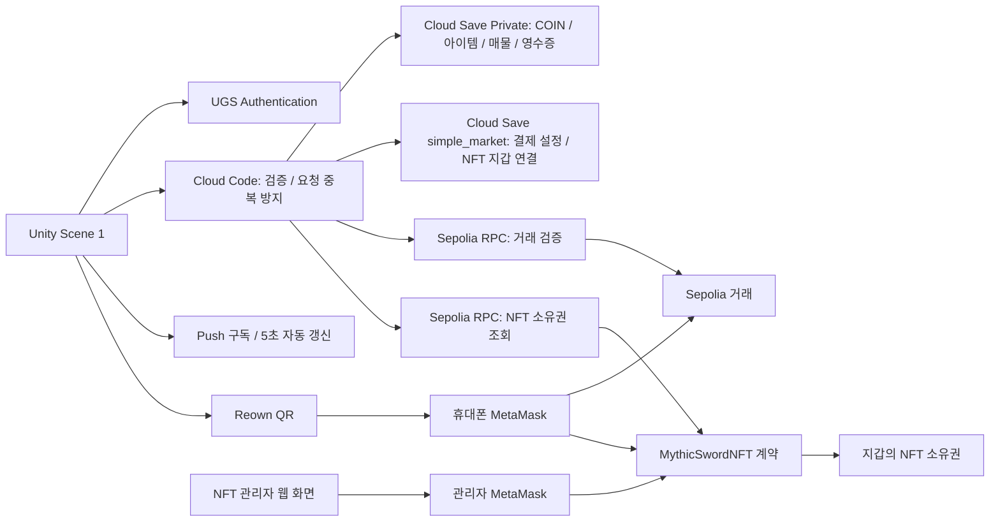

# UGSMarketwithSepoliaETH

현재 코드는 **Authentication + Cloud Save + Cloud Code**로 동작하는 Economy-free v2입니다. Economy 서비스 활성화, Currency/Inventory Item 생성, Economy Configuration Publish는 필요 없습니다.

Unity 6로 만든 **교육용 RPG 아이템 거래소 + Sepolia 지갑 결제 + NFT 쿠폰 실습** 프로젝트입니다.

학생은 GitHub의 **Code → Download ZIP**으로 코드를 내려받아 Unity Editor에서 실행합니다. 학생 간 거래 수업에서는 모두 같은 UGS 프로젝트·환경에 연결하고 게임 계정만 각자 만듭니다. 게임 골드·아이템·거래 기록은 Cloud Save에, 신화검NFT의 소유권은 Sepolia 블록체인에 저장합니다. MetaMask는 결제/NFT 실습 때 연결합니다.

> **실습 기준: `MarketPlaceUGS-main/Assets/Scene/1.unity`, Windows Editor Play, Reown QR + 휴대폰 MetaMask.**
> ZIP만 받으면 클라우드 설정까지 복제되는 것은 아닙니다. 아래 순서로 UGS 프로젝트·Cloud Code·지갑 설정을 준비해야 합니다.

v2 수정일: **2026-09-22**. 구버전은 제작자 환경에서 결제·NFT 연동을 확인했고, v2는 로컬 테스트와 컴파일을 검증했습니다. 실제 UGS 배포와 학생들의 온라인 거래 검증은 별도로 필요합니다. 학생의 새 환경에서는 아래 설정과 완료 체크를 수행합니다.

### 현재 수업 연결값

| 항목 | 값 |
|---|---|
| 새 UGS Project ID | `733a611e-93a2-4be3-aa68-9dd3325fa879` |
| UGS 환경 | `production` |
| Unity 실습 장면 | `MarketPlaceUGS-main/Assets/Scene/1.unity` |
| 거래소 데이터 | Cloud Save → Game Data → `classroom_market` → **Private** → `state` |

로컬 `ProjectSettings/ProjectSettings.asset`의 `cloudProjectId`는 위 ID로 변경되어 있습니다. 이것만으로 Dashboard의 인증 공급자·데이터·서버 함수가 생성되는 것은 아닙니다. Unity Services에서 실제 조직·프로젝트 연결을 확인하고 아래 설정을 완료하세요. 다른 수업에서 사용한다면 담당자가 지정한 Project ID로 연결합니다.

**JS 코드는 Cloud Code에 업로드하고, JSON 초기값은 Cloud Save에 저장합니다.** 프로젝트 안의 모든 `.js` 파일을 업로드하는 것이 아닙니다. 배포할 파일과 파라미터는 9절에 있습니다.

### 처음이라면 이 순서로 진행하세요

| 단계 | 학생이 하는 일 | 완료 기준 |
|---|---|---|
| 1 | 1~4절: 개념·구조·준비물 확인 | 게임 계정, 지갑, 서버의 역할 구분 |
| 2 | 5~9절: ZIP 열기, UGS 리소스와 기본 거래소 서버 8개 배포 | Scene 1 로그인과 기본 데이터 준비 |
| 3 | 10절: 일반 아이템 거래 | 판매·구매·판매대금 수령 확인 |
| 4 | 11~12절: Reown 지갑 연결, 테스트 ETH 결제 | 골드 10000 및 일반 전설검 지급 |
| 5 | 13.1~13.4: NFT 계약·쿠폰·Unity 필드 준비 | 계약 주소와 학생용 쿠폰 확보 |
| 6 | 13.5: NFT 서버 3개 배포, 지갑 서명 연결 | UGS 계정과 지갑의 1:1 연결 |
| 7 | 13.6~13.9: NFT 수령·인벤토리·다른 학생에게 전송 | 보유 시 표시, 전송 후 제거 및 새 소유자 표시 |

메뉴 이름은 Dashboard/MetaMask 버전에 따라 조금 다를 수 있습니다. 이 문서의 **리소스 ID, 함수 이름, 파일 경로, 환경 이름**을 기준으로 대조하세요.

## 목차

- [1. 프로젝트 개요와 구현 상태](#1-프로젝트-개요와-구현-상태)
- [2. 폴더 및 시스템 구조](#2-폴더-및-시스템-구조)
- [3. 강사와 학생의 역할](#3-강사와-학생의-역할)
- [4. 준비물](#4-준비물)
- [5. ZIP 다운로드와 Unity 실행](#5-zip-다운로드와-unity-실행)
- [6. UGS 프로젝트와 회원가입 설정](#6-ugs-프로젝트와-회원가입-설정)
- [7. Economy 없는 수업 구성](#7-economy-없는-수업-구성)
- [8. Cloud Save 초기 설정](#8-cloud-save-초기-설정)
- [9. Cloud Code 배포](#9-cloud-code-배포)
- [10. 기본 거래소 실습](#10-기본-거래소-실습)
- [11. MetaMask와 Reown QR 연결](#11-metamask와-reown-qr-연결)
- [12. 골드와 전설검 결제](#12-골드와-전설검-결제)
- [13. 신화검NFT 발행과 쿠폰 실습](#13-신화검nft-발행과-쿠폰-실습)
- [14. 장애 확인 및 복구 원칙](#14-장애-확인-및-복구-원칙)
- [15. 개발·검증·선택적 WebGL 빌드](#15-개발검증선택적-webgl-빌드)
- [16. 강사용 GitHub 배포 점검](#16-강사용-github-배포-점검)
- [17. 완료 체크와 후속 과제](#17-완료-체크와-후속-과제)

## 1. 프로젝트 개요와 구현 상태

### 1.1 무엇을 배우는가

1. Unity Authentication의 회원가입·로그인
2. Cloud Save의 서버 전용 골드와 인벤토리 관리
3. Cloud Code를 통한 아이템 매물 등록·구매·판매 대금 정산
4. Unity에서 QR로 외부 MetaMask 지갑 연결
5. 테스트 ETH 입금을 서버에서 검증한 후 게임 재화 지급
6. ERC-721 NFT 계약 배포, 지갑 지정 쿠폰 등록 및 사용
7. 메시지 서명으로 지갑 소유자를 확인하고 게임 계정에 연결하는 방법
8. 서버가 NFT 보유 여부를 확인해 인벤토리를 추가·제거하는 방법
9. 재시도·중복 지급 방지·오류 복구와 게임 데이터/블록체인 소유권의 차이

이 프로젝트는 완성된 전투 RPG가 아니라 **게임 경제와 외부 지갑을 연결하는 실습용 상점**입니다. 현재 화면에서 로그인, 재화 조회, 아이템 거래, 결제, NFT 쿠폰 사용을 공부합니다. 무기 장착·공격·전투 판정은 별도 구현 과제입니다.

### 알아둘 용어

| 용어 | 이 프로젝트에서의 의미 |
|---|---|
| UGS | Unity Gaming Services. 계정·인벤토리·서버 코드를 제공하는 서비스 |
| Player ID | 게임 로그인 계정의 고유 ID. 지갑 주소와 다름 |
| 지갑 주소 | NFT/테스트 ETH를 받는 `0x...` 공개 주소 |
| Sepolia | Ethereum 테스트 네트워크. 이 실습은 메인넷을 사용하지 않음 |
| 가스비 | 블록체인에 배포·발행·전송 거래를 기록할 때 필요한 테스트 ETH 수수료 |
| RPC | 서버가 블록체인의 거래·소유권을 읽는 통신 창구 |
| 계약 주소 | 배포한 NFT 프로그램의 주소. 관리자 개인 지갑 주소와 다름 |
| tokenId | **해당 계약 안에서** NFT 한 개를 구분하는 번호. 계약 주소와 함께 식별 |
| txHash | 승인 후 전송된 거래의 식별자. 오류 확인·지급 확인에 사용 |
| Publish | Dashboard의 수정본을 게임이 호출하는 실행 버전으로 발행 |

### 1.2 상품 세 가지의 차이

| 구분 | 10,000골드 | 전설검 | 신화검NFT |
|---|---|---|---|
| 지급 위치 | UGS Cloud Save COIN | UGS Cloud Save 인벤토리 | Sepolia NFT 계약 |
| 획득 | 0.0001 Sepolia ETH 결제 | 0.0001 Sepolia ETH 결제 | 관리자 쿠폰 또는 관리자 직접 발행 |
| 별도 가스비 | 있음 | 있음 | 발행·전송 시 있음 |
| MetaMask NFT 목록 | 없음 | 없음 | 계약 주소·tokenId로 확인 가능 |
| 게임 리소스 ID | `COIN` | `LEGENDARY_SWORD` | `MYTHIC_SWORD_NFT`로 인벤토리 연동 |
| 지갑 간 전송 | 게임 골드 자체는 불가능 | 일반 게임 아이템 자체는 불가능 | 가능 |

**Sepolia ETH, 게임 COIN, NFT는 서로 다른 자산입니다.** NFT 발행 가스비는 상점 매출이 아닙니다. UGS의 `production`은 서비스 환경 이름이며 Ethereum 메인넷이라는 뜻이 아닙니다.

### 1.3 현재 구현과 검증 범위 — 2026-09-22

| 항목 | 상태 |
|---|---|
| 인증·골드·인벤토리 | Username/Password 로그인, 최초 1회 1000 COIN, Cloud Save 조회 |
| 판매·구매·취소·정산 | 자산과 거래 기록을 같은 값에 저장, 동시 구매·중복 요청 테스트 통과 |
| 거래소 갱신 | 기본 5초 자동 조회, 선택적 C# Push 모듈로 변경 알림 |
| 골드·전설검 결제 | Sepolia 검증 유지, 지급과 영수증을 Cloud Save에 함께 저장하는 테스트 통과 |
| NFT 연동 | 기존 계약·쿠폰 흐름 유지, 소유권을 확인해 Cloud Save 인벤토리 추가/삭제 |
| 로컬 검증 | 서버·지갑·NFT 테스트 69개 통과, Unity 런타임/Editor 소스 컴파일 및 Push 모듈 패키징 성공 |
| 새 UGS 프로젝트 실습 | 인증·Cloud Save·Cloud Code 배포 및 두 클라이언트 온라인 검증은 별도 수행 필요 |

Scene 1의 Add Coin과 Random Item은 서버에서 제어하는 수업용 지급 기능입니다. demoEnabled 설정과 계정별 100회 한도를 적용합니다. SimpleMarket의 가챠는 100 COIN을 차감합니다. 거래는 하나의 Cloud Save 값에 원자적으로 저장하며 수업 규모의 용량·동시성 한도가 있습니다.

## 2. 폴더 및 시스템 구조

### 2.1 저장소에서 열어야 할 폴더

```text
UGSMarketwithSepoliaETH/                 ← 저장소 최상위, 이 README
├─ MarketPlaceUGS-main/                  ← Unity Hub에 추가할 프로젝트
│  ├─ Assets/Scene/0.unity               ← 원본 거래소 참고 장면
│  ├─ Assets/Scene/1.unity               ← 이 수업의 실제 실습 장면
│  ├─ Assets/Scripts/MarketPlace/        ← 거래소 UI·서버 호출·자동 갱신
│  ├─ Assets/Scripts/UGSTest/            ← 초기화·회원가입·로그인
│  ├─ Assets/Scripts/SimpleMarket/       ← 지갑·골드·전설검·NFT UI
│  ├─ Assets/Editor/                    ← UI 연결 메뉴
│  ├─ Assets/Plugins/WebGL/             ← 브라우저 MetaMask 연결
│  ├─ Assets/Data/Market/               ← 아이템 이름·아이콘·기본 판매가
│  ├─ Packages/                        ← Unity 패키지 명세
│  ├─ ProjectSettings/                 ← Unity 설정
│  ├─ js/Mkt_*.txt                     ← deploy/Mkt_*.js와 동일한 복사본
│  ├─ CloudCode/src/                   ← 공통 거래소·결제 서버 원본
│  ├─ CloudCode/deploy/                ← 빌드된 서버 코드
│  ├─ CloudCode/classroom-state.json    ← 새 거래소 Private state 초기값
│  ├─ CloudCode/MarketNotifications/    ← 선택적 실시간 알림 C# 모듈·.ccm
│  ├─ CloudCode/*_COPY_ALL.txt          ← Dashboard 전체 복사용 코드
│  ├─ CloudCode/nft/                   ← NFT 계정 연결·인벤토리 동기화 원본
│  ├─ CloudCode/nft/deploy/            ← NFT 함수 3개의 실행·복사용 파일
│  └─ NFTWorkshop/                     ← NFT 계약·웹 도구·로컬 테스트
├─ archive/                             ← 이전 골드 코드 보관 (배포 금지)
└─ AI_HANDOFF.md                        ← AI용 구조·배포·주의사항 요약
```

이전 Embedded Wallet 참고 문서와 중복 안내는 저장소 밖 문서 백업에 보관했습니다. 현재 구성은 Reown으로 휴대폰 MetaMask에 연결하는 방식입니다.

### 2.2 전체 연결도



NFT 계약과 Cloud Save 인벤토리 사이의 동기화는 `Nft_GetChallenge → Nft_BindWallet → Nft_SyncInventory`로 연결합니다. 첫 지갑 서명 연결 후 로그인·Refresh에서 보유 항목을 추가하고 전송된 항목을 제거합니다. **13.5절의 서버 설정이 필요합니다.** 화면에 지갑 주소만 표시된 상태와 서버에 서명으로 연결한 상태는 다릅니다.

### 먼저 읽을 클라이언트 코드

아래 네 폴더의 C#은 총 18개입니다. Cloud Code에 올리는 JS 함수 수와는 별개입니다. 배포 서버는 **거래소 8 + 결제 4 + NFT 3 = JS 15개**, 선택적 Push는 **C# 모듈 1개**입니다. 모든 경로는 `MarketPlaceUGS-main/` 기준입니다.

| 폴더 | 파일 | 읽을 내용 |
|---|---|---|
| Assets/Scripts/MarketPlace | PortfolioMarketDemo.cs | 전체 Refresh, Cloud Save 조회, 매물 등록/구매/Claim |
| 같은 폴더 | MarketCloudClient.cs | 플레이어 조회, 쓰기 요청 ID 생성·저장·재시도 |
| 같은 폴더 | MarketLiveUpdates.cs | Push 구독, 5초 자동 갱신, 연결 해제 처리 |
| 같은 폴더 | InventoryRowUI.cs | 인벤토리 한 줄과 NFT Sell 제한 |
| 같은 폴더 | MarketRowUI.cs | 거래소 한 줄, Buy/cancel |
| 같은 폴더 | ItemVisualData.cs | 리소스 ID ↔ 이름·아이콘·가격 |
| 같은 폴더 | UgsDiagnostics.cs | 프로젝트/로그인 상태 진단 |
| Assets/Scripts/UGSTest | UnityServiceInit.cs | UGS 초기화 |
| 같은 폴더 | UserNamePw.cs | Signup/Login 및 로그인 후 목록 갱신 |
| 같은 폴더 | CloudSaveTest.cs | 이전 예제 버튼을 새 서버 조회·수업 지급 함수에 연결 |
| Assets/Scripts/SimpleMarket | SceneWalletPanel.cs | 골드·전설검 견적/결제/확인 |
| 같은 폴더 | ReownWalletBridge.cs | QR 세션, 송금, NFT redeem, personal_sign |
| 같은 폴더 | WebGlWallet.cs | 브라우저 지갑 브리지 |
| 같은 폴더 | MythicNftPanel.cs | 쿠폰 상태·NFT 연결·서버 동기화 |
| 같은 폴더 | SimpleMarketApp.cs | 별도 자동 생성 SimpleMarket 장면용 |
| Assets/Editor | SceneWalletSetup.cs | 기존 WalletPanel 필드 연결 |
| 같은 폴더 | MythicNftSetup.cs | 기존 NFT 패널 필드 연결 |
| 같은 폴더 | SimpleMarketSetup.cs | 별도 예제 생성/빌드 메뉴, Scene 1 실습에서는 사용하지 않음 |

### 2.3 주요 코드 역할

| 파일/컴포넌트 | 역할 |
|---|---|
| `UnityServiceInit`, `UserNamePw` | UGS 초기화, Username/Password 인증 |
| `PortfolioMarketDemo` | 골드·인벤토리·매물 조회, 판매·구매·정산 버튼 |
| `SceneWalletPanel` | 골드/전설검 견적 요청, 지갑 호출, 지급 확인, UI 갱신 |
| `ReownWalletBridge` | Editor에서 AppKit 초기화·QR 연결·Sepolia 전송 |
| `WebGlWallet` + `SimpleMarketWallet.jslib` | WebGL 브라우저 MetaMask 요청·응답 |
| `SceneWalletSetup` | 기존 WalletPanel의 버튼과 텍스트 자동 연결 |
| `MarketCloudClient`, `MarketLiveUpdates` | Cloud Code 호출·중복 요청 식별·자동 화면 갱신 |
| `CloudCode/src/cloud-store.js` | Private 상태 읽기, writeLock 충돌 재시도, 계정·용량 한도 |
| `CloudCode/src/cloud-market.js` | 판매 등록·구매·취소·정산·가챠·수업 지급 |
| `CloudCode/src/core.js` | Sepolia 거래 검증, 상품·계정 결합, 결제 확인 |
| `CloudCode/src/cloud-adapter.js` | Cloud Save SDK 및 RPC 호출 |
| `CloudCode/build.js` | 공유 소스를 단독 실행 가능한 Dashboard 파일로 생성 |
| `CloudCode/MarketNotifications/Notifications.cs` | 서버에서 revision을 조회하고 MarketChanged 알림 전송 |
| `MythicSwordNFT.sol` | ERC-721 소유권, 쿠폰·발행·전송 규칙 |
| `NFTWorkshop/web` | 관리자 배포·쿠폰 등록, 학생 수령·보유 조회·전송 |
| `MythicNftPanel` | Unity QR 쿠폰 사용·서명 연결·NFT 인벤토리 동기화 |
| `CloudCode/nft/core.cjs` | 일회성 서명·지갑 연결·소유권 기반 추가/삭제 |
| `CloudCode/nft/adapter.cjs` | NFT 동기화의 Cloud Save/RPC 호출 |

`CloudCode/src/adapter.js`에는 구버전 Economy 어댑터가 회귀 테스트용으로 남아 있지만, 현재 `build.js`는 `cloud-adapter.js`를 사용합니다. Dashboard에는 원본 조각이나 테스트 파일을 올리지 않고 `deploy`의 완성된 파일을 사용합니다.

### 2.4 데이터 저장 위치

| 저장 위치 | 내용 | ZIP 포함 여부 |
|---|---|---|
| Authentication | 게임 계정과 Player ID | 미포함 |
| Cloud Save `classroom_market` Private `state` | COIN, 아이템, 매물, 정산, 요청·결제 기록 | 초기값만 포함 |
| Cloud Save `simple_market` Default `config` | 수신 공개 주소·금액·RPC·확인 수 | 문서에 JSON 예시 포함 |
| Cloud Save `simple_market` Default `nft_config` | 조회할 NFT 계약 주소와 RPC | 문서에 JSON 예시 포함 |
| Cloud Save `simple_market` Default `nft_state` | 계정↔지갑 연결, 일회성 서명 요청, 동기화 잠금 | 문서에 JSON 예시 포함 |
| PlayerPrefs / 브라우저 localStorage | 로컬 미확인 거래 참조 | 새 PC에 자동 이전되지 않음 |
| Sepolia | 송금 기록, NFT 계약·소유권·쿠폰 사용 여부 | 체인에 존재, ZIP과 별개 |
| NFT 웹 브라우저 localStorage | 최근 계약 주소·쿠폰 초안·거래 해시 | 브라우저별 별도 |

새 환경에는 `market/active_listings`나 `simple_market/Default/state`를 만들지 않습니다. 이들은 구버전 데이터입니다. 기존 환경에 이미 있다면 삭제하지 않으며, `cloud-adapter.js`는 옛 결제 기록을 읽어 재지급을 막습니다. 새 거래 기록은 전부 `classroom_market/Private/state`에 들어갑니다.

### 2.5 골드·전설검 지급 흐름

1. 게임 로그인 후 Cloud Code에서 상품 견적을 받습니다.
2. 견적의 송금 data에는 상품·UGS 프로젝트·환경·플레이어 구분 정보가 들어갑니다.
3. 학생이 MetaMask에서 0.0001 Sepolia ETH와 가스비를 승인합니다.
4. 서버가 chain ID, 송신/수신 주소, 금액, data, 거래 성공, 블록 확인 수를 검증합니다.
5. Cloud Save Private 상태에 지급 자산과 `GRANTED` 영수증을 같은 writeLock 저장으로 반영합니다.
6. Unity가 잔액·인벤토리를 갱신하고 해당 로컬 미확인 기록을 정리합니다.

골드와 전설검은 결제 메모·로컬 기록·확인 버튼이 구분됩니다. 골드 거래 해시로 전설검을 청구할 수 없습니다. v2 지급과 영수증은 하나의 저장으로 처리하며 응답 유실 후 동일 거래 해시 재확인이 가능합니다. 구버전 결제는 자동 이관하지 않으며 `REVIEW_REQUIRED`이면 관리자 확인이 필요합니다.

### 2.6 NFT 쿠폰 흐름

1. 관리자가 신화검NFT 계약을 배포합니다.
2. 웹 도구가 랜덤 쿠폰 비밀값을 생성합니다.
3. 관리자가 비밀값의 해시, 수령 지갑 주소, 유효기간을 계약에 등록합니다.
4. 학생에게 쿠폰 전체 문자열을 전달합니다.
5. 학생 지갑이 `redeem` 거래를 승인합니다. 상품 가격은 0 ETH이고 가스비만 필요합니다.
6. 계약이 지정 지갑·기한·취소/사용 여부·발행 한도를 검사해 NFT 1개를 발행합니다.
7. 같은 쿠폰은 다시 사용할 수 없습니다. 발행된 NFT는 별도로 전송 가능합니다.

이번 버전은 **서버 서명형 쿠폰이 아닌 관리자 온체인 등록형 쿠폰**입니다. 관리자 개인 키를 UGS나 Unity에 저장하지 않으며, 쿠폰 등록에도 관리자 가스비가 듭니다.

## 3. 강사와 학생의 역할

### 3.1 기본 진행: 같은 거래소에서 학생 간 거래

강사가 새 UGS 프로젝트의 `production`에 6~9절을 한 번 설정합니다. 학생은 같은 프로젝트에 연결된 Unity 클라이언트를 실행하고, 각자 Signup으로 다른 게임 계정을 만듭니다. 현재 수업 Project ID는 문서 상단의 `733a611e-93a2-4be3-aa68-9dd3325fa879`입니다.

학생이 Unity Editor에서 공용 프로젝트를 선택하려면 필요한 멤버 초대·권한을 강사가 관리합니다. Project ID만으로 Dashboard 관리 권한이 생기지는 않습니다. 공용 환경에서는 학생마다 초기값을 덮어쓰거나 서버 코드를 따로 Publish하지 않습니다.

### 3.2 학생별 독립 구축 실습

각자 새 UGS 프로젝트를 만들고 6~9절을 수행할 수도 있습니다. 이 경우 학생별 거래소는 분리되므로 다른 프로젝트의 학생 매물은 보이지 않습니다. 각 프로젝트에 A/B 게임 계정을 만들어 거래를 테스트합니다.

### 3.3 역할표

| 강사 | 학생 |
|---|---|
| 실습 브랜치/태그와 Unity 버전 지정 | 지정한 ZIP 다운로드 |
| 독립/공용 UGS 방식 결정 | 해당 방식에 맞춰 연결 |
| 수신 지갑·NFT 관리자 지갑 관리 | 자신의 구매/수령 지갑 관리 |
| 공용 NFT 계약 배포와 쿠폰 발급 가능 | 자기 주소의 쿠폰 수령 |
| 테스트 환경·사용량·오류 복구 관리 | 거래 해시 보관, 결과 검증 |

## 4. 준비물

| 준비물 | 기준 |
|---|---|
| Windows PC, 인터넷 | 현재 실습·검증 기준 |
| Unity Hub와 활성 라이선스 | Unity 계정 로그인 필요 |
| Unity Editor | **6000.3.18f1 (Unity 6.3)**, `ProjectVersion.txt` 기준 |
| Unity/UGS 계정 | 독립 실습이면 본인 프로젝트 생성 권한 |
| Reown 계정과 Project ID | QR 연결용, UGS Project ID와 다름 |
| 휴대폰 MetaMask | Editor QR 연결·결제·NFT 수령 |
| PC Chrome + MetaMask 확장 | NFT 관리자 웹 도구 |
| Sepolia 테스트 ETH | 구매 금액 및 배포·등록·발행 가스비 |
| Node.js + npm | NFT 도구 실행. 개발 검증은 Node 24.18.0 |
| Git | ZIP 다운로드에는 필요 없음 |
| WebGL Build Support | 브라우저 빌드 시에만 선택 설치 |

프로젝트 패키지에는 Reown AppKit Unity **1.7.1**, Cloud Code **2.10.2**, Cloud Save **3.4.0** 등이 선언돼 있습니다. Economy **3.5.3** 패키지 선언도 남아 있지만 현재 게임 스크립트는 Economy API를 사용하지 않으며 서비스 활성화가 필요하지 않습니다. 패키지의 최종 기준은 [manifest.json](MarketPlaceUGS-main/Packages/manifest.json)과 lock 파일입니다.

### 실습 전에 채워 둘 설정표

| 항목 | 학생/강사가 기록할 값 | 넣는 위치 |
|---|---|---|
| 압축 해제한 경로 | 본인 PC의 MarketPlaceUGS-main 폴더 | Unity Hub |
| UGS 조직·프로젝트 | 본인 또는 강사 승인 프로젝트 | Unity Project Settings → Services |
| 현재 수업 Project ID | `733a611e-93a2-4be3-aa68-9dd3325fa879` | ProjectSettings의 cloudProjectId와 대조 |
| UGS 환경 | production | Dashboard의 모든 서비스 |
| Reown Project ID | Reown에서 발급한 ID | WalletPanel → Reown Wallet Bridge |
| 구매자 공개 지갑 주소 | 학생 휴대폰 MetaMask 주소 | 연결 후 화면과 비교 |
| 상점 수신 공개 주소 | 구매용 MetaMask와 별도 지갑 | simple_market/config.receiverAddress |
| NFT 관리자 공개 주소 | 계약 배포 지갑 | NFT 웹 도구 연결 계정 |
| NFT 계약 주소 | 배포 후 받은 주소 | 웹 계약 칸·Mythic Nft Contract |

**새 학생 환경으로 바꿀 때 위 값은 자동 생성되지 않습니다.** 제작자 PC의 경로·Project ID·수신 주소를 그대로 따라 쓰지 말고 이 표의 값과 대조합니다.

## 5. ZIP 다운로드와 Unity 실행

1. 강사가 안내한 GitHub 저장소를 엽니다.
2. 강사가 지정한 브랜치/태그를 선택합니다.
3. 초록색 **Code → Download ZIP**을 누릅니다.
4. ZIP을 모두 압축 해제합니다. ZIP 안에서 프로젝트를 직접 열지 않습니다.
5. 가능하면 `C:/UnityLabs/UGSMarketwithSepoliaETH`처럼 짧은 경로를 사용합니다. 바깥 폴더 이름에 `-main`이 붙어도 괜찮습니다.
6. 안쪽 **MarketPlaceUGS-main**에 `Assets`, `Packages`, `ProjectSettings` 세 폴더가 있는지 확인합니다.
7. Unity Hub → Projects → Add/Add project from disk에서 **MarketPlaceUGS-main**을 선택합니다. 저장소 최상위나 Assets만 선택하지 않습니다.
8. Editor 버전을 6000.3.18f1로 선택합니다. 없으면 Hub에서 해당 버전을 설치합니다.
9. 프로젝트를 열고 패키지 복원과 첫 임포트가 끝날 때까지 기다립니다. ZIP에는 보통 Library 캐시가 없습니다.
10. Console의 빨간 컴파일 오류부터 해결합니다. SDK 다운로드 중에는 버튼 실습을 시작하지 않습니다.
11. Project 창에서 **Assets → Scene → 1**을 더블클릭합니다.
12. File → Build Profiles에서 활성 플랫폼을 **Windows**로 둡니다.
13. Scene이 정상적으로 보이면 Ctrl+S로 저장합니다.

**`Simple Market → 1. Create or Open Test Scene`은 이번 실습에서 실행하지 않습니다.** 별도 SimpleMarket 예제 장면을 만드는 메뉴입니다. 두 화면 모두 v2 서버를 사용하지만 이번 수업은 Scene 1을 기준으로 합니다.

참고: [GitHub 소스 ZIP 다운로드](https://docs.github.com/en/repositories/working-with-files/using-files/downloading-source-code-archives).

## 6. UGS 프로젝트와 회원가입 설정

1. [Unity Dashboard](https://cloud.unity.com/)에 본인 Unity 계정으로 로그인합니다.
2. 현재 수업은 Project ID **733a611e-93a2-4be3-aa68-9dd3325fa879**인 새 프로젝트를 선택합니다. 독립 구축 실습에서만 별도 프로젝트를 생성합니다.
3. Dashboard의 환경은 **production**으로 선택합니다. 새 프로젝트의 production을 사용하면 되며 같은 이름의 환경을 추가로 만들 필요는 없습니다.
4. Player Authentication/Authentication에서 **Username & Password** 공급자를 활성화하고 저장합니다. 여기서 설정하는 것은 플레이어 로그인 방식이며, 인증서 파일을 발급받아 넣는 과정이 아닙니다.
5. Unity Editor → Edit → Project Settings → Services에서 동일 조직·프로젝트를 선택해 연결합니다. 표시 이름에 이전 정보가 남아 있으면 실제 Project ID를 기준으로 확인합니다.
6. Scene 1의 `UnityServiceInit.cs`는 `MarketCloudClient.EnvironmentName`(기본값 `production`)을 명시해 초기화합니다. 로그인과 회원가입은 초기화 완료를 기다립니다. `SimpleMarketApp`은 별도 예제 장면용이므로 해당 컴포넌트의 값만 바꿔도 Scene 1의 환경은 바뀌지 않습니다.
7. WalletPanel의 Environment Name은 결제 기록 구분에도 사용합니다. 수업에서는 모두 production으로 맞춥니다. 다른 환경을 쓴다면 UGS 초기화와 `MarketCloudClient.EnvironmentName`, 지갑 기록의 환경 이름도 함께 맞춥니다.
8. 8절 Cloud Save와 9절 거래소 서버를 설정합니다. 이후 게임 화면의 Signup/Login으로 새 게임 계정을 만듭니다. 이전 UGS 프로젝트의 게임 계정이 새 프로젝트로 복사되는 것은 아닙니다.

Username & Password를 활성화하는 것과 플레이어의 회원가입은 별개입니다. Signup 성공 시 자동 로그인되어 실습 화면에 진입합니다. 이미 만든 계정은 Login을 사용합니다. 인증 처리 중에는 두 버튼을 잠시 비활성화합니다. 기본 지급은 Authentication 설정이 아니라 `Mkt_GetPlayer`가 처음 계정 데이터를 만들 때 수행합니다.

현재 게임의 비밀번호 검사는 **8~30자, 영문 대문자·소문자·숫자·특수문자 각 1개 이상**입니다. 실습 계정에도 다른 서비스에서 쓰는 비밀번호를 재사용하지 않습니다.

[Unity Username & Password 공식 안내](https://docs.unity.com/en-us/authentication/platform-signin/username-password).

## 7. Economy 없는 수업 구성

2026-09-22 수정본은 **Economy 활성화·상품 등록·Publish가 필요 없습니다.** Authentication, Cloud Save, Cloud Code를 사용합니다. Unity는 2026-09-08부터 Economy 신규 프로젝트 등록을 중단했습니다. [공식 안내](https://docs.unity.com/en-us/economy)

학생끼리 거래하려면 **같은 UGS Project ID + 같은 production 환경 + 서로 다른 게임 계정**으로 실행합니다. 각자 다른 UGS 프로젝트를 만들면 거래소도 별개입니다.

처음에는 새 수업용 프로젝트/환경을 사용하세요. 기존 강사 Economy 잔액·인벤토리·매물은 자동 이관하지 않습니다. 기존 Cloud Save `market`, `simple_market/state`를 삭제하거나 초기화하지 않습니다. 이전 결제 영수증은 재지급하지 않고 확인 대상으로 남깁니다. 기존 서비스와 새 서비스를 같은 환경에서 동시에 쓰는 전환은 지원하지 않습니다.

## 8. Cloud Save 초기 설정

### 8.1 거래소 상태 — 필수

1. Dashboard에서 수업 프로젝트와 **production**을 선택합니다.
2. Cloud Save → **Game Data** → Add Custom Item을 엽니다.
3. Custom Item ID: **`classroom_market`**.
4. Access Class: **Private**. Default나 Player Data에 만들지 않습니다.
5. Key: **`state`**, Value: 아래 **JSON 객체**. 문자열로 감싸지 않습니다.

```json
{
  "version": 2,
  "revision": 0,
  "demoEnabled": true,
  "players": {},
  "listings": {},
  "operations": {},
  "payments": {}
}
```

같은 내용은 `MarketPlaceUGS-main/CloudCode/classroom-state.json`에 있습니다. **신규 환경에서 최초 한 번만 저장**합니다. 수업 중 초기값으로 덮어쓰면 학생 자산과 중복 지급 방지 기록이 사라집니다.

[classroom-state.json 열기](MarketPlaceUGS-main/CloudCode/classroom-state.json). 서버는 초기값이 없을 때 자동으로 빈 상태를 덮어쓰지 않고 `SETUP_REQUIRED`를 반환합니다. 먼저 Dashboard에서 저장을 완료해야 합니다.

첫 로그인 시 학생에게 1,000 COIN을 한 번 지급합니다. Add Coin은 +100, Random Item은 일반 아이템 1개이며, 두 버튼을 합쳐 계정당 100회까지 제공합니다. `demoEnabled: false`로 바꾸면 두 지급 버튼의 서버 요청을 차단합니다. 가챠는 100 COIN을 사용합니다. 일반 검·포션·전설검은 거래 가능하며 신화검NFT는 지갑으로 전송합니다.

잔액, 인벤토리, 판매 상태, 정산 기록은 **한 JSON 값을 writeLock과 함께 저장**합니다. 동시 구매 중 한 요청만 성공하며, 다른 요청은 최신 상태로 재검증합니다. 요청 ID와 처리 결과도 함께 저장하므로 응답 유실 후 같은 요청을 재시도해도 중복 차감·지급하지 않습니다.

이 구현의 자체 제한은 최대 200계정, 상태 JSON 4,000,000바이트 이하입니다. 결제 견적은 공간 여유를 두기 위해 3,800,000바이트를 넘으면 거절합니다. 한 값에 쓰기가 집중되므로 대규모/고빈도 거래소용 설계는 아닙니다. `BUSY`는 동일 요청 재시도, `LEDGER_FULL`/`CLASSROOM_FULL`은 강사가 환경 및 용량을 점검합니다. 공간 확보를 위해 영수증이나 요청 기록을 임의 삭제하지 않습니다.

로그인 후 Dashboard에서 `state.players` 아래 실제 Player ID가 생겼는지 확인할 수 있습니다. 그 아래 `balance`는 코인, `items`는 인벤토리입니다. `listings`는 매물·정산 상태, `operations`는 중복 요청 기록, `payments`는 결제 영수증입니다. Private 데이터이므로 클라이언트는 이 JSON 전체를 읽거나 직접 수정하지 않고 Cloud Code로 본인 정보와 판매 목록을 조회합니다.

### 8.2 Sepolia 결제 설정 — 결제 실습 시

기본 거래소만 실습하면 이 단계와 지갑/NFT 설정을 나중에 해도 됩니다.

Cloud Save → Game Data → Custom Item **`simple_market`**, **Default**에 `config`를 추가합니다.

```json
{
  "receiverAddress": "여기를_수신용_0x공개주소로_교체",
  "rpcUrl": "https://ethereum-sepolia-rpc.publicnode.com",
  "priceWei": "100000000000000",
  "goldAmount": 10000,
  "confirmations": 3
}
```

구매자와 다른 일반 수신 지갑을 사용합니다. Default 데이터는 플레이어가 읽을 수 있으므로 비밀키나 비공개 RPC 키를 넣지 않습니다. 새 결제 기록은 `classroom_market/Private/state`에 자산과 함께 저장됩니다. 기존 `simple_market/state`가 있으면 **보존**하세요. 구버전에서 지급된 결제를 새 버전에서 다시 받는 용도로 사용하지 않습니다.

## 9. Cloud Code 배포

### 9.1 JavaScript 서버

`CloudCode/deploy/*.js`가 기준입니다. `js/Mkt_*.txt`는 같은 코드의 복사본으로 통일했습니다. 새 클라이언트와 **새 서버를 한 세트로** 사용합니다. 구버전 서버와 섞지 않습니다.

기본 거래소 8개, 결제 4개, NFT 3개입니다. 기본 거래소부터 실습하려면 우선 8개를 배포하세요.

| 업로드 순서·함수 이름 | 전체 복사할 파일 | 파라미터 |
|---|---|---|
| 1. `Mkt_GetPlayer` | [Mkt_GetPlayer.js](MarketPlaceUGS-main/CloudCode/deploy/Mkt_GetPlayer.js) | 없음 |
| 2. `Mkt_GetActiveListings` | [Mkt_GetActiveListings.js](MarketPlaceUGS-main/CloudCode/deploy/Mkt_GetActiveListings.js) | `limit`: Numeric 선택, `sort`: String 선택 |
| 3. `Mkt_GrantDemo` | [Mkt_GrantDemo.js](MarketPlaceUGS-main/CloudCode/deploy/Mkt_GrantDemo.js) | `kind`: String 필수, `request_id`: String 필수 |
| 4. `Mkt_Gacha` | [Mkt_Gacha.js](MarketPlaceUGS-main/CloudCode/deploy/Mkt_Gacha.js) | `request_id`: String 필수 |
| 5. `Mkt_CreateListing` | [Mkt_CreateListing.js](MarketPlaceUGS-main/CloudCode/deploy/Mkt_CreateListing.js) | `players_inventory_item_id`: String 필수, `price`: Numeric 필수, `currency_id`: String 선택, `request_id`: String 필수 |
| 6. `Mkt_BuyListing` | [Mkt_BuyListing.js](MarketPlaceUGS-main/CloudCode/deploy/Mkt_BuyListing.js) | `listing_id`: String 필수, `request_id`: String 필수 |
| 7. `Mkt_CancelListing` | [Mkt_CancelListing.js](MarketPlaceUGS-main/CloudCode/deploy/Mkt_CancelListing.js) | `listing_id`: String 필수, `request_id`: String 필수 |
| 8. `Mkt_ClaimEarnings` | [Mkt_ClaimEarnings.js](MarketPlaceUGS-main/CloudCode/deploy/Mkt_ClaimEarnings.js) | `currency_id`: String 선택, `request_id`: String 필수 |
| 9. `Gold_GetQuote` | [Gold_GetQuote.js](MarketPlaceUGS-main/CloudCode/deploy/Gold_GetQuote.js) | 없음 |
| 10. `Gold_Claim` | [Gold_Claim.js](MarketPlaceUGS-main/CloudCode/deploy/Gold_Claim.js) | `tx_hash`: String 필수 |
| 11. `Sword_GetQuote` | [Sword_GetQuote.js](MarketPlaceUGS-main/CloudCode/deploy/Sword_GetQuote.js) | 없음 |
| 12. `Sword_Claim` | [Sword_Claim.js](MarketPlaceUGS-main/CloudCode/deploy/Sword_Claim.js) | `tx_hash`: String 필수 |

위 파일은 생성되어 있으므로 처음 설정할 때 Node.js 빌드 없이 전체를 복사해도 됩니다. 함수 이름에는 `.js`나 `.txt` 확장자를 넣지 않습니다. 파일 간 배포 순서가 실행을 제어하는 것은 아니며, 실습을 시작하기 전에 사용할 함수가 모두 Publish되어 있어야 합니다.

`Mkt_Gacha`는 별도 SimpleMarket 화면의 유료 뽑기에 쓰이며, Scene 1의 Random Item 버튼은 `Mkt_GrantDemo`를 호출합니다. 위 8개를 배포하면 두 화면의 거래소 기능을 모두 준비할 수 있습니다.

1. Dashboard → Cloud Code → JS Scripts에서 위 이름으로 스크립트를 생성합니다.
2. 해당 `CloudCode/deploy/함수이름.js` 전체를 복사합니다.
3. 기본 샘플 코드를 전부 교체하고 위 파라미터를 설정합니다. [parameters.json](MarketPlaceUGS-main/CloudCode/deploy/parameters.json)에서도 확인할 수 있습니다.
4. **Save Script → Publish Version**을 완료합니다. Working Copy 저장만으로는 적용되지 않습니다.
5. Unity와 같은 프로젝트·환경의 Live 버전인지 확인합니다.

`request_id`는 클라이언트가 생성하고 로컬에 보관합니다. 응답이 불확실한 요청은 같은 버튼/같은 인수로 재시도합니다. 실패 직후 로컬 PlayerPrefs를 지우지 않습니다. 게임 Player ID와 서비스 토큰은 Cloud Code context에서 가져오므로 코드에 계정 비밀값을 넣지 않습니다.

파라미터 값은 코드에서 다음과 같이 사용합니다.

- `kind`: Add Coin은 `coin`, Random Item은 `item`.
- `currency_id`: 생략하거나 `COIN`. 다른 통화는 거부됩니다.
- `price`: 1~1,000,000 정수.
- `sort`: `NEWEST`, `PRICE_ASC`, `PRICE_DESC`. `limit`은 기본 30이며 서버에서 1~100으로 제한합니다.
- `listing_id`와 `players_inventory_item_id`: 서버에서 받은 실제 ID. 아이템 종류인 `SWORD`와 인스턴스 ID는 다릅니다.

Dashboard의 Run은 Publish를 대신하지 않습니다. 실제 플레이어 인증 context가 필요한 함수이므로 최초 동작 확인은 Unity 게임에서 로그인 후 수행합니다. `build.js`, `src/`, 테스트 JS, `NFTWorkshop/web/` 파일은 Cloud Code 함수로 업로드하지 않습니다.

### 9.2 실시간 알림

클라이언트는 기본적으로 **5초마다 자동 갱신**합니다. 아래 Push 모듈까지 배포하면 거래 완료 시 다른 학생 화면이 알림을 받아 갱신됩니다. 알림은 저장 결과를 알려주는 신호이며 자산 변경 권한은 없습니다. 연결 복구와 알림 누락은 주기 조회로 보완합니다.

모듈 원본: `CloudCode/MarketNotifications/`. 모듈 이름은 반드시 **`MarketNotifications`**, 함수는 **`NotifyChanged`**, 파라미터는 없습니다. 모듈은 서버 상태의 revision을 조회해 변경 알림만 전송합니다. 학생이 임의 메시지나 다른 학생 잔액을 전달할 수 없습니다. 알림 중복 제한은 모듈 인스턴스별이며 전역 전송 보장은 아닙니다.

배포용 [MarketNotifications.ccm](MarketPlaceUGS-main/CloudCode/MarketNotifications/MarketNotifications.ccm)이 포함되어 있습니다. 소스를 수정했다면 프로젝트 루트 `MarketPlaceUGS-main`에서 .NET SDK와 PowerShell 7(`pwsh`)로 다시 패키징합니다.

```powershell
pwsh -File CloudCode/MarketNotifications/package.ps1
```

생성물 `CloudCode/MarketNotifications/MarketNotifications.ccm`을 Cloud Code C# 모듈로 배포합니다. UGS CLI 설치·인증을 완료한 서버 설정 담당자는 현재 수업 프로젝트·환경을 지정한 뒤 배포합니다. 독립 프로젝트를 쓰면 아래 ID를 자신의 값으로 바꿉니다.

```powershell
ugs config set project-id 733a611e-93a2-4be3-aa68-9dd3325fa879
ugs config set environment-name production
ugs deploy CloudCode/MarketNotifications/MarketNotifications.ccm
```

CLI 인증/역할 설정은 [공식 모듈 배포 안내](https://docs.unity.com/en-us/cloud-code/modules/how-to-guides/manual-workflow)를 따릅니다. 코드 복사로 JS 스크립트에 붙여 넣는 파일이 아닙니다. 모듈 없이도 거래는 저장되고 5초 갱신으로 수업할 수 있습니다. [Push Messages 문서](https://docs.unity.com/en-us/cloud-code/modules/how-to-guides/push-messages)

현재 Push 요청은 클라이언트가 거래소 쓰기 응답을 받은 뒤 보냅니다. 저장 성공 후 응답이나 알림이 유실될 수 있으므로 5초 조회도 유지합니다. NFT의 블록체인 소유권 변화까지 이 알림이 자동 감시하는 것은 아닙니다.

## 10. 기본 거래소 실습

1. Scene 1을 열고 Signup/Login으로 게임 계정을 만듭니다. 최초 1,000 COIN과 빈 인벤토리를 확인합니다.
2. A 계정에서 Random Item을 눌러 일반 아이템을 받습니다.
3. PriceInput에 가격을 입력하고 Sell을 누릅니다. 비워 두면 아이템 행의 기본 가격입니다. 허용 범위는 1~1,000,000 정수입니다.
4. 같은 프로젝트·환경에 연결된 B 계정 화면에서 매물이 자동으로 보이는지 확인합니다.
5. B가 Buy를 누르면 잔액 감소와 아이템 추가를 확인합니다.
6. A가 Claim을 누르면 판매 대금이 한 번만 들어옵니다.
7. 다른 미판매 매물은 A가 Cancel해서 아이템을 돌려받을 수 있습니다.
8. B와 C가 같은 상품을 동시에 구매해서 한 명만 성공하고 다른 계정의 잔액은 보존되는지 확인합니다.

기본 로그인 화면에는 로그아웃 버튼이 없습니다. 다른 PC/별도 실행 클라이언트로 A/B를 테스트하는 것이 편합니다. 같은 PC에서 계정을 바꿀 때 기존 로그인 세션이 남은 상태로 진행하지 않습니다.

수동 Refresh와 로그인은 NFT 동기화도 시도합니다. NFT 실습 전에는 해당 패널의 설정 오류가 나올 수 있지만 일반 거래소 설정과는 별개입니다. 자동 5초 갱신은 NFT RPC를 반복 호출하지 않습니다.

실습 완료 기준: A 판매 → B 구매 → B 인벤토리 반영 → A 정산, 재로그인 후 자산 유지, 동시 구매 시 중복 소유 없음. 실제 UGS 배포 후 두 클라이언트 검증은 로컬 테스트와 별도로 수행합니다.


## 11. MetaMask와 Reown QR 연결

### 11.0 지갑과 테스트 ETH 준비

1. [MetaMask 공식 사이트](https://metamask.io/)에서 휴대폰 앱과 PC 확장 설치 경로를 확인합니다. 학생 구매/수령 지갑은 휴대폰에 준비합니다.
2. MetaMask에서 테스트 네트워크 표시를 켜고 **Sepolia**를 선택합니다. Mainnet이나 다른 테스트넷을 선택하지 않습니다.
3. 구매자 공개 주소를 복사하고 `0x`로 시작하는 42자리 주소인지 확인합니다.
4. 강사가 지급하거나 [Ethereum 공식 테스트 네트워크·faucet 안내](https://ethereum.org/en/developers/docs/networks/#sepolia)의 테스트 ETH 지급 서비스를 사용합니다. Faucet은 테스트 ETH를 받는 곳이며 서비스마다 제한이 다릅니다.
5. 구매자는 상품 금액 **0.0001 ETH + 가스비**가 필요합니다. NFT 수령·전송에도 별도 가스비가 필요합니다.
6. 관리자는 계약 배포·쿠폰 등록용 테스트 ETH를 따로 준비합니다. 계약 배포는 단순 송금보다 비용이 클 수 있으므로 MetaMask에 표시된 최대 수수료보다 잔액이 충분한지 확인합니다. 고정 가스비를 가정하지 않습니다.
7. 구매용 지갑과 상점 수신 지갑을 구분합니다. 개인키·복구 구문 대신 **공개 주소만** 주고받습니다. Sepolia 실습에 실제 ETH 구매는 필요 없습니다.

| 역할 | 사용하는 곳 | 필요한 승인 |
|---|---|---|
| 학생 구매/수령 지갑 | Unity QR, NFT 수령 | 결제·NFT 발행/전송은 거래 승인, 계정 연결은 메시지 서명 |
| 상점 수신 지갑 | Cloud Save config.receiverAddress | 입금만 받는 데는 수신자의 승인 불필요 |
| NFT 관리자 지갑 | PC NFTWorkshop 웹 | 계약 배포·쿠폰 등록 승인 |

상점 수신 지갑과 NFT 관리자는 같은 별도 지갑으로 운영할 수 있습니다. 학생 수령 지갑과는 구분합니다. PC와 휴대폰 MetaMask가 자동으로 같은 계정이 되는 것은 아니므로 **주소를 비교**하세요.

### 11.1 Reown 설정

1. [Reown Dashboard](https://dashboard.reown.com/)에서 프로젝트를 생성합니다.
2. **Reown Project ID**를 복사합니다. UGS의 Project ID와 혼동하지 않습니다.
3. Unity Package Manager에서 Reown AppKit Unity 1.7.1이 복원됐는지 확인합니다.
4. ZIP에 포함된 manifest에 OpenUPM과 `com.reown`, `com.nethereum` scope가 선언돼 있으므로 정상 복원됐다면 추가 설치하지 않습니다.
5. 복원이 안 되면 Edit → Project Settings → Package Manager의 Scoped Registries에서 다음을 확인합니다.

| 항목 | 값 |
|---|---|
| Name | OpenUPM |
| URL | `https://package.openupm.com` |
| Scope | `com.reown` |
| Scope | `com.nethereum` |

6. File → Build Profiles의 활성 플랫폼을 Windows로 둡니다.
7. Edit → Project Settings → Player → Other Settings의 **Script Compilation → Scripting Define Symbols**에 `SIMPLE_MARKET_REOWN`이 있는지 확인합니다. 없으면 추가하고 Apply합니다. 기존 심볼은 유지합니다.
8. Hierarchy에 Reown AppKit Prefab이 있는지 확인합니다. 없을 때만 Packages → Reown AppKit Unity → Prefabs의 Prefab을 Scene 최상위에 하나 추가합니다.
9. Canvas → WalletPanel → Reown Wallet Bridge의 Project Id에 본인/강사 지정 Reown Project ID를 넣습니다.
10. Game Url은 수업 프로젝트 소개 페이지의 완전한 `https://...` 주소를 넣습니다.
11. Icon Url은 로그인 없이 접근할 수 있는 실제 이미지 파일의 HTTPS 주소를 넣습니다. GitHub 파일 보기 페이지가 아닌 raw 이미지 URL을 사용합니다.
12. 빈 URL·공백·`C:/...` 경로를 넣지 않습니다. 이 URL은 앱 표시 정보이며 결제 수신 주소가 아닙니다.

공식 설치 참고: [Reown Unity 설치](https://docs.reown.com/appkit/unity/core/installation). SDK 요구사항과 맞지 않는 패키지 오류는 Console 전체 메시지로 확인합니다.

### 11.2 기존 지갑 UI 연결 확인

1. Play를 종료합니다.
2. Hierarchy에서 WalletPanel을 선택합니다.
3. **Simple Market → Scene 1 - Connect Selected WalletPanel**을 실행합니다.
4. Scene Wallet Panel의 필드를 확인합니다.

| 필드 | 오브젝트 |
|---|---|
| Wallet Button | WalletButton |
| Buy 10000 Gold Button | Buy10000GoldButton |
| Payment Check Button | PaymentCheckButton |
| Buy Legendary Sword Button | BuyLegendarySwordButton |
| Sword Payment Check Button | SwordPaymentCheckButton |
| Wallet Address Text | WalletAddressText |
| Sepolia Eth Text | Sepolia ETH Text |
| Payment Status Text | PaymentStatusText |
| Market Demo | PortfolioMarketDemo가 붙은 기존 GameManager 등 |

5. 빠진 버튼이 있으면 기존 버튼을 복제해 위 이름으로 만들고 연결 메뉴를 다시 실행합니다.
6. 버튼 On Click()에 같은 함수를 수동으로 중복 연결하지 않습니다.
7. Ctrl+S로 저장합니다.
8. Play → 게임 로그인 → 지갑 연결을 누릅니다.
9. MetaMask를 선택하고 휴대폰 MetaMask로 QR을 읽습니다.
10. 연결과 Sepolia 전환을 승인합니다.
11. 게임에 학생 지갑 주소와 Sepolia ETH 잔액이 표시되는지 확인합니다.

이 지갑 연결 자체가 UGS 계정에 지갑 소유권을 영구 등록하는 기능은 아닙니다.

## 12. 골드와 전설검 결제

### 12.1 10,000골드

1. 구매 전 COIN을 기록합니다.
2. 구매 지갑에 0.0001 ETH와 별도 가스비가 충분한지 확인합니다.
3. **Buy 10K Gold use Sepolia**를 한 번 누릅니다.
4. MetaMask에서 수신 지갑·Sepolia·0.0001 ETH·가스비를 확인하고 승인합니다.
5. 블록 확인과 UGS 지급이 끝날 때까지 기다립니다.
6. 자동 확인이 끝나지 않으면 **골드 결제 확인**을 누릅니다. 구매 버튼을 다시 눌러 송금하지 않습니다.
7. COIN이 정확히 10000 증가했는지 확인합니다.
8. 확인 버튼을 다시 눌러도 추가 지급되지 않아야 합니다.
9. Play를 종료하고 같은 게임 계정으로 로그인해 잔액이 유지되는지 확인합니다.

### 12.2 전설검

1. v2 Cloud Code와 classroom_market Private state가 설정됐는지 확인합니다. LEGENDARY_SWORD는 서버 카탈로그에 포함됩니다.
2. 위 표의 전설검 버튼과 서버 함수 두 개가 준비됐는지 확인합니다.
3. 구매 전 COIN과 전설검 개수를 기록합니다.
4. **Buy LegendarySword use Sepolia**를 한 번 누릅니다.
5. MetaMask에서 0.0001 ETH와 가스비를 승인합니다.
6. 필요하면 **무기/전설검 결제 확인**을 누릅니다. 골드 확인 버튼과 구분합니다.
7. 전설검 1개 증가, COIN 유지, 재로그인 후 보존을 확인합니다.
8. 인벤토리의 전설검 기본 판매가 1000 COIN은 **게임 내 재판매 가격**입니다. 0.0001 ETH 결제 가격과 다른 값입니다.

아이콘 매핑은 `Assets/Data/Market/GlobalItemVisuals.asset`에서 관리합니다. 코드 위치는 [AI 인수인계서](AI_HANDOFF.md)를 참고하세요.

## 13. 신화검NFT 발행과 쿠폰 실습

이 절에서는 **계약 배포 → 쿠폰 등록 → 게임 계정과 지갑 연결 → NFT 수령 → 인벤토리 표시 → 다른 지갑으로 전송**까지 진행합니다. 현재 NFT를 이미 받은 학생은 재발행하지 말고 13.5절의 연결·동기화만 진행합니다.

NFTWorkshop은 외부 NFT 마켓 사이트가 아니라 **이 프로젝트에 포함된 실습용 발행 웹 도구**입니다. 실제 NFT 소유권은 웹 서버에 저장되지 않고 Sepolia 계약에 기록됩니다. 웹 서버를 꺼도 이미 발행한 NFT가 없어지지 않습니다.

### 13.1 NFT 도구 실행

1. 탐색기에서 **MarketPlaceUGS-main/NFTWorkshop**을 엽니다.
2. 빈 곳 우클릭 → 터미널에서 열기를 선택합니다.
3. ZIP에는 node_modules가 없으므로 최초 한 번 다음을 실행합니다.

```powershell
npm.cmd ci
npm.cmd run build
npm.cmd start
```

4. 이후에는 같은 폴더에서 `npm.cmd start`만 실행하면 됩니다.
5. 터미널을 켜 둔 채 **PC Chrome**에서 `http://127.0.0.1:8787`을 엽니다.
6. 이 주소는 내 PC 전용입니다. 휴대폰에서 이 localhost로 접속하지 않습니다.
7. 포트를 사용 중이라면 먼저 열어둔 동일 도구가 있는지 확인합니다.

터미널에 `Open http://127.0.0.1:8787`이 출력되고 웹 제목에 신화검NFT 발행·쿠폰 실습이 보이면 성공입니다. 종료는 터미널에서 `Ctrl+C`입니다. `npm.ps1` 실행 정책 오류가 나면 정책을 바꾸기 전에 **명령을 npm.cmd로 입력했는지** 확인하세요. `npm`/`node` 자체를 찾지 못하면 Node.js 설치 후 터미널을 새로 엽니다.

### 13.2 관리자 계약 배포

1. PC MetaMask를 관리자 계정·Sepolia로 전환합니다.
2. 웹의 **MetaMask 연결**을 누릅니다.
3. 연결 주소가 관리자 주소인지 확인합니다.
4. **실습용 내장 메타데이터 채우기**를 누릅니다. 외부 이미지 저장소 없이 기본 검으로 시작할 수 있습니다.
5. 최대 발행 개수를 1000으로 둡니다.
6. **새 NFT 계약 배포**를 누릅니다.
7. MetaMask에서 배포 가스비를 확인하고 승인합니다.
8. 배포 완료 후 화면의 **계약 주소**를 메모합니다. 관리자 개인 지갑 주소와 다릅니다.
9. 이미 강사가 배포한 공용 NFT 계약이 있으면 새로 배포하지 않고 그 계약 주소를 사용합니다. 쿠폰 등록은 해당 관리자만 할 수 있습니다.

**주의할 두 주소:** MetaMask 위쪽의 Account 주소는 관리자 지갑입니다. 배포가 끝나 웹의 “신화검NFT 계약 주소” 칸에 들어가는 주소가 계약 주소입니다. 이후 웹·Unity·Cloud Save 세 곳에 **동일한 계약 주소**를 넣습니다.

MetaMask의 확인 버튼이 `경고 검토`라면 눌러 사유를 읽습니다. `자금 부족`이면 관리자 Sepolia 잔액을 보충한 뒤 재시도합니다. 버튼을 반복해서 눌러 새 배포 요청을 여러 개 만들지 않습니다. 배포 거래가 이미 전송됐다면 활동 내역에서 결과를 먼저 확인합니다.

### 13.3 학생 쿠폰 등록

1. 관리자가 웹의 계약 주소를 확인합니다.
2. “받을 학생의 공개 지갑 주소”에 학생의 실제 수령 지갑 주소를 넣습니다.
3. 유효기간을 입력합니다. 처음에는 7일을 사용합니다.
4. **쿠폰 생성 및 등록**을 누르고 관리자 MetaMask에서 가스비를 승인합니다.
5. **등록 상태 확인**으로 지정 주소와 등록 완료를 확인합니다.
6. **쿠폰 복사**로 전체 문자열을 학생에게 전달합니다.
7. 학생은 `MSW1|11155111|...` 전체를 보관합니다. 일부만 복사하거나 값을 수정하지 않습니다.

쿠폰 형식은 `MSW1|체인ID|계약주소|수령주소|비밀값`입니다. 이 문자열을 학생에게 전달하는 것과 NFT 발행은 다른 단계입니다. 아직 학생이 쿠폰을 사용하지 않았다면 NFT는 없습니다. 같은 쿠폰으로 NFT를 두 개 만들 수 없고, 지정된 다른 지갑이 대신 수령할 수 없습니다.

### 13.4 Unity NFT UI 만들기와 연결

Scene 1에 NFT 패널이 없는 배포본은 다음을 수행합니다. 이미 있으면 필드 연결만 확인합니다.

1. Play를 끄고 Canvas 아래 UI Panel을 하나 만들어 **MythicNftPanel**로 이름을 바꿉니다.
2. 그 아래 TMP Input Field를 만들어 **NftCouponInput**으로 이름을 바꿉니다.
3. Input Field Character Limit을 **0**으로 두어 쿠폰이 잘리지 않게 합니다.
4. 버튼 세 개와 상태 TMP 텍스트를 만듭니다.

| 오브젝트 이름 | 표시 글자 |
|---|---|
| NftConnectButton | NFT 지갑 연결 |
| NftRedeemButton | 쿠폰으로 신화검NFT 받기 |
| NftCheckButton | NFT 발행 확인 |
| NftStatusText | 상태 표시용 텍스트 |

5. 기존 거래소를 가리지 않게 패널을 배치하고 버튼 On Click()은 비웁니다.
6. MythicNftPanel을 선택하고 **Simple Market → NFT - Connect Selected MythicNftPanel**을 실행합니다.
7. Mythic Nft Panel 컴포넌트에 입력칸·버튼·텍스트가 연결됐는지 확인합니다.
8. Wallet에는 기존 WalletPanel의 **Reown Wallet Bridge**를 연결합니다.
9. 기존 WalletPanel → Reown Wallet Bridge의 **Mythic Nft Contract**에 13.2에서 받은 NFT 계약 주소를 넣습니다.
10. Rpc Url은 Sepolia 공개 RPC 기본값으로 시작합니다.
11. Ctrl+S로 저장합니다.

### 13.5 NFT 인벤토리 서버 설정과 첫 지갑 서명

이 단계는 **서버 설정 담당자**가 준비하고 학생은 게임에서 서명합니다. 공용 UGS 수업에서는 강사가 설정을 한 번만 수행합니다.

#### A. Cloud Save 확인

1. 8.1절의 classroom_market / Private / state가 있는지 확인합니다.
2. MYTHIC_SWORD_NFT는 서버 카탈로그에 포함되어 있으며 Economy 등록은 필요 없습니다.
3. Cloud Save → **Game Data → simple_market → Default**를 엽니다. Player Data가 아닙니다.
4. **새 키 nft_config**를 만들고 아래 값을 JSON 객체로 저장합니다. contractAddress는 13.2에서 얻은 실제 계약 주소로 교체합니다.

```json
{
  "contractAddress": "여기를_실제_배포한_NFT_계약_0x주소로_교체",
  "rpcUrl": "https://ethereum-sepolia-rpc.publicnode.com"
}
```

5. **새 키 nft_state**를 만들고 신규 환경에서만 아래 값을 저장합니다.

```json
{
  "version": 1,
  "sequence": 0,
  "bindings": {},
  "wallets": {},
  "challenges": {},
  "leases": {}
}
```

6. `simple_market → Default`에 **nft_config / nft_state** 두 키가 있는지 확인합니다. Sepolia 결제 실습도 한다면 `config`가 추가되어 총 세 키입니다. 새 환경에는 이곳의 `state`가 필요하지 않습니다. 거래소 `state`는 별도 Custom Item인 **classroom_market → Private**에 있습니다.
7. nft_state가 이미 있으면 위 빈 JSON을 다시 넣지 않습니다. 연결된 계정·서명 재사용 방지 기록이 들어 있습니다.

#### B. Cloud Code 세 개 배포

파일 경로는 저장소 최상위 기준입니다. 빌드된 복사용 파일이 포함돼 있으므로 이 단계에서 직접 코드를 작성할 필요 없습니다.

| Dashboard 함수 이름 | 전체 복사할 파일 | Parameters |
|---|---|---|
| `Nft_GetChallenge` | [Nft_GetChallenge_COPY.txt](MarketPlaceUGS-main/CloudCode/nft/deploy/Nft_GetChallenge_COPY.txt) | `wallet_address`: String 필수 |
| `Nft_BindWallet` | [Nft_BindWallet_COPY.txt](MarketPlaceUGS-main/CloudCode/nft/deploy/Nft_BindWallet_COPY.txt) | `signature`: String 필수 |
| `Nft_SyncInventory` | [Nft_SyncInventory_COPY.txt](MarketPlaceUGS-main/CloudCode/nft/deploy/Nft_SyncInventory_COPY.txt) | 없음 |

1. Dashboard → Cloud Code → JS Scripts에서 위 이름으로 스크립트를 생성합니다. production 환경인지 확인합니다.
2. 파일을 메모장/VS Code로 엽니다. **파일 안에서 Ctrl+A → Ctrl+C** 합니다. GitHub 화면의 일부 코드만 선택하지 않습니다.
3. Dashboard 코드 편집기에서 Ctrl+A → Ctrl+V로 기본 샘플을 전부 교체합니다.
4. 첫 줄이 **NFT SYNC COPY V3**인지 확인합니다. 서명 검증 라이브러리가 들어 있어 길지만 전체가 필요합니다.
5. 표대로 파라미터를 등록하고 **Save Script → Publish Version**을 누릅니다.
6. 세 개 모두 Live를 확인합니다. 9절의 함수와 합쳐 총 **15개**입니다. Gold/Sword 함수를 NFT 코드로 바꾸지 않습니다.
7. 9절에서 배포한 v2 거래소는 NFT 판매·구매를 차단합니다. 구버전에서 전환한다면 두 함수만 바꾸지 말고 9절의 거래소 서버와 새 Unity 클라이언트를 함께 적용합니다.

`||=` 구문이나 이상한 문자에 편집기 밑줄이 뜨는 과거 압축본은 사용하지 않습니다. V3는 ES2020 문법과 줄바꿈을 적용한 파일입니다. 현재 파일에서도 오류가 나면 빨간 밑줄의 설명을 확인합니다.

#### C. Unity 계정과 지갑 연결

1. Unity에서 NFT 패널의 Wallet이 기존 Reown Wallet Bridge를 가리키는지 확인합니다.
2. 그 Bridge의 **Mythic Nft Contract**와 서버 **nft_config.contractAddress**가 같은지 비교합니다.
3. Scene 저장 → Play → 본인의 **게임 계정** 로그인 순서로 진행합니다.
4. **NFT지갑연결**을 누릅니다. 위쪽 일반 “지갑 연결”만 눌렀다면 NFT 계정 연결은 아직 안 된 것입니다.
5. 휴대폰 MetaMask에서 **쿠폰을 받을 학생 지갑**이 선택돼 있는지 확인하고 QR 세션을 연결합니다.
6. 처음에는 MetaMask에 **메시지 서명 요청**이 나타납니다. `Mythic Sword NFT - Link wallet`, 게임 Player ID, 지갑, 프로젝트, 계약 등의 내용이 보입니다.
7. 내용을 확인하고 서명합니다. **이 서명은 가스비가 없고 송금이나 NFT 이동이 아닙니다.** 개인키 입력은 필요 없습니다.
8. 서버가 서명을 검증하면 계정↔지갑 연결이 저장되고 인벤토리가 동기화됩니다.
9. 아직 NFT를 받지 않았다면 **동기화 완료: 0개**가 정상입니다. 이미 받은 NFT가 있다면 즉시 신화검NFT가 나타날 수 있습니다.
10. 이미 같은 계정과 지갑이 연결돼 있다면 재서명 없이 동기화됩니다. 이 경우 서명창이 안 뜨는 것이 오류는 아닙니다.

**한 게임 계정 ↔ 한 지갑** 정책입니다. 같은 지갑을 여러 학생 게임 계정에 연결하거나 연결한 게임 계정을 다른 지갑으로 바꾸는 UI는 없습니다. 첫 서명 전에 게임 계정과 지갑을 반드시 대조합니다. NFT 관리자 지갑을 학생 계정에 잘못 연결하지 않습니다.

### 13.6 학생의 NFT 수령

1. 휴대폰 MetaMask를 쿠폰에 지정된 계정·Sepolia로 선택합니다.
2. Unity Play → 게임 로그인 → NFT 지갑 연결을 누릅니다.
3. QR 연결을 완료합니다.
4. 쿠폰 입력칸에 전체 문자열을 붙여넣습니다.
5. **쿠폰으로 신화검NFT 받기**를 한 번 누릅니다.
6. MetaMask에서 발행 가스비를 승인합니다. 상품 가격은 **0 ETH**입니다.
7. 전송 후 **NFT 발행 확인**을 눌러 상태를 조회합니다.
8. 확인 과정에서 발행 tokenId/소유자를 조회한 뒤 서버 인벤토리 동기화 결과가 표시됩니다. 최종적으로 **신화검NFT 인벤토리 동기화 완료: 1개**와 왼쪽 인벤토리 항목을 확인합니다. tokenId와 소유자를 다시 보려면 웹의 쿠폰 상태 조회를 사용합니다.
9. 아직 발행되지 않았다면 기다린 후 확인 버튼을 다시 누릅니다. 받기 버튼을 연속으로 누르지 않습니다.
10. MetaMask NFT 탭에서 자동 표시가 안 되면 계약 주소와 tokenId로 가져오기를 시도합니다. 내장 SVG 이미지는 일부 지갑에서 표시되지 않을 수 있습니다.

서버는 최근 블록에서 두 블록 이전의 소유권을 확인합니다. 막 발행된 거래라면 추가 블록이 쌓인 뒤 다시 **NFT발행확인** 또는 왼쪽 **Refresh**를 누릅니다. 이미 쿠폰이 사용됐으면 재발행 승인 창이 뜨지 않는 것이 정상입니다.

#### PC 웹에서 받는 대안

1. PC MetaMask에 **쿠폰에 지정된 학생 지갑**이 있는 경우에만 사용합니다. 관리자 지갑으로 학생 쿠폰을 받으려 하지 않습니다.
2. 웹의 MetaMask 연결에서 학생 계정을 선택하고 Sepolia를 확인합니다.
3. “쿠폰 전체 붙여넣기”에 전체 문자열을 넣고 **쿠폰 상태 조회**로 수령 주소를 확인합니다.
4. 아직 미발행이면 **내 지갑으로 NFT 받기** → MetaMask에서 발행 가스비 승인.
5. 이미 `발행 완료 tokenId: ...`이면 추가 승인이 필요 없습니다. **현재 소유자**가 학생 주소인지 확인합니다.
6. Unity에서 같은 학생 지갑을 서명 연결하고 Refresh하면 같은 NFT가 인벤토리에 표시됩니다. 웹에서 받았다고 게임에서 또 발행하지 않습니다.

### 13.7 인벤토리 유지와 중복 지급 확인

1. 왼쪽에 **신화검NFT** 이름과 아이콘이 보이는지 확인합니다. 일반 **전설검**과 다른 항목입니다.
2. 신화검NFT에는 **NFT 보유 아이템** 표시가 있고 일반 Sell 버튼이 없습니다.
3. Refresh를 여러 번 눌러도 동일 tokenId가 여러 개 생기지 않는지 확인합니다.
4. Play 종료 후 같은 게임 계정으로 다시 로그인합니다. 서버 연결이 저장돼 있으므로 쿠폰을 다시 붙이지 않아도 동기화됩니다.
5. COIN과 일반 전설검이 NFT 동기화 때문에 바뀌지 않는지 확인합니다.
6. Dashboard → Cloud Save → Game Data → classroom_market → Private → state의 players[Player ID].items에서 MYTHIC_SWORD_NFT를 확인할 수 있습니다. 상태는 조회만 하고 임의 수정하지 않습니다.

게임 인벤토리는 NFT 원본이 아니라 **현재 NFT를 보유한 계정의 게임 내 표시 항목**입니다. 지급/삭제 동기화는 NFT를 다시 mint하거나 burn하지 않습니다.

### 13.8 다른 학생에게 전송하고 자동 제거 확인

1. PC MetaMask에 있는 학생 지갑을 사용하는 경우 실습 웹의 “내 NFT 목록 조회”로 tokenId를 봅니다.
2. tokenId와 받는 학생의 공개 주소를 입력합니다.
3. “NFT 1개 전송”을 누르고 현재 소유자 MetaMask에서 승인합니다.
4. 받는 지갑에서 보유 목록을 확인합니다.
5. 이전 학생이 쿠폰 상태를 확인하면 이미 발행된 tokenId와 바뀐 현재 소유자가 나옵니다.
6. 휴대폰은 MetaMask에서 해당 NFT의 보내기 기능을 사용합니다. 앱에서 기능을 찾을 수 없으면 강사에게 확인하고 복구 구문을 다른 PC로 옮기지 않습니다.

7. 전송 거래 채굴 후 추가 블록이 쌓일 때까지 기다립니다. 바로 Refresh하면 이전 보유 상태가 잠시 남을 수 있습니다.
8. **A 게임 계정**으로 로그인하거나 왼쪽 Refresh를 누릅니다. 신화검NFT가 사라지고 일반 전설검·포션은 남는지 확인합니다.
9. **B 게임 계정**으로 로그인하고 B 지갑을 NFT지갑연결에서 서명 연결합니다. A와 B는 서로 다른 게임 계정과 지갑을 사용합니다.
10. B 인벤토리에 신화검NFT가 나타나는지 확인합니다. 같은 계약/tokenId이므로 B용 새 쿠폰을 만들 필요 없습니다.
11. 서로 다른 UGS 프로젝트를 사용한다면 각각 동일 NFT 계약을 nft_config에 등록해야 합니다. 한 프로젝트에서 여러 학생이 실습할 때는 같은 환경의 서로 다른 Player ID를 사용합니다.

**NFT의 블록체인 소유권 조회는 로그인/수동 Refresh/확인 버튼에서 수행**합니다. 거래소의 Push·5초 자동 갱신은 이미 Cloud Save에 저장된 데이터를 조회하므로 NFT 지갑 전송 자체를 감지하지 않습니다. 접속 중 NFT를 전송했다면 A와 B가 각각 NFT 동기화를 실행합니다. 장착·전투 효과의 실시간 회수는 아직 구현하지 않았습니다.

### 13.9 여기까지의 성공 기준

| 확인 | 기대 결과 |
|---|---|
| 학생 A가 지정 쿠폰 사용 | A 지갑에 NFT 1개 |
| A 첫 지갑 서명 연결 | A 게임 인벤토리에 신화검NFT |
| 같은 쿠폰·확인 버튼 재사용 | NFT 및 게임 항목 중복 증가 없음 |
| A 재로그인 | 보유 중이면 유지 |
| A → B NFT 전송 후 A 동기화 | A 게임 항목 제거 |
| B 서명 연결·동기화 | B 게임 항목 표시 |
| NFT 동기화 | 일반 전설검과 COIN은 유지 |

여기까지 되면 **NFT 발행·쿠폰·지갑 소유 증명·게임 인벤토리 연동 실습**을 완료한 것입니다. 이후 개발을 맡는 AI용 요약은 [AI_HANDOFF.md](AI_HANDOFF.md)에 있습니다.

## 14. 장애 확인 및 복구 원칙

| 증상 | 의미와 조치 |
|---|---|
| 회원가입/로그인 실패 | 프로젝트 연결, Username & Password 활성화, 입력 규칙 확인 |
| Script not found | 함수 이름·환경·Publish 확인 |
| SETUP_REQUIRED: classroom_market / Private / state v2 | Game Data의 Custom ID·Private·state 키·version 2 초기값을 확인. Default에 만든 값은 읽지 않음 |
| SERVER_AUTH_REQUIRED | 같은 이름의 최신 Cloud Code 배포 파일과 서버 실행 context 확인. 서비스 토큰을 클라이언트에 넣지 않음 |
| INVALID_REQUEST_ID | 최신 Unity 클라이언트 사용 여부와 필수 String request_id 파라미터 확인 |
| REQUEST_ID_REUSED | 같은 request_id를 다른 작업이나 인수에 재사용함. 서버 요청 기록을 지우지 말고 호출부 확인 |
| INSUFFICIENT_GOLD | 구매/가챠 잔액 부족. Mkt_GetPlayer 응답 또는 Private state의 본인 balance 확인 |
| LISTING_NOT_ACTIVE / LISTING_NOT_FOUND | 다른 학생이 먼저 구매/취소했거나 잘못된 매물 ID. 목록 갱신 |
| CANNOT_BUY_OWN / SELLER_ONLY | 자기 매물 구매 금지, 취소는 판매자 계정으로 수행 |
| INVALID_LISTING | 실제 인스턴스 ID와 1~1,000,000 정수 가격 확인 |
| DEMO_DISABLED / DEMO_LIMIT | 수업용 지급 비활성화 또는 계정당 합계 100회 한도. 관리자 설정 확인 |
| BUSY | 동시 저장 충돌 재시도 한도 도달. 잠시 후 같은 요청을 다시 시도 |
| CLASSROOM_FULL / LEDGER_FULL | 계정 수·공유 상태 크기 한도. 담당자 확인, 기존 상태/영수증 초기화 금지 |
| Push 모듈 연결 안내 | 거래 저장은 별개로 완료될 수 있음. 모듈 배포 확인, 기본 5초 갱신으로 목록 대조 |
| Quote에 `roll`이 없다는 오류 | 견적 함수에 기본 샘플 또는 다른 코드가 배포됨. 전체 교체 후 Publish |
| Curl malformed URL / Remote sprite 오류 | Game URL·Icon URL의 빈 값/공백/비이미지 URL 확인 |
| External transactions to internal accounts cannot include data | 수신 계정이 구매용 MetaMask에 함께 등록돼 있는지 확인 |
| RPC_RECEIPT_NOT_FOUND | 아직 RPC에 영수증이 보이지 않음. 결제 확인으로 재조회 |
| CONFIRMATIONS:1/3, 2/3 | 블록 확인 대기. 새 송금하지 않음 |
| REVIEW_REQUIRED | 지급/기록 저장 결과 불확실. 강사가 구버전 기록과 Cloud Save 지급 기록 대조 |
| INVENTORY_LOOKUP_FAILED | 조회 실패. 미지급이라고 단정하지 않음 |
| INVENTORY_INSTANCE_NOT_FOUND | 현재 인벤토리에 없음. 판매·삭제 이력까지 확인해야 재지급 판단 가능 |
| 이 상품에 확인할 결제가 없습니다 | 지급 완료 후 로컬 기록 정리 또는 다른 상품 확인 버튼. 인벤토리·잔액 확인 |
| 골드 지급 실패 | 같은 프로젝트·환경의 Gold_* Publish, simple_market/Default/config, classroom_market/Private/state 및 결제 해시 확인. Economy 설정 불필요 |
| NFT WRONG_RECIPIENT / 주소 불일치 | 쿠폰 대상 지갑과 실제 연결 계정 확인 |
| NFT 그림 없음 | 계약 주소·tokenId·소유권부터 확인. 이미지 미리보기는 별도 |
| NFT_CONFIG_REQUIRED | 13.5절의 simple_market/Default/nft_config 및 RPC URL 확인 |
| NFT_STATE_REQUIRED / NFT_STATE_INVALID | nft_state 키·JSON 구조 확인. 이미 있는 연결 기록은 지우지 않음 |
| ITEM_NOT_TRADABLE | NFT는 거래소에서 팔 수 없습니다. 지갑 전송을 사용합니다. |
| NFT지갑연결 안내 / NOT_LINKED | 게임 로그인 후 NFT지갑연결에서 메시지 서명 완료 |
| CHALLENGE_EXPIRED | 서명 요청 후 5분 초과. NFT지갑연결에서 새 요청을 받아 서명 |
| WRONG_SIGNER / INVALID_SIGNATURE | 요청 당시 지갑과 서명 지갑이 같은지 확인 |
| PLAYER_ALREADY_LINKED | 이 게임 계정에 연결했던 원래 지갑 사용. UI에서 지갑 교체는 지원하지 않음 |
| WALLET_ALREADY_LINKED | 이 지갑을 연결했던 원래 게임 계정 사용 |
| NFT_BUSY_RETRY | 동기화 잠금. 60초 후 확인을 다시 누름 |
| RPC_UNAVAILABLE / CHAIN_CHANGED_RETRY | RPC 장애 또는 조회 블록 변경. 기다렸다 재시도. 이를 소유량 0으로 처리하지 않음 |
| PARTIAL | 제한 시간 안에 일부만 반영. 확인/Refresh로 나머지 동기화 |
| NFT_HOLDING_LIMIT_20 | 수업 구현은 지갑당 NFT 20개까지 확인. 초과 시 자동 삭제 없이 중단 |
| 동기화 완료 0개인데 NFT를 받았음 | 서버/Unity/웹 계약 주소 일치, 연결 지갑, 현재 소유자, 블록 확인 지연 점검 |
| NFT 받기에서 승인 창이 안 뜸 | 쿠폰 상태가 이미 발행 완료인지 확인. 완료됐다면 다시 받을 필요 없음 |

1. **승인한 거래가 있다면 구매 버튼부터 다시 누르지 않습니다.** 거래 해시를 먼저 보관합니다.
2. `state`를 초기값으로 덮어쓰거나 기록을 삭제하지 않습니다.
3. 새 버전의 지급 자산과 `GRANTED` 영수증은 함께 저장됩니다. 구버전에서 남은 `GRANTING` 등을 수동으로 `GRANTED`로 바꿔도 자산이 이전·지급되지는 않습니다.
4. 골드는 골드 확인, 전설검은 전설검 확인, NFT는 NFT 발행 확인을 사용합니다.
5. 선택 UI `TransactionHashInput`에 실제 해시를 입력해 해당 상품 확인을 할 수 있습니다. 잘못된 상품 해시는 거부됩니다.
6. Recovery/기록 해제는 **송금과 승인 대기 요청이 모두 없음을 확인한 미전송 건**에만 사용합니다. 환불 기능이 아닙니다.
7. 강사에게 프로젝트·환경, 게임 Player ID, 상품, 거래 해시, Console 오류 전문을 전달합니다. 개인 키는 전달하지 않습니다.

[운영·복구 참고](AI_HANDOFF.md). 과거 특정 거래의 복구 코드를 학생 결제에 임의로 재사용하지 않습니다.

### 오류를 강사에게 전달할 때

1. **어느 버튼**을 눌렀는지 적습니다: Save/Publish/Run/구매/NFT지갑연결/쿠폰 받기/Refresh.
2. Unity Console의 첫 오류와 상세 내용을 복사합니다. 전체 스크립트 코드만 보내는 것은 오류 메시지가 아닙니다.
3. Dashboard 문제면 빨간 밑줄에 마우스를 올린 설명 또는 Response/Logs를 함께 기록합니다.
4. 프로젝트·환경·게임 Player ID·계약 주소·공개 지갑 주소·tokenId/txHash를 구분해 적습니다.
5. API 토큰·비밀번호·복구 구문은 제외합니다. 화면의 완료 문구뿐 아니라 Cloud Save 실제 인벤토리와 NFT 현재 소유자를 대조합니다.

## 15. 개발·검증·선택적 WebGL 빌드

### 15.1 서버 코드를 수정한 경우

터미널 위치: `MarketPlaceUGS-main`

```powershell
node CloudCode/build.js
node --test --test-isolation=none CloudCode/tests/*.test.js CloudCode/nft/tests.cjs
```

원본은 `CloudCode/src`입니다. `deploy`와 `js`는 빌드 생성물이므로 직접 수정하지 않습니다. 빌드 후에도 UGS에는 자동 배포되지 않습니다. v2로 전환할 때는 새 클라이언트와 9절 서버 전체를 같은 새 환경에 배포합니다.

통합 테스트의 NFT 서명 검증에는 `NFTWorkshop` 의존성이 필요합니다. ZIP을 새로 받은 개발자는 먼저 해당 폴더에서 `npm.cmd ci`를 실행합니다. 공통 `cloud-store.js`나 `cloud-adapter.js`를 수정했다면 NFT 배포 파일도 이를 포함하므로 15.2절의 `build:sync`를 다시 실행한 뒤 테스트합니다.

### 15.2 NFT 개발 검증

터미널 위치: `MarketPlaceUGS-main/NFTWorkshop`

```powershell
npm.cmd ci
npm.cmd run build
npm.cmd test
npm.cmd run build:sync
npm.cmd run test:sync
```

계약은 Solidity 0.8.30, OpenZeppelin 5.4.0, optimizer runs 200, EVM Shanghai로 빌드합니다. 로컬 블록체인 테스트는 실제 Sepolia ETH를 쓰지 않습니다. Node 24에서 Ganache의 네이티브 모듈 경고 후 JavaScript 대체 구현으로 실행될 수 있으므로 최종 테스트 결과를 확인합니다.

`build`는 NFT 계약/웹 산출물을, `build:sync`는 Cloud Code NFT 배포/복사 파일 3쌍을 만듭니다. 계약 원본을 수정했다면 이미 배포된 계약은 바뀌지 않습니다. 새 계약 배포와 주소 변경 범위를 별도로 판단해야 합니다. Cloud Code 원본을 수정했다면 재빌드 후 Dashboard Publish가 필요합니다.

2026-09-22 v2 검증 기록: **CloudCode/tests 59개 + NFT 동기화/서명 10개 = 69개 통과**. 동시 구매·취소, 잔액 초과 사용, 중복 정산, 저장 응답 유실, 결제 재확인을 포함합니다. Unity 설치본의 Roslyn과 기존 프로젝트 참조로 런타임/Editor 소스 컴파일을 확인했고, Push 모듈은 Linux 대상 publish와 `.ccm` 생성을 확인했습니다. NFT 계약 생명주기 테스트는 별도 `npm.cmd test`로 실행합니다.

로컬 테스트·컴파일은 실제 UGS 배포 성공이나 새 프로젝트에서 두 학생이 거래한 결과를 의미하지 않습니다. 온라인 검증은 10절 순서로 별도 수행합니다. 이 README 갱신 자체는 서버 배포나 코드 변경을 수행하지 않습니다.

### 15.3 WebGL은 선택 실습

1. Editor QR 실습을 먼저 완료합니다.
2. Hub에서 같은 Unity 버전의 WebGL Build Support를 설치합니다.
3. File → Build Profiles에서 WebGL을 선택합니다.
4. 빌드 장면 목록에 **Scene 1**을 넣습니다.
5. 별도 SimpleMarket 장면을 대상으로 하는 자동 Build WebGL 메뉴는 사용하지 않습니다.
6. HTTP 서버로 빌드를 실행하고 PC 브라우저 MetaMask를 연결합니다.
7. NFT Unity 패널은 현재 Editor QR용이므로 WebGL NFT 실습은 NFTWorkshop 웹 화면을 사용합니다.

## 16. 강사용 GitHub 배포 점검

**README 작성은 GitHub 업로드를 자동으로 수행하지 않습니다.** 수업 배포 전 다음을 확인합니다.

1. Unity에서 Scene 1을 저장합니다. Inspector에서 작업한 내용은 Scene을 저장해야 ZIP에 들어갑니다.
2. Assets와 각 `.meta`, Packages, ProjectSettings, `js`, CloudCode, NFTWorkshop 소스·lock·문서를 Git에 포함합니다.
3. Library, Temp, Logs, obj, Builds, UserSettings, node_modules, `.npm-cache`, `CloudCode/.nuget-packages`, 모듈의 bin/obj, `.env` 및 개인 인증 파일은 올리지 않습니다. 배포에 필요한 `MarketNotifications.csproj`, 소스, `package.ps1`, `MarketNotifications.ccm`은 포함합니다. `.gitignore`가 있어도 이미 추적 중인 파일은 별도로 확인해야 합니다.
4. 개인 키·복구 구문·서비스 계정 비밀키·비공개 RPC 토큰이 없는지 확인합니다.
5. Scene/ProjectSettings에 남아 있는 제작자 UGS 연결 정보와 Reown Project ID를 점검합니다. 공개 식별자와 비밀 키는 다르지만 수업에서 사용할 환경·사용량 관리 주체를 정해야 합니다.
6. Asset Store 등 외부 이미지·폰트·에셋을 공개 저장소에 재배포할 권한을 확인합니다. 코드와 에셋에 포괄적 라이선스가 있다고 가정하지 않습니다.
7. GitHub에 올릴 때 불필요한 캐시 대신 소스만 올립니다. 대용량 파일은 GitHub 제한과 LFS 사용 여부를 확인합니다.
8. LFS를 쓴다면 저장소 설정에서 **ZIP 아카이브에 LFS 객체를 포함할지** 확인합니다. 학생이 실제 이미지 대신 포인터 파일만 받지 않는지 검사합니다. [GitHub LFS 아카이브 안내](https://docs.github.com/en/enterprise-cloud@latest/repositories/managing-your-repositorys-settings-and-features/managing-git-lfs-objects-in-archives-of-your-repository).
9. 작업물을 commit/push한 뒤 GitHub에서 직접 Code → Download ZIP을 다시 받습니다. 커밋되지 않은 로컬 파일은 학생 ZIP에 없습니다.
10. 다른 폴더에 압축 해제하고 Library가 없는 상태에서 Hub로 열어 패키지 복원·컴파일·Scene 1 표시를 확인합니다.
11. 새 UGS 환경 또는 수업 공용 환경에서 이 README의 실습을 끝까지 한 번 수행합니다.
12. 확인된 버전에 태그 또는 Release를 붙이고 학생에게 그 버전을 안내합니다.
13. 수업 중에는 검증되지 않은 패키지 업데이트나 서버 일괄 교체를 피하고, 공용 프로젝트의 상태 초기화 권한을 관리합니다.

### 공개 서비스로 발전시키려면

현재 테스트 버튼도 Cloud Code를 거칩니다. 공개 서비스에서는 demoEnabled를 끄고, 계정 생성 제한·호출량·로그 보존·개인정보·대규모 거래 저장소를 추가 설계해야 합니다. 기존 project-policy.json은 구버전 Economy 쓰기 제한용이며 v2의 필수 설정이 아닙니다. Private Game Data는 플레이어가 직접 수정할 수 없습니다.

## 17. 완료 체크와 후속 과제

### 학생 제출 체크

- [ ] ZIP에서 올바른 Unity 프로젝트와 Scene 1을 열었다.
- [ ] 본인/수업 UGS 프로젝트·환경을 기록했다.
- [ ] 새 게임 계정의 1000 COIN과 빈 인벤토리를 확인했다.
- [ ] 일반 아이템 판매·구매·Claim을 테스트했다.
- [ ] 다른 학생의 거래가 자동 갱신에 반영되고 동시에 같은 매물을 사면 한 명만 성공했다.
- [ ] Cloud Code의 JS 15개와 선택적 C# Push 모듈의 차이를 구분했다.
- [ ] QR로 휴대폰 MetaMask에 연결했다.
- [ ] 골드 결제 후 정확히 10000이 증가하고 재로그인 후 유지됐다.
- [ ] 전설검 결제 후 1개만 지급되고 재로그인 후 유지됐다.
- [ ] NFT 계약 주소와 관리자/학생 주소를 구분했다.
- [ ] 쿠폰으로 NFT를 받고 tokenId·소유자를 확인했다.
- [ ] NFT를 다른 지갑으로 전송하고 소유자가 바뀌는 것을 확인했다.
- [ ] NFT지갑연결에서 메시지 서명을 완료하고 인벤토리에 신화검NFT가 나타났다.
- [ ] 재로그인·반복 Refresh에서 NFT 항목이 중복되지 않았다.
- [ ] NFT 전송 후 A 인벤토리에서 제거되고 B 인벤토리에 표시됐다.
- [ ] 거래 해시와 오류 대응 과정을 기록했다.

### 제출할 실습 결과

1. 본인 UGS 프로젝트·환경, Unity 버전, 핵심 스크립트 역할을 정리합니다.
2. 골드 구매 전/후 COIN, 전설검 지급 화면, 각 txHash를 기록합니다.
3. NFT 계약 주소·tokenId, A/B 공개 주소, 전송 txHash를 기록합니다.
4. A 보유 화면 → A 전송 후 제거 화면 → B 수령 후 표시 화면을 제출합니다.
5. “왜 지갑 연결과 메시지 서명이 다른가?”, “왜 RPC 오류가 난다고 아이템을 지우면 안 되는가?”, “왜 txHash 기록을 초기화하면 안 되는가?”를 설명합니다.

### 후속 개발 과제

1. 로그아웃·게임 계정 전환 UI와 지갑 연결 상태 안내 개선.
2. 거래 목록 검색·페이지 이동 UI 추가.
3. NFT 장착/전투 권한의 서버 검증 및 접속 중 소유권 변경 대응.
4. 대규모 운영을 위한 저장소 분할 및 트랜잭션 구조 설계.
5. 수업용 공유 상태 저장과 NFT 조회 개수 한도를 넘어서는 구조 설계.

### 문서 안내

학생 실습은 이 README를 기준으로 진행합니다. 구조·배포 파일·복구 주의사항은 [AI 인수인계서](AI_HANDOFF.md)에 요약했습니다. 별도 README와 이전 상세 안내 문서는 통합했습니다.
