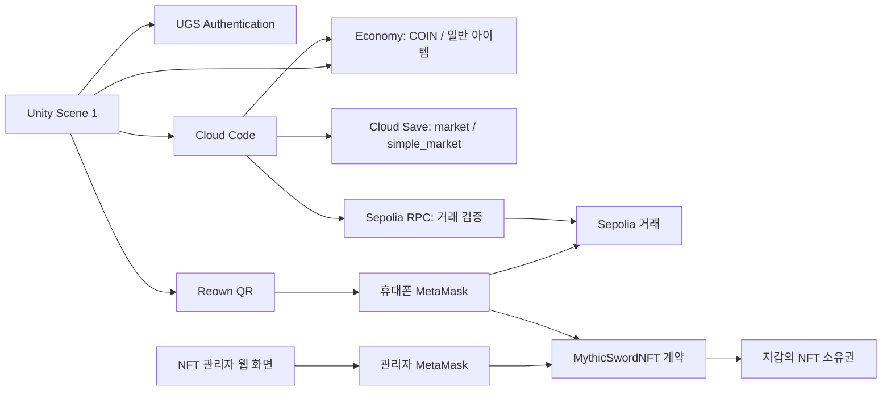

# UGSMarketwithSepoliaETH

Unity 6로 만든 **교육용 RPG 아이템 거래소 + Sepolia 지갑 결제 + NFT 쿠폰 실습** 프로젝트입니다.

학생은 GitHub의 **Code → Download ZIP**으로 코드를 내려받아 Unity Editor에서 실행하고, 본인 UGS와 MetaMask를 연결합니다. 게임 골드·일반 아이템은 UGS에 저장하며, 신화검NFT의 소유권은 Sepolia 블록체인에 저장합니다.

> **실습 기준: `MarketPlaceUGS-main/Assets/Scene/1.unity`, Windows Editor Play, Reown QR + 휴대폰 MetaMask.**
> ZIP만 받으면 클라우드 설정까지 복제되는 것은 아닙니다. 아래 순서로 UGS 프로젝트·Cloud Code·지갑 설정을 준비해야 합니다.

문서 검토일: **2026-09-17**. 아래 “개발 환경에서 확인”은 제작 과정의 검증 기록이며, 학생 본인의 새 환경에서는 완료 체크를 다시 수행합니다.

## 목차

- [1. 프로젝트 개요와 구현 상태](#1-프로젝트-개요와-구현-상태)
- [2. 폴더 및 시스템 구조](#2-폴더-및-시스템-구조)
- [3. 강사와 학생의 역할](#3-강사와-학생의-역할)
- [4. 준비물](#4-준비물)
- [5. ZIP 다운로드와 Unity 실행](#5-zip-다운로드와-unity-실행)
- [6. UGS 프로젝트와 회원가입 설정](#6-ugs-프로젝트와-회원가입-설정)
- [7. Economy 설정](#7-economy-설정)
- [8. Cloud Save 초기 설정](#8-cloud-save-초기-설정)
- [9. Cloud Code 배포](#9-cloud-code-배포)
- [10. 기본 거래소 실습](#10-기본-거래소-실습)
- [11. MetaMask와 Reown QR 연결](#11-metamask와-reown-qr-연결)
- [12. 골드와 전설검 결제](#12-골드와-전설검-결제)
- [13. 신화검NFT 발행과 쿠폰 실습](#13-신화검nft-발행과-쿠폰-실습)
- [14. 장애 확인 및 복구 원칙](#14-장애-확인-및-복구-원칙)
- [15. 개발·검증·선택적 WebGL 빌드](#15-개발검증선택적-webgl-빌드)
- [16. 강사용 GitHub 배포 점검](#16-강사용-github-배포-점검)
- [17. 완료 체크와 후속 과제](#17-완료-체크와-후속-과제)

## 1. 프로젝트 개요와 구현 상태

### 1.1 무엇을 배우는가

1. Unity Authentication의 회원가입·로그인
2. Economy의 골드와 인벤토리 관리
3. Cloud Code를 통한 아이템 매물 등록·구매·판매 대금 정산
4. Unity에서 QR로 외부 MetaMask 지갑 연결
5. 테스트 ETH 입금을 서버에서 검증한 후 게임 재화 지급
6. ERC-721 NFT 계약 배포, 지갑 지정 쿠폰 등록 및 사용
7. 게임 데이터와 블록체인 소유권의 차이

### 1.2 상품 세 가지의 차이

| 구분 | 10,000골드 | 전설검 | 신화검NFT |
|---|---|---|---|
| 지급 위치 | UGS Economy COIN | UGS Economy 인벤토리 | Sepolia NFT 계약 |
| 획득 | 0.0001 Sepolia ETH 결제 | 0.0001 Sepolia ETH 결제 | 관리자 쿠폰 또는 관리자 직접 발행 |
| 별도 가스비 | 있음 | 있음 | 발행·전송 시 있음 |
| MetaMask NFT 목록 | 없음 | 없음 | 계약 주소·tokenId로 확인 가능 |
| 게임 리소스 ID | `COIN` | `LEGENDARY_SWORD` | 향후 `MYTHIC_SWORD_NFT` 연동 예정 |
| 지갑 간 전송 | 게임 골드 자체는 불가능 | 일반 게임 아이템 자체는 불가능 | 가능 |

**Sepolia ETH, 게임 COIN, NFT는 서로 다른 자산입니다.** NFT 발행 가스비는 상점 매출이 아닙니다. UGS의 `production`은 서비스 환경 이름이며 Ethereum 메인넷이라는 뜻이 아닙니다.

### 1.3 현재 상태 — 2026-09-17

| 항목 | 상태 |
|---|---|
| 회원가입·로그인·일반 거래소 | 코드 포함, 기존 실습 장면 사용 |
| MetaMask QR 연결·골드 결제 | 개발 환경에서 실결제·UGS 지급 확인 |
| 전설검 결제 | 코드 포함, 기존 실패 결제 복구 지급·재로그인 유지 확인 |
| 새 전설검 결제의 자동 지급 | 각 실습 환경에서 추가 검증 필요 |
| NFT 계약·쿠폰·보유 조회·전송 | 코드 및 로컬 블록체인 테스트 완료 |
| NFT Sepolia 실배포·휴대폰 쿠폰 수령 | 제작자 환경에서 사용자 완료 확인. 학생 환경은 별도 설정 필요 |
| 로그인 시 NFT → UGS 자동 추가/삭제 | 제작자 환경에서 사용자 완료 확인. [학생 환경 설정 안내](AI_HANDOFF.md) |

현재 Scene 1의 **Add Coin과 Random Item은 개발용 직접 지급 기능**입니다. Random Item은 기본 검·빨간 포션·파란 포션 중 하나를 주며 유료 가챠가 아닙니다. 별도 SimpleMarket 예제의 서버 가챠 설명과 혼동하지 마세요. 공개 상용 서비스용 권한·거래 원자성을 완성한 프로젝트는 아닙니다.

## 2. 폴더 및 시스템 구조

### 2.1 저장소에서 열어야 할 폴더

```text
UGSMarketwithSepoliaETH/                 ← 저장소 최상위, 이 README
├─ MarketPlaceUGS-main/                  ← Unity Hub에 추가할 프로젝트
│  ├─ Assets/Scene/0.unity               ← 원본 거래소 참고 장면
│  ├─ Assets/Scene/1.unity               ← 이 수업의 실제 실습 장면
│  ├─ Assets/Scripts/MarketPlace/        ← 기존 거래소·인벤토리 UI
│  ├─ Assets/Scripts/UGSTest/            ← 초기화·회원가입·로그인
│  ├─ Assets/Scripts/SimpleMarket/       ← 지갑·골드·전설검·NFT UI
│  ├─ Assets/Editor/                    ← UI 연결 메뉴
│  ├─ Assets/Plugins/WebGL/             ← 브라우저 MetaMask 연결
│  ├─ Assets/Data/Market/               ← 아이템 이름·아이콘·기본 판매가
│  ├─ Packages/                        ← Unity 패키지 명세
│  ├─ ProjectSettings/                 ← Unity 설정
│  ├─ js/Mkt_*.txt                     ← Scene 1용 기존 거래소 서버 코드
│  ├─ CloudCode/src/                   ← 결제 및 별도 예제 서버 원본
│  ├─ CloudCode/deploy/                ← 빌드된 서버 코드
│  ├─ CloudCode/*_COPY_ALL.txt          ← Dashboard 전체 복사용 코드
│  └─ NFTWorkshop/                     ← NFT 계약·웹 도구·로컬 테스트
├─ archive/                             ← 이전 골드 코드 보관 (배포 금지)
└─ AI_HANDOFF.md                        ← AI용 구조·배포·주의사항 요약
```

이전 Embedded Wallet 참고 문서와 중복 안내는 저장소 밖 문서 백업에 보관했습니다. 현재 구성은 Reown으로 휴대폰 MetaMask에 연결하는 방식입니다.

### 2.2 전체 연결도



NFT 계약과 Economy 사이의 동기화는 `Nft_GetChallenge → Nft_BindWallet → Nft_SyncInventory`로 연결합니다. 첫 지갑 서명 연결 후 로그인·Refresh에서 보유 항목을 추가하고 전송된 항목을 제거합니다. [설정 순서](AI_HANDOFF.md)를 완료해야 작동합니다.

### 2.3 주요 코드 역할

| 파일/컴포넌트 | 역할 |
|---|---|
| `UnityServiceInit`, `UserNamePw` | UGS 초기화, Username/Password 인증 |
| `PortfolioMarketDemo` | 골드·인벤토리·매물 조회, 판매·구매·정산 버튼 |
| `SceneWalletPanel` | 골드/전설검 견적 요청, 지갑 호출, 지급 확인, UI 갱신 |
| `ReownWalletBridge` | Editor에서 AppKit 초기화·QR 연결·Sepolia 전송 |
| `WebGlWallet` + `SimpleMarketWallet.jslib` | WebGL 브라우저 MetaMask 요청·응답 |
| `SceneWalletSetup` | 기존 WalletPanel의 버튼과 텍스트 자동 연결 |
| `CloudCode/src/core.js` | 거래 검증, 상품·플레이어 결합, 지급 기록·중복 방지 |
| `CloudCode/src/adapter.js` | UGS SDK 및 RPC 호출 |
| `CloudCode/build.js` | 공유 소스를 단독 실행 가능한 Dashboard 파일로 생성 |
| `MythicSwordNFT.sol` | ERC-721 소유권, 쿠폰·발행·전송 규칙 |
| `NFTWorkshop/web` | 관리자 배포·쿠폰 등록, 학생 수령·보유 조회·전송 |
| `MythicNftPanel` | Unity QR 지갑으로 쿠폰 사용·발행 상태 조회 |

### 2.4 데이터 저장 위치

| 저장 위치 | 내용 | ZIP 포함 여부 |
|---|---|---|
| Authentication | 게임 계정과 Player ID | 미포함 |
| Economy | COIN 잔액, 아이템 인스턴스 | 미포함 |
| Cloud Save `market` | 기존 거래소 매물·판매 대금 | 미포함 |
| Cloud Save `simple_market/state` | 골드·전설검 지급 상태와 거래 해시 | 미포함 |
| Cloud Save `simple_market/config` | 수신 공개 주소·금액·RPC·확인 수 | 예시 파일만 포함 |
| PlayerPrefs / 브라우저 localStorage | 로컬 미확인 거래 참조 | 새 PC에 자동 이전되지 않음 |
| Sepolia | 송금 기록, NFT 계약·소유권·쿠폰 사용 여부 | 체인에 존재, ZIP과 별개 |
| NFT 웹 브라우저 localStorage | 최근 계약 주소·쿠폰 초안·거래 해시 | 브라우저별 별도 |

### 2.5 골드·전설검 지급 흐름

1. 게임 로그인 후 Cloud Code에서 상품 견적을 받습니다.
2. 견적의 송금 data에는 상품·UGS 프로젝트·환경·플레이어 구분 정보가 들어갑니다.
3. 학생이 MetaMask에서 0.0001 Sepolia ETH와 가스비를 승인합니다.
4. 서버가 chain ID, 송신/수신 주소, 금액, data, 거래 성공, 블록 확인 수를 검증합니다.
5. Cloud Save에 `GRANTING` 지급 예약을 저장합니다. writeLock으로 같은 기록의 동시 변경을 제어합니다.
6. Economy에 COIN 10,000 또는 전설검 1개를 지급합니다.
7. 성공 기록을 `GRANTED`로 저장합니다.
8. Unity가 잔액·인벤토리를 갱신하고 해당 로컬 미확인 기록을 정리합니다.

골드와 전설검은 결제 메모·로컬 기록·확인 버튼이 구분됩니다. 골드 거래 해시로 전설검을 청구할 수 없습니다. Cloud Save와 Economy는 하나의 원자적 트랜잭션이 아니므로, 중간 오류는 자동 재지급하지 않고 `REVIEW_REQUIRED`로 남을 수 있습니다.

### 2.6 NFT 쿠폰 흐름

1. 관리자가 신화검NFT 계약을 배포합니다.
2. 웹 도구가 랜덤 쿠폰 비밀값을 생성합니다.
3. 관리자가 비밀값의 해시, 수령 지갑 주소, 유효기간을 계약에 등록합니다.
4. 학생에게 쿠폰 전체 문자열을 전달합니다.
5. 학생 지갑이 `redeem` 거래를 승인합니다. 상품 가격은 0 ETH이고 가스비만 필요합니다.
6. 계약이 지정 지갑·기한·취소/사용 여부·발행 한도를 검사해 NFT 1개를 발행합니다.
7. 같은 쿠폰은 다시 사용할 수 없습니다. 발행된 NFT는 별도로 전송 가능합니다.

이번 버전은 **서버 서명형 쿠폰이 아닌 관리자 온체인 등록형 쿠폰**입니다. 관리자 개인 키를 UGS나 Unity에 저장하지 않으며, 쿠폰 등록에도 관리자 가스비가 듭니다.

## 3. 강사와 학생의 역할

### 3.1 기본 진행: 학생별 독립 UGS 프로젝트

이 README는 학생이 본인 UGS 프로젝트를 만들고 6~9절을 직접 설정하는 방식을 기본으로 합니다. 다른 학생의 데이터와 섞이지 않습니다. 서로 거래하려면 **같은 UGS 프로젝트·환경의 서로 다른 게임 계정**을 사용해야 합니다.

### 3.2 공용 UGS를 사용하는 수업

강사가 공용 환경을 준비했다면 강사가 6~9절을 한 번 수행하고 학생은 승인된 프로젝트에 연결합니다. 강사의 초대·권한 부여가 필요하며 Project ID만 복사한다고 Dashboard 관리 권한이 생기지는 않습니다. 공용 환경에서 `state`를 초기화하거나 Cloud Code를 각자 덮어쓰지 않습니다.

### 3.3 역할표

| 강사 | 학생 |
|---|---|
| 실습 브랜치/태그와 Unity 버전 지정 | 지정한 ZIP 다운로드 |
| 독립/공용 UGS 방식 결정 | 해당 방식에 맞춰 연결 |
| 수신 지갑·NFT 관리자 지갑 관리 | 자신의 구매/수령 지갑 관리 |
| 공용 NFT 계약 배포와 쿠폰 발급 가능 | 자기 주소의 쿠폰 수령 |
| 테스트 환경·사용량·오류 복구 관리 | 거래 해시 보관, 결과 검증 |

## 4. 준비물

| 준비물 | 기준 |
|---|---|
| Windows PC, 인터넷 | 현재 실습·검증 기준 |
| Unity Hub와 활성 라이선스 | Unity 계정 로그인 필요 |
| Unity Editor | **6000.3.18f1 (Unity 6.3)**, `ProjectVersion.txt` 기준 |
| Unity/UGS 계정 | 독립 실습이면 본인 프로젝트 생성 권한 |
| Reown 계정과 Project ID | QR 연결용, UGS Project ID와 다름 |
| 휴대폰 MetaMask | Editor QR 연결·결제·NFT 수령 |
| PC Chrome + MetaMask 확장 | NFT 관리자 웹 도구 |
| Sepolia 테스트 ETH | 구매 금액 및 배포·등록·발행 가스비 |
| Node.js + npm | NFT 도구 실행. 개발 검증은 Node 24.18.0 |
| Git | ZIP 다운로드에는 필요 없음 |
| WebGL Build Support | 브라우저 빌드 시에만 선택 설치 |

프로젝트 패키지에는 Reown AppKit Unity **1.7.1**, Cloud Code **2.10.2**, Cloud Save **3.4.0**, Economy **3.5.3** 등이 선언돼 있습니다. 임의로 최신 버전으로 일괄 업데이트하지 마세요. 패키지의 최종 기준은 [manifest.json](MarketPlaceUGS-main/Packages/manifest.json)과 lock 파일입니다.

### 실습 전에 채워 둘 설정표

| 항목 | 학생/강사가 기록할 값 | 넣는 위치 |
|---|---|---|
| 압축 해제한 경로 | 본인 PC의 MarketPlaceUGS-main 폴더 | Unity Hub |
| UGS 조직·프로젝트 | 본인 또는 강사 승인 프로젝트 | Unity Project Settings → Services |
| UGS 환경 | production | Dashboard의 모든 서비스 |
| Reown Project ID | Reown에서 발급한 ID | WalletPanel → Reown Wallet Bridge |
| 구매자 공개 지갑 주소 | 학생 휴대폰 MetaMask 주소 | 연결 후 화면과 비교 |
| 상점 수신 공개 주소 | 구매용 MetaMask와 별도 지갑 | simple_market/config.receiverAddress |
| NFT 관리자 공개 주소 | 계약 배포 지갑 | NFT 웹 도구 연결 계정 |
| NFT 계약 주소 | 배포 후 받은 주소 | 웹 계약 칸·Mythic Nft Contract |

**새 학생 환경으로 바꿀 때 위 값은 자동 생성되지 않습니다.** 제작자 PC의 경로·Project ID·수신 주소를 그대로 따라 쓰지 말고 이 표의 값과 대조합니다.

## 5. ZIP 다운로드와 Unity 실행

1. 강사가 안내한 GitHub 저장소를 엽니다.
2. 강사가 지정한 브랜치/태그를 선택합니다.
3. 초록색 **Code → Download ZIP**을 누릅니다.
4. ZIP을 모두 압축 해제합니다. ZIP 안에서 프로젝트를 직접 열지 않습니다.
5. 가능하면 `C:/UnityLabs/UGSMarketwithSepoliaETH`처럼 짧은 경로를 사용합니다. 바깥 폴더 이름에 `-main`이 붙어도 괜찮습니다.
6. 안쪽 **MarketPlaceUGS-main**에 `Assets`, `Packages`, `ProjectSettings` 세 폴더가 있는지 확인합니다.
7. Unity Hub → Projects → Add/Add project from disk에서 **MarketPlaceUGS-main**을 선택합니다. 저장소 최상위나 Assets만 선택하지 않습니다.
8. Editor 버전을 6000.3.18f1로 선택합니다. 없으면 Hub에서 해당 버전을 설치합니다.
9. 프로젝트를 열고 패키지 복원과 첫 임포트가 끝날 때까지 기다립니다. ZIP에는 보통 Library 캐시가 없습니다.
10. Console의 빨간 컴파일 오류부터 해결합니다. SDK 다운로드 중에는 버튼 실습을 시작하지 않습니다.
11. Project 창에서 **Assets → Scene → 1**을 더블클릭합니다.
12. File → Build Profiles에서 활성 플랫폼을 **Windows**로 둡니다.
13. Scene이 정상적으로 보이면 Ctrl+S로 저장합니다.

**`Simple Market → 1. Create or Open Test Scene`은 이번 실습에서 실행하지 않습니다.** 별도 SimpleMarket 예제 장면을 만드는 메뉴이며 Scene 1 수업과 서버 구성이 다릅니다.

참고: [GitHub 소스 ZIP 다운로드](https://docs.github.com/en/repositories/working-with-files/using-files/downloading-source-code-archives).

## 6. UGS 프로젝트와 회원가입 설정

1. [Unity Dashboard](https://cloud.unity.com/)에 본인 Unity 계정으로 로그인합니다.
2. 본인 조직에서 수업용 프로젝트를 생성합니다. 이름은 자유지만 어떤 프로젝트를 쓰는지 기록합니다.
3. Unity Editor → Edit → Project Settings → Services에서 동일 조직·프로젝트에 연결합니다.
4. 기존 제작자의 프로젝트 연결 정보가 남아 있다면 본인/강사 승인 프로젝트로 바꿉니다. 장면과 설정 파일을 받았다고 기존 제작자의 환경을 사용해도 되는 것은 아닙니다.
5. Dashboard 환경을 **production**으로 선택합니다.
6. Player Authentication/Authentication에서 **Username & Password** 공급자를 활성화하고 저장합니다.
7. Scene 1의 UGS 초기화는 기본 production 환경을 사용합니다. WalletPanel의 Environment Name만 바꾸어도 실제 UGS 환경이 바뀌는 것은 아닙니다. 다른 환경을 쓸 때는 초기화 코드와 서버 설정을 함께 맞춰야 합니다.
8. 아래 Economy·서버 설정을 마친 후 게임 화면의 Signup으로 새 게임 계정을 만듭니다. Unity 개발자 로그인 계정과 게임 계정은 별개입니다.

현재 게임의 비밀번호 검사는 **8~30자, 영문 대문자·소문자·숫자·특수문자 각 1개 이상**입니다. 실습 계정에도 다른 서비스에서 쓰는 비밀번호를 재사용하지 않습니다.

[Unity Username & Password 공식 안내](https://docs.unity.com/en-us/authentication/platform-signin/username-password).

## 7. Economy 설정

1. Dashboard → Economy → Configuration으로 이동합니다.
2. 프로젝트와 환경이 6절과 같은지 확인합니다.
3. **Add Resource**에서 다음 항목을 만듭니다.

| 종류 | 이름 예시 | ID — 정확히 입력 | 값 |
|---|---|---|---|
| Currency | coin | `COIN` | Initial balance 1000, Max balance 1000000 |
| Inventory Item | sword | `SWORD` | 기본 설정 |
| Inventory Item | redPotion | `REDPOTION` | 기본 설정 |
| Inventory Item | bluePotion | `BLUEPOTION` | 기본 설정 |
| Inventory Item | 전설검 | `LEGENDARY_SWORD` | 기본 설정 |

4. 자동 생성된 ID가 다르면 위 표대로 고칩니다. 표시 이름보다 **ID 일치**가 중요합니다.
5. Save 후 Configuration의 **Publish**를 완료합니다.
6. 새 계정에서 처음 잔액을 조회하면 기본 1000 COIN을 받습니다. 로그인할 때마다 1000을 추가하는 기능이 아닙니다.
7. 기존 계정의 잔액은 초기 잔액을 바꿔도 소급 변경되지 않습니다.
8. 처음 아이템은 0개입니다. NFT용 `MYTHIC_SWORD_NFT` 리소스는 현재 단계에서 만들 필요 없습니다.

COIN 최대값을 10000으로 설정하면 기존 잔액에 10000을 더하는 구매가 실패할 수 있습니다. 테스트 중 잔액이 최대값에 가까워지면 충분한 한도로 수정하고 Publish하세요.

## 8. Cloud Save 초기 설정

### 8.1 일반 거래소용 `market`

1. Cloud Save → **게임 데이터 / Game Data**로 갑니다. Player Data가 아닙니다.
2. **Add Custom Item**을 누릅니다.
3. Custom Item ID에 `market`을 입력합니다.
4. Key에 `active_listings`를 입력합니다.
5. Value 편집에서 JSON 배열 `[]`를 입력합니다. 문자열 `"[]"`가 아닙니다.
6. Access Class는 **Default**로 두고 저장합니다.
7. 이미 존재하는 공용 `market`이면 기존 값을 보존합니다.

매물 등록 후 서버가 `listing_...`, `earn_...` 등의 키를 추가합니다. 학생이 직접 매물 JSON을 만들지 않습니다.

### 8.2 결제용 `simple_market`

1. 게임 데이터 목록으로 돌아가 **Add Custom Item**을 누릅니다.
2. Custom Item ID에 `simple_market`을 입력합니다.
3. 첫 Key는 `state`, Access Class는 Default로 설정합니다.
4. Value 편집기에 아래를 **JSON 객체**로 넣습니다.

```json
{"version":1,"payments":{},"listings":{},"operations":{}}
```

5. Add Key 또는 생성 후 Add Key Value Pairs로 두 번째 Key `config`를 만듭니다.
6. Value에 아래 JSON을 넣고 수신 주소만 실제 수신용 공개 주소로 바꿉니다.

```json
{
  "receiverAddress": "여기를_수신용_0x공개주소로_교체",
  "rpcUrl": "https://ethereum-sepolia-rpc.publicnode.com",
  "priceWei": "100000000000000",
  "goldAmount": 10000,
  "confirmations": 3
}
```

7. 수신 지갑은 구매자와 다른 일반 지갑을 사용합니다. 현재 결제는 data를 포함하므로 **구매용 MetaMask에 함께 등록된 다른 계정도 수신용으로 쓰지 않는 구성**을 사용합니다. 별도 브라우저 프로필의 독립 지갑 등으로 준비하고 공개 주소만 복사합니다.
8. Save/Add 확인까지 완료합니다.
9. `simple_market → Default` 목록에 `state`, `config`가 각각 보이는지 확인합니다.

**state 초기값은 신규 환경에서 딱 한 번만 넣습니다.** 구매 후 덮어쓰면 중복 지급 방지 기록이 사라집니다. Default Game Data에 개인 키·복구 구문·비밀 API 키가 든 RPC URL을 넣지 않습니다. `confirmations: 3`은 실습용 블록 확인 기준이며 완전한 체인 최종성과 같지는 않습니다.

## 9. Cloud Code 배포

### 9.1 사용할 파일을 먼저 구분

**이 README의 Scene 1 거래소는 `js/Mkt_*.txt`를 사용합니다.** `CloudCode/deploy/Mkt_*`는 별도 SimpleMarket 예제용입니다. 이름이 같더라도 그대로 덮어쓰면 저장 구조가 달라집니다.

| 용도 | Dashboard 함수 이름 | 복사할 파일 |
|---|---|---|
| 매물 목록 | `Mkt_GetActiveListings` | `MarketPlaceUGS-main/js/Mkt_GetActiveListings.txt` |
| 판매 등록 | `Mkt_CreateListing` | `MarketPlaceUGS-main/js/Mkt_CreateListing.txt` |
| 구매 | `Mkt_BuyListing` | `MarketPlaceUGS-main/js/Mkt_BuyListing.txt` |
| 판매 취소 | `Mkt_CancelListing` | `MarketPlaceUGS-main/js/Mkt_CancelListing.txt` |
| 판매 대금 수령 | `Mkt_ClaimEarnings` | `MarketPlaceUGS-main/js/Mkt_ClaimEarnings.txt` |
| 골드 견적 | `Gold_GetQuote` | `MarketPlaceUGS-main/CloudCode/deploy/Gold_GetQuote.js` |
| 골드 지급 | `Gold_Claim` | `MarketPlaceUGS-main/CloudCode/deploy/Gold_Claim.js` |
| 전설검 견적 | `Sword_GetQuote` | `MarketPlaceUGS-main/CloudCode/Sword_GetQuote_COPY_ALL.txt` |
| 전설검 지급 | `Sword_Claim` | `MarketPlaceUGS-main/CloudCode/Sword_Claim_COPY_ALL.txt` |

### 9.2 함수마다 반복할 절차

1. Dashboard → Cloud Code → JS 스크립트에서 새 스크립트를 만듭니다.
2. 이름을 위 표의 이름 그대로 입력합니다. `.txt`나 `.js`는 함수 이름에 넣지 않습니다.
3. 표의 로컬 파일을 편집기로 열어 **Ctrl+A → Ctrl+C** 합니다.
4. Dashboard의 코드 편집 영역을 클릭하고 **Ctrl+A → Ctrl+V**로 기본 샘플을 전부 교체합니다.
5. 기존 스크립트 수정이면 먼저 **Working Copy**를 선택합니다.
6. 아래 파라미터를 설정합니다. 화면에 따라 Details 탭에 있습니다.
7. **Save Script → Publish Version**을 누릅니다.
8. Live 버전의 코드가 바뀌었는지 확인합니다. 저장만 해서는 게임에 적용되지 않습니다.
9. 9개 스크립트에 대해 반복합니다.

| 함수 | 파라미터와 유형 |
|---|---|
| Mkt_GetActiveListings | `limit`: Numeric 선택 / `sort`: String 선택 |
| Mkt_CreateListing | `players_inventory_item_id`: String 필수 / `price`: Numeric 필수 / `currency_id`: String 필수 |
| Mkt_BuyListing | `listing_id`: String 필수 |
| Mkt_CancelListing | `listing_id`: String 필수 |
| Mkt_ClaimEarnings | `currency_id`: String 필수 |
| Gold_GetQuote | 없음 |
| Gold_Claim | `tx_hash`: String 필수 |
| Sword_GetQuote | 없음 |
| Sword_Claim | `tx_hash`: String 필수 |

이 Scene 1 경로에서는 `Mkt_Gacha`를 등록할 필요 없습니다. 코드의 context에 Project ID, Player ID, 토큰을 직접 하드코딩하지 않습니다.

전설검 코드에는 개발 중 특정 플레이어·특정 거래 한 건에 한정한 과거 복구 분기가 있습니다. **학생에게 적용되는 일반 복구 함수가 아니며, 그 거래 해시나 Player ID를 학생 값으로 바꿔 사용하지 않습니다.** 학생은 새 UGS 환경과 새 결제로 실습합니다.

## 10. 기본 거래소 실습

1. Unity에서 Scene 1을 열고 Play를 누릅니다.
2. Signup으로 새 게임 계정을 만듭니다. 오류가 나면 화면의 사용자 이름·비밀번호 규칙에 맞게 수정합니다.
3. 필요하면 Login으로 로그인합니다.
4. Refresh 후 COIN이 1000, 보유 아이템이 0개인지 확인합니다.
5. **Random Item**을 눌러 기본 아이템을 받습니다. 현재는 무료 테스트 지급입니다.
6. 인벤토리에서 아이템을 확인합니다.
7. PriceInput에 양의 정수 가격을 입력하고 해당 아이템의 Sell을 누릅니다.
8. 거래소 Refresh로 매물이 보이는지 확인합니다.
9. 다른 게임 계정으로 로그인해 Buy를 누릅니다. 같은 매도 계정으로 자기 매물을 사지 않습니다.
10. 구매자 COIN 감소와 아이템 추가를 확인합니다.
11. 매도 계정으로 돌아가 **Claim**을 눌러 판매 대금을 수령합니다.
12. 판매 중인 본인 매물의 cancel은 매물을 취소하고 아이템을 돌려받는 기능입니다.

서로 다른 PC의 학생끼리 거래하려면 같은 UGS 프로젝트·환경을 사용해야 합니다. 독립 프로젝트라면 자신의 환경에 게임 계정 두 개를 만들어 테스트합니다. 동시 접속이 필요하면 별도 실행 클라이언트를 준비합니다.

현재 기본 로그인 화면에는 로그아웃 버튼이 없습니다. 한 PC에서 계정을 바꾸려면 **Play 종료 후 Unity Editor를 다시 열어**, 로그인 화면에서 다른 계정으로 로그인하는 방법으로 진행합니다. 기존 인증 세션이 남은 상태에서는 아이디 입력만 바꿔도 계정이 전환되지 않습니다. “이미 로그인된 상태”가 나오면 그 상태로 구매 테스트를 이어가지 마세요.

## 11. MetaMask와 Reown QR 연결

### 11.1 Reown 설정

1. [Reown Dashboard](https://dashboard.reown.com/)에서 프로젝트를 생성합니다.
2. **Reown Project ID**를 복사합니다. UGS의 Project ID와 혼동하지 않습니다.
3. Unity Package Manager에서 Reown AppKit Unity 1.7.1이 복원됐는지 확인합니다.
4. ZIP에 포함된 manifest에 OpenUPM과 `com.reown`, `com.nethereum` scope가 선언돼 있으므로 정상 복원됐다면 추가 설치하지 않습니다.
5. 복원이 안 되면 Edit → Project Settings → Package Manager의 Scoped Registries에서 다음을 확인합니다.

| 항목 | 값 |
|---|---|
| Name | OpenUPM |
| URL | `https://package.openupm.com` |
| Scope | `com.reown` |
| Scope | `com.nethereum` |

6. File → Build Profiles의 활성 플랫폼을 Windows로 둡니다.
7. Edit → Project Settings → Player → Other Settings의 **Script Compilation → Scripting Define Symbols**에 `SIMPLE_MARKET_REOWN`이 있는지 확인합니다. 없으면 추가하고 Apply합니다. 기존 심볼은 유지합니다.
8. Hierarchy에 Reown AppKit Prefab이 있는지 확인합니다. 없을 때만 Packages → Reown AppKit Unity → Prefabs의 Prefab을 Scene 최상위에 하나 추가합니다.
9. Canvas → WalletPanel → Reown Wallet Bridge의 Project Id에 본인/강사 지정 Reown Project ID를 넣습니다.
10. Game Url은 수업 프로젝트 소개 페이지의 완전한 `https://...` 주소를 넣습니다.
11. Icon Url은 로그인 없이 접근할 수 있는 실제 이미지 파일의 HTTPS 주소를 넣습니다. GitHub 파일 보기 페이지가 아닌 raw 이미지 URL을 사용합니다.
12. 빈 URL·공백·`C:/...` 경로를 넣지 않습니다. 이 URL은 앱 표시 정보이며 결제 수신 주소가 아닙니다.

공식 설치 참고: [Reown Unity 설치](https://docs.reown.com/appkit/unity/core/installation). SDK 요구사항과 맞지 않는 패키지 오류는 Console 전체 메시지로 확인합니다.

### 11.2 기존 지갑 UI 연결 확인

1. Play를 종료합니다.
2. Hierarchy에서 WalletPanel을 선택합니다.
3. **Simple Market → Scene 1 - Connect Selected WalletPanel**을 실행합니다.
4. Scene Wallet Panel의 필드를 확인합니다.

| 필드 | 오브젝트 |
|---|---|
| Wallet Button | WalletButton |
| Buy 10000 Gold Button | Buy10000GoldButton |
| Payment Check Button | PaymentCheckButton |
| Buy Legendary Sword Button | BuyLegendarySwordButton |
| Sword Payment Check Button | SwordPaymentCheckButton |
| Wallet Address Text | WalletAddressText |
| Sepolia Eth Text | Sepolia ETH Text |
| Payment Status Text | PaymentStatusText |
| Market Demo | PortfolioMarketDemo가 붙은 기존 GameManager 등 |

5. 빠진 버튼이 있으면 기존 버튼을 복제해 위 이름으로 만들고 연결 메뉴를 다시 실행합니다.
6. 버튼 On Click()에 같은 함수를 수동으로 중복 연결하지 않습니다.
7. Ctrl+S로 저장합니다.
8. Play → 게임 로그인 → 지갑 연결을 누릅니다.
9. MetaMask를 선택하고 휴대폰 MetaMask로 QR을 읽습니다.
10. 연결과 Sepolia 전환을 승인합니다.
11. 게임에 학생 지갑 주소와 Sepolia ETH 잔액이 표시되는지 확인합니다.

이 지갑 연결 자체가 UGS 계정에 지갑 소유권을 영구 등록하는 기능은 아닙니다.

## 12. 골드와 전설검 결제

### 12.1 10,000골드

1. 구매 전 COIN을 기록합니다.
2. 구매 지갑에 0.0001 ETH와 별도 가스비가 충분한지 확인합니다.
3. **Buy 10K Gold use Sepolia**를 한 번 누릅니다.
4. MetaMask에서 수신 지갑·Sepolia·0.0001 ETH·가스비를 확인하고 승인합니다.
5. 블록 확인과 UGS 지급이 끝날 때까지 기다립니다.
6. 자동 확인이 끝나지 않으면 **골드 결제 확인**을 누릅니다. 구매 버튼을 다시 눌러 송금하지 않습니다.
7. COIN이 정확히 10000 증가했는지 확인합니다.
8. 확인 버튼을 다시 눌러도 추가 지급되지 않아야 합니다.
9. Play를 종료하고 같은 게임 계정으로 로그인해 잔액이 유지되는지 확인합니다.

### 12.2 전설검

1. Economy에 `LEGENDARY_SWORD`가 Publish됐는지 확인합니다.
2. 위 표의 전설검 버튼과 서버 함수 두 개가 준비됐는지 확인합니다.
3. 구매 전 COIN과 전설검 개수를 기록합니다.
4. **Buy LegendarySword use Sepolia**를 한 번 누릅니다.
5. MetaMask에서 0.0001 ETH와 가스비를 승인합니다.
6. 필요하면 **무기/전설검 결제 확인**을 누릅니다. 골드 확인 버튼과 구분합니다.
7. 전설검 1개 증가, COIN 유지, 재로그인 후 보존을 확인합니다.
8. 인벤토리의 전설검 기본 판매가 1000 COIN은 **게임 내 재판매 가격**입니다. 0.0001 ETH 결제 가격과 다른 값입니다.

아이콘 매핑은 `Assets/Data/Market/GlobalItemVisuals.asset`에서 관리합니다. 코드 위치는 [AI 인수인계서](AI_HANDOFF.md)를 참고하세요.

## 13. 신화검NFT 발행과 쿠폰 실습

이 절은 MetaMask 지갑에 NFT를 발행하는 실습입니다. 발행이 끝나면 [NFT 인벤토리 연동 안내](AI_HANDOFF.md)에서 Cloud Save/Economy 설정 및 첫 메시지 서명을 완료하여 게임 인벤토리에도 표시합니다.

### 13.1 NFT 도구 실행

1. 탐색기에서 **MarketPlaceUGS-main/NFTWorkshop**을 엽니다.
2. 빈 곳 우클릭 → 터미널에서 열기를 선택합니다.
3. ZIP에는 node_modules가 없으므로 최초 한 번 다음을 실행합니다.

```powershell
npm.cmd ci
npm.cmd run build
npm.cmd start
```

4. 이후에는 같은 폴더에서 `npm.cmd start`만 실행하면 됩니다.
5. 터미널을 켜 둔 채 **PC Chrome**에서 `http://127.0.0.1:8787`을 엽니다.
6. 이 주소는 내 PC 전용입니다. 휴대폰에서 이 localhost로 접속하지 않습니다.
7. 포트를 사용 중이라면 먼저 열어둔 동일 도구가 있는지 확인합니다.

### 13.2 관리자 계약 배포

1. PC MetaMask를 관리자 계정·Sepolia로 전환합니다.
2. 웹의 **MetaMask 연결**을 누릅니다.
3. 연결 주소가 관리자 주소인지 확인합니다.
4. **실습용 내장 메타데이터 채우기**를 누릅니다. 외부 이미지 저장소 없이 기본 검으로 시작할 수 있습니다.
5. 최대 발행 개수를 1000으로 둡니다.
6. **새 NFT 계약 배포**를 누릅니다.
7. MetaMask에서 배포 가스비를 확인하고 승인합니다.
8. 배포 완료 후 화면의 **계약 주소**를 메모합니다. 관리자 개인 지갑 주소와 다릅니다.
9. 이미 강사가 배포한 공용 NFT 계약이 있으면 새로 배포하지 않고 그 계약 주소를 사용합니다. 쿠폰 등록은 해당 관리자만 할 수 있습니다.

### 13.3 학생 쿠폰 등록

1. 관리자가 웹의 계약 주소를 확인합니다.
2. “받을 학생의 공개 지갑 주소”에 학생의 실제 수령 지갑 주소를 넣습니다.
3. 유효기간을 입력합니다. 처음에는 7일을 사용합니다.
4. **쿠폰 생성 및 등록**을 누르고 관리자 MetaMask에서 가스비를 승인합니다.
5. **등록 상태 확인**으로 지정 주소와 등록 완료를 확인합니다.
6. **쿠폰 복사**로 전체 문자열을 학생에게 전달합니다.
7. 학생은 `MSW1|11155111|...` 전체를 보관합니다. 일부만 복사하거나 값을 수정하지 않습니다.

### 13.4 Unity NFT UI 만들기와 연결

Scene 1에 NFT 패널이 없는 배포본은 다음을 수행합니다. 이미 있으면 필드 연결만 확인합니다.

1. Play를 끄고 Canvas 아래 UI Panel을 하나 만들어 **MythicNftPanel**로 이름을 바꿉니다.
2. 그 아래 TMP Input Field를 만들어 **NftCouponInput**으로 이름을 바꿉니다.
3. Input Field Character Limit을 **0**으로 두어 쿠폰이 잘리지 않게 합니다.
4. 버튼 세 개와 상태 TMP 텍스트를 만듭니다.

| 오브젝트 이름 | 표시 글자 |
|---|---|
| NftConnectButton | NFT 지갑 연결 |
| NftRedeemButton | 쿠폰으로 신화검NFT 받기 |
| NftCheckButton | NFT 발행 확인 |
| NftStatusText | 상태 표시용 텍스트 |

5. 기존 거래소를 가리지 않게 패널을 배치하고 버튼 On Click()은 비웁니다.
6. MythicNftPanel을 선택하고 **Simple Market → NFT - Connect Selected MythicNftPanel**을 실행합니다.
7. Mythic Nft Panel 컴포넌트에 입력칸·버튼·텍스트가 연결됐는지 확인합니다.
8. Wallet에는 기존 WalletPanel의 **Reown Wallet Bridge**를 연결합니다.
9. 기존 WalletPanel → Reown Wallet Bridge의 **Mythic Nft Contract**에 13.2에서 받은 NFT 계약 주소를 넣습니다.
10. Rpc Url은 Sepolia 공개 RPC 기본값으로 시작합니다.
11. Ctrl+S로 저장합니다.

### 13.5 학생의 NFT 수령

1. 휴대폰 MetaMask를 쿠폰에 지정된 계정·Sepolia로 선택합니다.
2. Unity Play → 게임 로그인 → NFT 지갑 연결을 누릅니다.
3. QR 연결을 완료합니다.
4. 쿠폰 입력칸에 전체 문자열을 붙여넣습니다.
5. **쿠폰으로 신화검NFT 받기**를 한 번 누릅니다.
6. MetaMask에서 발행 가스비를 승인합니다. 상품 가격은 **0 ETH**입니다.
7. 전송 후 **NFT 발행 확인**을 눌러 상태를 조회합니다.
8. tokenId와 현재 소유자 주소가 표시되면 소유자가 자신의 지갑인지 확인합니다.
9. 아직 발행되지 않았다면 기다린 후 확인 버튼을 다시 누릅니다. 받기 버튼을 연속으로 누르지 않습니다.
10. MetaMask NFT 탭에서 자동 표시가 안 되면 계약 주소와 tokenId로 가져오기를 시도합니다. 내장 SVG 이미지는 일부 지갑에서 표시되지 않을 수 있습니다.

### 13.6 보유·전송 실습

1. PC MetaMask에 있는 학생 지갑을 사용하는 경우 실습 웹의 “내 NFT 목록 조회”로 tokenId를 봅니다.
2. tokenId와 받는 학생의 공개 주소를 입력합니다.
3. “NFT 1개 전송”을 누르고 현재 소유자 MetaMask에서 승인합니다.
4. 받는 지갑에서 보유 목록을 확인합니다.
5. 이전 학생이 쿠폰 상태를 확인하면 이미 발행된 tokenId와 바뀐 현재 소유자가 나옵니다.
6. 휴대폰은 MetaMask에서 해당 NFT의 보내기 기능을 사용합니다. 앱에서 기능을 찾을 수 없으면 강사에게 확인하고 복구 구문을 다른 PC로 옮기지 않습니다.

서버 연동 설정과 코드 위치는 [AI 인수인계서](AI_HANDOFF.md)에 요약했습니다. ZIP 사용자는 **자신이 ZIP을 푼 경로**에서 13.1의 `npm.cmd ci`부터 시작합니다.

## 14. 장애 확인 및 복구 원칙

| 증상 | 의미와 조치 |
|---|---|
| 회원가입/로그인 실패 | 프로젝트 연결, Username & Password 활성화, 입력 규칙 확인 |
| Script not found | 함수 이름·환경·Publish 확인 |
| Quote에 `roll`이 없다는 오류 | 견적 함수에 기본 샘플 또는 다른 코드가 배포됨. 전체 교체 후 Publish |
| Curl malformed URL / Remote sprite 오류 | Game URL·Icon URL의 빈 값/공백/비이미지 URL 확인 |
| External transactions to internal accounts cannot include data | 수신 계정이 구매용 MetaMask에 함께 등록돼 있는지 확인 |
| RPC_RECEIPT_NOT_FOUND | 아직 RPC에 영수증이 보이지 않음. 결제 확인으로 재조회 |
| CONFIRMATIONS:1/3, 2/3 | 블록 확인 대기. 새 송금하지 않음 |
| REVIEW_REQUIRED | 지급/기록 저장 결과 불확실. 강사가 Economy와 지급 기록 대조 |
| INVENTORY_LOOKUP_FAILED | 조회 실패. 미지급이라고 단정하지 않음 |
| INVENTORY_INSTANCE_NOT_FOUND | 현재 인벤토리에 없음. 판매·삭제 이력까지 확인해야 재지급 판단 가능 |
| 이 상품에 확인할 결제가 없습니다 | 지급 완료 후 로컬 기록 정리 또는 다른 상품 확인 버튼. 인벤토리·잔액 확인 |
| 골드 지급 실패 | COIN 최대값, 같은 환경의 리소스 Publish 확인 |
| NFT WRONG_RECIPIENT / 주소 불일치 | 쿠폰 대상 지갑과 실제 연결 계정 확인 |
| NFT 그림 없음 | 계약 주소·tokenId·소유권부터 확인. 이미지 미리보기는 별도 |

1. **승인한 거래가 있다면 구매 버튼부터 다시 누르지 않습니다.** 거래 해시를 먼저 보관합니다.
2. `state`를 초기값으로 덮어쓰거나 기록을 삭제하지 않습니다.
3. `GRANTING`을 `GRANTED`로 글자만 바꿔도 실제 지급이 되지는 않습니다.
4. 골드는 골드 확인, 전설검은 전설검 확인, NFT는 NFT 발행 확인을 사용합니다.
5. 선택 UI `TransactionHashInput`에 실제 해시를 입력해 해당 상품 확인을 할 수 있습니다. 잘못된 상품 해시는 거부됩니다.
6. Recovery/기록 해제는 **송금과 승인 대기 요청이 모두 없음을 확인한 미전송 건**에만 사용합니다. 환불 기능이 아닙니다.
7. 강사에게 프로젝트·환경, 게임 Player ID, 상품, 거래 해시, Console 오류 전문을 전달합니다. 개인 키는 전달하지 않습니다.

[운영·복구 참고](AI_HANDOFF.md). 과거 특정 거래의 복구 코드를 학생 결제에 임의로 재사용하지 않습니다.

## 15. 개발·검증·선택적 WebGL 빌드

### 15.1 서버 코드를 수정한 경우

터미널 위치: `MarketPlaceUGS-main`

```powershell
node CloudCode/build.js
node --test --test-isolation=none CloudCode/tests/*.test.js
```

원본은 `CloudCode/src`입니다. `deploy`만 손으로 고치면 다음 빌드에서 덮어써집니다. 빌드 후에도 UGS Dashboard에는 자동 배포되지 않습니다. 수정한 함수만 Save·Publish합니다. 빌드된 `Mkt_*`를 Scene 1 서버에 일괄 업로드하지 않습니다.

### 15.2 NFT 개발 검증

터미널 위치: `MarketPlaceUGS-main/NFTWorkshop`

```powershell
npm.cmd ci
npm.cmd run build
npm.cmd test
```

계약은 Solidity 0.8.30, OpenZeppelin 5.4.0, optimizer runs 200, EVM Shanghai로 빌드합니다. 로컬 블록체인 테스트는 실제 Sepolia ETH를 쓰지 않습니다. Node 24에서 Ganache의 네이티브 모듈 경고 후 JavaScript 대체 구현으로 실행될 수 있으므로 최종 테스트 결과를 확인합니다.

개발 환경 확인: 기존 서버/브라우저 테스트 44개 통과, NFT 계약 생명주기 테스트 통과, Unity 런타임·Editor 코드 컴파일 통과. 이것이 모든 PC의 새 ZIP 임포트나 실제 Sepolia 배포 성공을 보장하지는 않습니다.

### 15.3 WebGL은 선택 실습

1. Editor QR 실습을 먼저 완료합니다.
2. Hub에서 같은 Unity 버전의 WebGL Build Support를 설치합니다.
3. File → Build Profiles에서 WebGL을 선택합니다.
4. 빌드 장면 목록에 **Scene 1**을 넣습니다.
5. 별도 SimpleMarket 장면을 대상으로 하는 자동 Build WebGL 메뉴는 사용하지 않습니다.
6. HTTP 서버로 빌드를 실행하고 PC 브라우저 MetaMask를 연결합니다.
7. NFT Unity 패널은 현재 Editor QR용이므로 WebGL NFT 실습은 NFTWorkshop 웹 화면을 사용합니다.

## 16. 강사용 GitHub 배포 점검

**README 작성은 GitHub 업로드를 자동으로 수행하지 않습니다.** 수업 배포 전 다음을 확인합니다.

1. Unity에서 Scene 1을 저장합니다. Inspector에서 작업한 내용은 Scene을 저장해야 ZIP에 들어갑니다.
2. Assets와 각 `.meta`, Packages, ProjectSettings, `js`, CloudCode, NFTWorkshop 소스·lock·문서를 Git에 포함합니다.
3. Library, Temp, Logs, obj, Builds, UserSettings, node_modules, `.npm-cache`, `.env` 및 개인 인증 파일은 올리지 않습니다. `.gitignore`가 있어도 이미 추적 중인 파일은 별도로 확인해야 합니다.
4. 개인 키·복구 구문·서비스 계정 비밀키·비공개 RPC 토큰이 없는지 확인합니다.
5. Scene/ProjectSettings에 남아 있는 제작자 UGS 연결 정보와 Reown Project ID를 점검합니다. 공개 식별자와 비밀 키는 다르지만 수업에서 사용할 환경·사용량 관리 주체를 정해야 합니다.
6. Asset Store 등 외부 이미지·폰트·에셋을 공개 저장소에 재배포할 권한을 확인합니다. 코드와 에셋에 포괄적 라이선스가 있다고 가정하지 않습니다.
7. GitHub에 올릴 때 불필요한 캐시 대신 소스만 올립니다. 대용량 파일은 GitHub 제한과 LFS 사용 여부를 확인합니다.
8. LFS를 쓴다면 저장소 설정에서 **ZIP 아카이브에 LFS 객체를 포함할지** 확인합니다. 학생이 실제 이미지 대신 포인터 파일만 받지 않는지 검사합니다. [GitHub LFS 아카이브 안내](https://docs.github.com/en/enterprise-cloud@latest/repositories/managing-your-repositorys-settings-and-features/managing-git-lfs-objects-in-archives-of-your-repository).
9. 작업물을 commit/push한 뒤 GitHub에서 직접 Code → Download ZIP을 다시 받습니다. 커밋되지 않은 로컬 파일은 학생 ZIP에 없습니다.
10. 다른 폴더에 압축 해제하고 Library가 없는 상태에서 Hub로 열어 패키지 복원·컴파일·Scene 1 표시를 확인합니다.
11. 새 UGS 환경 또는 수업 공용 환경에서 이 README의 실습을 끝까지 한 번 수행합니다.
12. 확인된 버전에 태그 또는 Release를 붙이고 학생에게 그 버전을 안내합니다.
13. 수업 중에는 검증되지 않은 패키지 업데이트나 서버 일괄 교체를 피하고, 공용 프로젝트의 상태 초기화 권한을 관리합니다.

### 공개 서비스로 발전시키려면

현재 테스트 버튼은 클라이언트에서 Economy를 직접 변경합니다. 공개 서비스에는 지급·가챠의 서버 처리, 플레이어 직접 쓰기 제한, 기존 거래소의 동시성·부분 실패 복구 보완이 필요합니다. `CloudCode/project-policy.json`을 현재 Scene 1에 무작정 적용하면 Add Coin/Random Item 및 기존 호출이 거부될 수 있습니다. 관련 코드를 함께 이관한 뒤 적용합니다.

## 17. 완료 체크와 후속 과제

### 학생 제출 체크

- [ ] ZIP에서 올바른 Unity 프로젝트와 Scene 1을 열었다.
- [ ] 본인/수업 UGS 프로젝트·환경을 기록했다.
- [ ] 새 게임 계정의 1000 COIN과 빈 인벤토리를 확인했다.
- [ ] 일반 아이템 판매·구매·Claim을 테스트했다.
- [ ] QR로 휴대폰 MetaMask에 연결했다.
- [ ] 골드 결제 후 정확히 10000이 증가하고 재로그인 후 유지됐다.
- [ ] 전설검 결제 후 1개만 지급되고 재로그인 후 유지됐다.
- [ ] NFT 계약 주소와 관리자/학생 주소를 구분했다.
- [ ] 쿠폰으로 NFT를 받고 tokenId·소유자를 확인했다.
- [ ] NFT를 다른 지갑으로 전송하고 소유자가 바뀌는 것을 확인했다.
- [ ] 거래 해시와 오류 대응 과정을 기록했다.

### NFT 인벤토리 연동 실습 및 후속 개발

1. [NFT 인벤토리 연동 안내](AI_HANDOFF.md)에 따라 Economy에 `MYTHIC_SWORD_NFT`를 추가하고 Publish합니다.
2. Cloud Save에 `nft_config`, `nft_state` 키를 새로 추가합니다. 기존 결제 state는 보존합니다.
3. 안내문의 NFT Cloud Code 세 개와 기존 거래소 스크립트 두 개를 Publish합니다.
4. 게임 로그인 후 NFT지갑연결에서 메시지 서명을 승인합니다. 한 게임 계정과 한 지갑을 연결합니다.
5. 보유 NFT가 인벤토리에 표시되고, 재로그인·Refresh 시 중복 없이 유지되는지 확인합니다.
6. 다른 지갑으로 전송 후 다시 동기화하여 NFT 항목만 제거되는지 확인합니다. 조회 오류일 때는 제거하지 않습니다.
7. 현재는 인벤토리 연동까지입니다. 장착/전투 권한 검증과 운영용 Economy 접근 정책 강화는 후속 작업입니다.

### 문서 안내

학생 실습은 이 README를 기준으로 진행합니다. 구조·배포 파일·복구 주의사항은 [AI 인수인계서](AI_HANDOFF.md)에 요약했습니다. 별도 README와 이전 상세 안내 문서는 통합했습니다.
